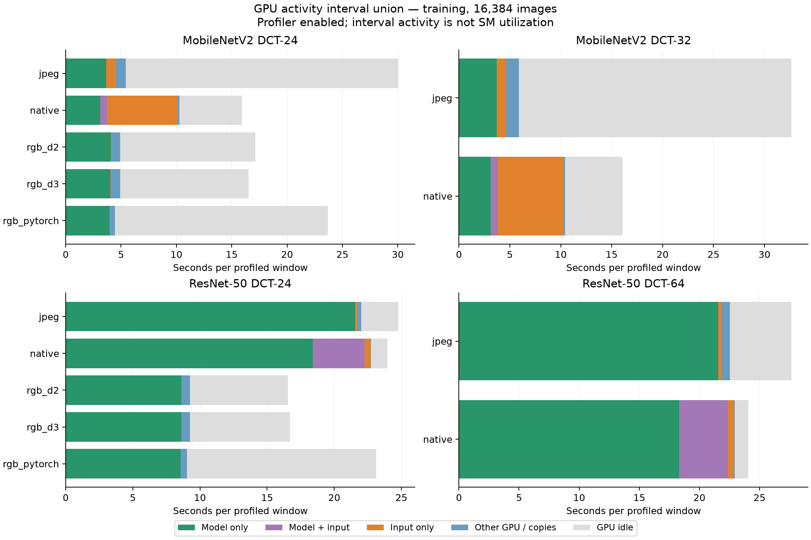

# GALP 全模型综合报告：ViT、SwinV2、eFUN 与 CNN 的训练、推理和资源分析

整理日期：2026-09-16。本文汇总已完成实验，不新增 GPU 测量。数据来自不同日期的完整运行与独立 profiling，保留各自的配置、统计范围和重复次数。章节采用“模型与设置 → 总体结果 → 存储及资源 → 分模型 breakdown”的顺序。

## 1. 模型汇总与来源

当前完整系统实验覆盖 **12 个架构/输入配置**：ViT-Ti RGB/DCT、SwinV2-T RGB/DCT、MobileNetV2 RGB/DCT24/DCT32、ResNet-50 RGB/DCT24/DCT64、base eFUN、RGB EfficientNet-B0。不同 reader、输出布局和下推开关是同一模型的执行路径，不另计模型。eFUN-L/S/S+ 已核查作者源码与参数量，但尚无本系统完整推理或训练结果。

### 1.1 架构、参数量与输入

参数量为模型参数元素总数，含 1000 类分类头，不含 optimizer state、临时激活、输入缓存及无参数 DCT 变换矩阵。输入形状均省略 batch；M 表示百万参数。

| 模型配置 | 参数量 | 输入 | 主要架构 | 实验覆盖 / reference |
| --- | ---: | --- | --- | --- |
| ViT-Ti RGB | 5,716,456 | 3×224×224 | patch16；12 blocks；dim192；3 heads×64；MLP ratio4；196 tokens | 分类推理、训练性能；[R1] |
| ViT-Ti DCT / JPEG-Ti | 5,642,728 | Y 1×28×28×8×8；CbCr 2×14×14×8×8 | grouped/sub-block embedding，ver1；与 RGB 相同尺度的 Transformer | 分类推理、训练性能；[R1] |
| SwinV2-T RGB | 28,347,154 | 训练 3×224×224；推理 3×256×256 | patch4；depths [2,2,6,2]；dims [96,192,384,768]；heads [3,6,12,24] | 推理、训练性能；[R1, R2] |
| SwinV2-T DCT | 28,344,850 | 训练 Y28²/CbCr14²；推理 Y32²/CbCr16²，每 block 8×8 | DCT grouped/sub-block stem；上述四阶段主干；训练 window7，推理 window8；MLP4、DropPath .2 | 推理、训练性能、配对 E15 和 native 长前缀；[R1, R2] |
| MobileNetV2 RGB | 3,504,872 | 3×224×224 | width1.0；倒残差、depthwise convolution；head1280 | 推理、从零训练 2 轮；[R3] |
| MobileNetV2 DCT24 | 3,503,728 | 24×112×112；Y/Cb/Cr=16/4/4 | `MobileNetV2DCT_Subset_woinp`；移除 RGB 首层卷积并调整首个残差块 | 推理、从零训练 2 轮；[R3] |
| MobileNetV2 DCT32 | 3,503,944 | 32×112×112；22/5/5 | 同上；改变固定输入频率预算 | 推理、从零训练 2 轮；[R3] |
| ResNet-50 RGB | 25,557,032 | 3×224×224 | bottleneck [3,4,6,3]；阶段输出 [256,512,1024,2048] | 推理、从零训练 2 轮；[R3] |
| ResNet-50 DCT24 | 25,534,696 | 24×56×56；16/4/4 | `ResNetDCT_Upscaled_Static`；去掉 RGB stem，layer2 stride1 | 推理、从零训练 2 轮；[R3] |
| ResNet-50 DCT64 | 25,547,496 | 64×56×56；44/10/10 | 同上；固定频率预算不同，后续空间计算量近似相同 | 推理、从零训练 2 轮；[R3] |
| eFUN | 4,233,448 | 192×28×28；64/64/64 | MBConv＋SE＋Swish；stage 通道×块数 128×3→160×6→192×1；head1280 | 推理、从零训练 2 轮；[R4] |
| EfficientNet-B0 RGB | 5,288,548 | 3×224×224 | Torchvision EfficientNet-B0，MBConv 主干，head1280 | eFUN 的独立 RGB 系统参照；推理、训练 2 轮；[R5] |
| eFUN-L | 6,209,180 | 192×28×28；64/64/64 | 144×3→180×2→180×5→216×2；head1280 | 仅源码/参数核查；**未实测**；[R4] |
| eFUN-S | 3,394,390 | 同上 | 120×3→140×5→192×1；head1280 | 仅源码/参数核查；**未实测**；[R4] |
| eFUN-S+ | 2,540,728 | 同上 | 96×3→120×4→192×1；head960 | 仅源码/参数核查；**未实测**；[R4] |

ViT 分类头为 LayerNorm→token 平均→Linear(192,192)→Tanh→Linear(192,1000)。Swin 的 224/window7 训练和 256/window8 推理不是同一分辨率工作量。ResNet DCT24/64 均约 13.56 Conv/Linear GMAC/image，RGB 约 4.09；参数接近不意味着计算量接近。MobileNet 是 **V2**。eFUN-S/L 改变内部宽度、深度及扩展比例，四个 eFUN 变体都保留全部 192 个输入频率通道。

### 1.2 模型 reference 与 checkpoint

| 编号 | 来源与本地实现 | 本报告使用方式 |
| --- | --- | --- |
| R1 | Park & Johnson, *RGB No More: Minimally-Decoded JPEG Vision Transformers*, CVPR 2023；[论文](https://openaccess.thecvf.com/content/CVPR2023/html/Park_RGB_No_More_Minimally-Decoded_JPEG_Vision_Transformers_CVPR_2023_paper.html)、[作者代码](https://github.com/JeongsooP/RGB-no-more) | ViT 与 DCT Swin 实现来自 RGB-no-more；ViT checkpoint 为 `imgnetDCTViTTi_ep300_75.1.pth` / `imgnetRGBViTTi_ep300_74.1.pth` |
| R2 | [本项目模型注册与 Swin 构造配置](../training_pls/model_registry.py)、[Swin 原始实验报告](SWINV2_SYSTEM_PERFORMANCE_REPORT_2026-09-13.md) | Swin checkpoint 为 `imgnetSwinDCT_ep300_79.4.pth` / `imgnetSwinRGB_ep300_79.0.pth`；DCT 扩展采用 R1 实现 |
| R3 | Xu 等，*Learning in the Frequency Domain*, CVPR 2020；[DCTNet 作者代码](https://github.com/kaix-nv/DCTNet)；revision `bd7c669b478e47fde230119045133d10e135de97`；[本地适配器](../../../experiments/dct_pushdown_inference/backend.py) | 严格加载对应 DCT 官方 checkpoint；RGB 使用仓库引用的官方 RGB 权重，wrapper 补齐标准 RGB forward 和 stride；每条 N 结果的 `model_profile` 保留频率、标准化和 checkpoint 路径 |
| R4 | Goldberg 等，*Rethinking FUN: Frequency-Domain Utilization Networks*；[论文](https://arxiv.org/abs/2012.03357)、[作者代码](https://github.com/kfirgoldberg/FUN)；revision `6c2b5f4a43a2b514163ff1f3f114d4feeb174d3c`；[本地家族参数核查](../../../experiments/dct_pushdown_inference/EFUN_RESULTS_AND_TRAINING_ZH.md) | base 使用作者 `efun.pth` 的 `state_dict`，不选 EMA；不将作者 V100、batch1 的 FPS 混入本系统结果 |
| R5 | [Torchvision EfficientNet-B0](https://docs.pytorch.org/vision/stable/models/generated/torchvision.models.efficientnet_b0.html)、[本地 eFUN/RGB 适配器](../../../experiments/dct_pushdown_inference/efun_backend.py) | `IMAGENET1K_V1`，`efficientnet_b0_rwightman-7f5810bc.pth`；它不是 eFUN 的同构 RGB checkpoint |

以上 checkpoint 用于预训练推理；CNN/eFUN 训练构造模型后重置参数，从零训练。作者公开精度与本地 ImageNet-512 重编码数据上的精度分别解释。历史 ViT 192 维特征提取实验见 [2026-08-04 报告](LATEST_EXPERIMENT_REPORT_2026-08-04.md)，其输出不是 1000 类 logits，因此不混入分类推理表。

## 2. 实验设置与比较边界

### 2.1 数据、硬件与统计口径

| 项目 | 设置 / 范围 |
| --- | --- |
| GPU | 单张 RTX 4090；训练主报告 UUID `40c637bd-acf5-ea1a-0df8-617138228467`，24 GiB 级显存 |
| 数据 | ImageNet-512；每训练 epoch 1,281,167 个唯一样本；分类验证/推理 50,000 图，1000 类 |
| 软件证据 | ViT 9 月训练与 Swin 性能矩阵记录 Torch 2.11.0+cu128/CUDA 12.8；ViT 记录 DALI 2.2.0、driver 590.48.01、Nsight 2025.5.2；不据此假定所有历史运行软件相同 |
| 运行批次 | ViT 推理 8/5、训练 9/1；Swin 9/11–12；CNN 训练 9/14、推理 9/15；eFUN 9/15–16，DALI 采用 9/16 更新 |
| 缓存 | 训练主要比较 warm E2；推理未统一强制冷 page cache；不是冷 NVMe 性能排名 |
| 时间 | 完整训练时间排除单独验证；CNN/eFUN 首轮包含首次编译；推理在线时间不含 GALP 离线提取、编码、重排及索引构建 |
| 统计范围 | ViT/Swin 推理各 5 repeats，保留 repeat0、聚合 repeat1–4；CNN 单次 50K；eFUN DALI 三次确认取中位，其余路径单次 |
| 延迟 | ViT/Swin 有实际 batch mean/p95；CNN/eFUN 主表仅提供 `1000×batch/吞吐` 的摊销 batch 间隔，不冒充实测请求延迟或 p95 |
| 单位 | GB/MB 为十进制；GiB/MiB 为二进制；`—` 表示本次汇总来源未提供该口径的可用数值，绝不表示零 |

CNN 9/15 推理复测未观察到同卡额外计算进程；训练没有同等独占证据。eFUN JPEG 训练主表采用无同卡额外进程记录的复测；最新 DALI 训练仍记录约 21 秒和 4 秒的额外进程，以下用 **†** 标识。无竞争记录也不能排除共享 CPU/I/O 或短时干扰。

### 2.2 训练配置

| 设置 | 当前性能矩阵 |
| --- | --- |
| Batch | microbatch64 × accumulation16＝通常有效 batch1024；每轮 20,019 microbatches、1252 次更新；不丢尾批 |
| 初始化 / seed | 从零训练；seed11997733；ViT 性能窗口从 E1 checkpoint 恢复测 E2 |
| 优化器 | AdamW，LR0.003，betas(.9,.999)，epsilon1e−8；内置 decay0，独立 weight decay1e−4；梯度 norm clipping1 |
| 调度 | 10,000 optimizer-update warmup，300-epoch cosine horizon；**不表示已完成 300 轮** |
| 精度 / 编译 | ViT 性能研究 FP32，编译在 E2 计时外；Swin BF16 autocast；CNN/eFUN BF16 autocast＋Inductor，TF32 off |
| 实际训练长度 | CNN/eFUN 每臂完整 2 轮（2504 次更新，仍在 warmup）；Swin 性能矩阵 2 轮，另有 E15 配对及 native 长前缀；ViT 主表为 warm E2 性能研究 |
| B6 调度 | 每1024图共享几何决策，4组构成4096图封闭池，延迟 shuffle 并预取下一池；CNN 使用 M4 双 context、32768 transform blocks/launch；eFUN 使用注册的默认 transform 配置 |
| 数值检查 | CNN/Swin/eFUN 首100次更新严格检查，之后递延检查；ViT 9/1 E2 仍保留更新前 gradient finite 检查；策略差异影响性能解释 |

| 模型组 | JPEG / RGB PyTorch 训练 workers | DALI 训练配置 | 推理 batch / 并行 |
| --- | --- | --- | --- |
| ViT-Ti | PyTorch 4 与调优候选48 | 16 operator threads，prefetch2；D2 计划增强，D3 原生随机增强 | batch50，workers8 |
| SwinV2-T | 以运行 manifest 为准；不沿用其他组默认值 | D2 / D3 分别报告，线程及预取按原运行配置 | batch50，workers8 |
| CNN | JPEG/PyTorch16，worker 内 Torch1线程，主进程8线程 | 4线程；D2 / D3 | batch64；R/O/PyTorch64 workers；N 为4个 rowgroup prefetch workers、64-rowgroup decode batching、512 MiB workset |
| eFUN / EfficientNet-B0 | JPEG/PyTorch16 | 最新 D2：16线程、prefetch4 † | batch64；JPEG/PyTorch16；最新 DALI4线程、prefetch4 |

DALI 的线程数与 PyTorch 的多进程 worker 数不是同一种资源。D2 使用计划 crop/flip 与顺序，D3 使用 DALI 原生随机裁剪/顺序；D3 是另一配置参照，不应称为已证明的性能上限。

### 2.3 数据增强、归一化和验证变换

| 模型 / 输入域 | 训练增强与数值处理 | 预训练推理 / 验证输入 |
| --- | --- | --- |
| ViT / Swin DCT | DCT random resized crop：scale[.05,1]、ratio1；horizontal flip .5；RandAugment N2/M3、11 bins；Mixup α.2；系数范围按 `(x+4)/1020` 归一化 | ViT `ResizedCenterCrop_DCT(32,28)`；Swin `Resize_DCT(32)`，256/window8 |
| MobileNet / ResNet DCT | 同一 DCT 裁剪、翻转、RandAugment/Mixup 配方；resize 后整数取整及 int16 限制；增强 clamp[-1024,1016]；选定通道按作者 mean/std 标准化后 Mixup | ResNet：像素 resize512/crop448/upscale2，目标网格56；MobileNet：resize1024/crop896/upscale2，目标网格112；作者 JPEG/DCT 提取及通道顺序 |
| eFUN DCT | 上述 DCT 增强；保留全部192通道；整数输入，不做 mean/std 标准化 | bicubic resize256/crop224，ToTensor/ToPILImage、Q100 JPEG；jpeg2dct 转码4:2:0，作者 upsample/concat 得到192×28² |
| RGB 系统训练，各组 | 每图 random resized crop224：scale[.05,1]、ratio[3/4,4/3]；flip .5；bilinear、mean/std .5；hard labels；无 RandAugment/Mixup | 训练验证沿用各训练 runner 的系统配方，不能用预训练推理精度替代训练验证 |
| RGB 预训练推理 | 无随机训练增强 | ViT：resize256/crop224、mean/std .5；Swin：resize256/crop256、mean/std .5；CNN：resize256/crop224、bilinear、ImageNet mean/std；EfficientNet-B0：bicubic、ImageNet mean/std |

DCT 与 RGB 的增强和标签形式不同。Swin 的 GALP/RGB-no-more DCT 配对还对齐了初始状态、premixed mapping、封闭池顺序和增强，是最强的同域训练对照。CNN/eFUN 的 JPEG A0 逐图独立裁剪、全局 shuffle，B6 共享组裁剪并延迟 shuffle；两者的性能比包含调度与裁剪关联性变化。

推理中的 CNN N 与 eFUN GALP 存储的是**离线生成的确定性模型目标**。尤其 eFUN 已在离线完成 resize/crop、重编码与 DCT 提取，在线几何变换为 identity。相对 JPEG 的在线加速包含固定预处理前移，不能单独归因于在线 crop pushdown。训练 B6 则从完整源 DCT 在线执行各 epoch 的裁剪、读取规划、解码和增强，不是预存每轮裁剪结果。

## 3. 总体推理结果

### 3.1 完整 50K 分类推理

下表先列每个模型的主要同域路径及 RGB 参照；CNN 全部 grid/projected/off/on/O 消融在第 7 节。CNN 的 RGB 行采用 DCT24 测试组的对应运行，DCT32/64 组的重复 RGB 测量单列于第 7 节，不算新模型。

`T50K*` 对 ViT/Swin 是聚合 mean batch 时间×1000 的换算，不包含该计时范围以外的进程启动；其他组为原始完整在线秒数。`batch间隔*` 对 CNN/eFUN 是由吞吐推导的摊销值。ViT/Swin 的 p95 是各 repeat 的 batch p95 再取 hot 中位数，不是四次运行混合后的 p95。

| 模型 | 路径 | Batch | T50K* 秒 | images/s | mean / batch间隔* ms | batch p95 ms | Top-1 % | Top-5 % |
| --- | --- | --- | --- | --- | --- | --- | --- | --- |
| ViT-Ti | GALP DCT | 50 | 10.490 | 4766.23 | 10.490 | 11.005 | 75.140 | 92.446 |
| ViT-Ti | PyTorch RGB | 50 | 32.273 | 1549.46 | 32.273 | 122.498 | 74.100 | 92.088 |
| ViT-Ti | RGB-no-more DCT | 50 | 27.955 | 1788.58 | 27.955 | 92.782 | 75.140 | 92.446 |
| ViT-Ti | DALI RGB | 50 | 10.612 | 4711.70 | 10.612 | 10.947 | 74.076 | 92.104 |
| SwinV2-T | GALP DCT | 50 | 47.892 | 1044.01 | 47.892 | 48.012 | 79.370 | 94.766 |
| SwinV2-T | RGB-no-more DCT | 50 | 54.138 | 923.57 | 54.138 | 56.410 | 79.370 | 94.766 |
| SwinV2-T | DALI RGB | 50 | 46.792 | 1068.56 | 46.792 | 47.145 | 78.980 | 94.634 |
| SwinV2-T | PyTorch RGB | 50 | 58.215 | 858.91 | 58.215 | 65.266 | 79.006 | 94.662 |
| MobileNetV2 RGB | RGB PyTorch | 64 | 17.846 | 2801.70 | 22.843* | — | 70.746 | 89.676 |
| MobileNetV2 RGB | RGB DALI | 64 | 10.263 | 4871.78 | 13.137* | — | 70.788 | 89.694 |
| MobileNetV2 DCT-24 | R | 64 | 75.177 | 665.10 | 96.227* | — | 69.440 | 88.940 |
| MobileNetV2 DCT-24 | N projected on | 64 | 9.974 | 5013.23 | 12.766* | — | 69.440 | 88.940 |
| MobileNetV2 DCT-32 | R | 64 | 77.146 | 648.12 | 98.747* | — | 70.428 | 89.670 |
| MobileNetV2 DCT-32 | N projected on | 64 | 11.687 | 4278.30 | 14.959* | — | 70.428 | 89.670 |
| ResNet-50 RGB | RGB PyTorch | 64 | 31.398 | 1592.43 | 40.190* | — | 74.784 | 92.308 |
| ResNet-50 RGB | RGB DALI | 64 | 24.929 | 2005.72 | 31.909* | — | 74.870 | 92.288 |
| ResNet-50 DCT-24 | R | 64 | 69.241 | 722.11 | 88.629* | — | 75.386 | 92.884 |
| ResNet-50 DCT-24 | N projected on | 64 | 63.564 | 786.61 | 81.361* | — | 75.386 | 92.884 |
| ResNet-50 DCT-64 | R | 64 | 73.165 | 683.38 | 93.652* | — | 75.272 | 92.746 |
| ResNet-50 DCT-64 | N projected on | 64 | 63.926 | 782.16 | 81.825* | — | 75.272 | 92.746 |
| eFUN | JPEG R | 64 | 41.873 | 1194.09 | 53.597* | — | 75.428 | 92.622 |
| eFUN | GALP projected/off | 64 | 10.730 | 4659.86 | 13.734* | — | 75.428 | 92.622 |
| EfficientNet-B0 RGB | PyTorch | 64 | 22.338 | 2238.30 | 28.593* | — | 76.774 | 93.238 |
| EfficientNet-B0 RGB | DALI 4/4 | 64 | 11.733 | 4261.62 | 15.018* | — | 76.770 | 93.262 |

来源：[ViT 汇总](VITTI_SYSTEM_PERFORMANCE_REPORT_2026-09-16.md)、[Swin 汇总](SWINV2_SYSTEM_PERFORMANCE_REPORT_2026-09-13.md)、[CNN 汇总](CNN_SYSTEM_PERFORMANCE_REPORT_2026-09-15.md)、[eFUN 最新汇总](../../../experiments/dct_pushdown_inference/EFUN_RESULTS_AND_TRAINING_ZH.md)。第 9 节提供原始 CSV/JSON。

### 3.2 相同 DCT checkpoint 与 RGB 系统参照

| DCT 模型 | GALP / 同域参考吞吐 | GALP / RGB DALI吞吐 | 精度与比较边界 |
| --- | --- | --- | --- |
| ViT-Ti | 2.66× | 1.012× | DCT预测全量一致；RGB不同checkpoint |
| SwinV2-T | 1.13× | 0.977× | DCT预测一致；RGB不同checkpoint |
| MobileNetV2 DCT24 | 7.54× | 1.029× | N/R一致；DCT与RGB不同架构输入 |
| MobileNetV2 DCT32 | 6.60× | 0.876× | RGB为该DCT32测试组的重复运行 |
| ResNet-50 DCT24 | 1.09× | 0.392× | DCT计算量约为RGB的3.32倍 |
| ResNet-50 DCT64 | 1.14× | 0.391× | RGB为该DCT64测试组的重复运行 |
| eFUN projected/off | 3.90× | 1.093× | 全频率；相对RGB DALI Top-1低1.342 pp |

ViT 的 GALP/DALI 约1.012×，没有达到该实验预设的1.10×目标；Swin 的 GALP 比 DALI 略慢。MobileNet DCT24 的优势明显，ResNet DCT 路径依然比其 RGB 模型慢，符合后者计算量更小的事实。eFUN/GALP 相对 RGB DALI 约1.09×，同时 Top-1 低1.342个百分点。以上跨域结果描述速度—精度—输入表示的组合，不是单独 reader 或 codec 的加速比。

## 4. 总体训练结果

### 4.1 完整 warm Epoch 2

所有行每轮均为1,281,167图；时间含相应 runner 的 epoch 准备和训练循环，验证另计。`ms/更新* = E2秒×1000/1252` 是将整轮开销摊到 optimizer update 的平均间隔，包含16次 microbatch及准备/等待，**不是实测 optimizer kernel 延迟**。没有统一的逐更新 p95，不填造尾延迟。模型流计数与 Nsight kernel 并集不同，也可能与输入重叠。

| 模型 | 路径 | E2 秒 | images/s | ms/更新* | 输入等待秒 | 模型流秒 |
| --- | --- | --- | --- | --- | --- | --- |
| ViT-Ti | GALP B6 DCT | 570.325 | 2246.38 | 455.53 | 2.644 | — |
| ViT-Ti | DALI D2 RGB | 797.185 | 1607.11 | 636.73 | 12.058 | — |
| ViT-Ti | DALI D3 RGB | 697.740 | 1836.17 | 557.30 | 5.201 | — |
| ViT-Ti | PyTorch4 RGB | 1363.368 | 939.71 | 1088.95 | 209.918 | — |
| ViT-Ti | PyTorch48 RGB | 1168.602 | 1096.32 | 933.39 | 7.125 | — |
| SwinV2-T | GALP B6 DCT | 924.079 | 1386.43 | 738.08 | 11.564 | — |
| SwinV2-T | RGB-no-more DCT | 2368.959 | 540.81 | 1892.14 | 126.682 | — |
| SwinV2-T | DALI D2 RGB | 1221.341 | 1048.98 | 975.51 | 9.182 | — |
| SwinV2-T | DALI D3 RGB | 1115.530 | 1148.48 | 891.00 | 4.005 | — |
| SwinV2-T | PyTorch RGB | 1854.400 | 690.88 | 1481.15 | 5.322 | — |
| MobileNetV2 DCT-24 | B6 | 1348.257 | 950.24 | 1076.88 | 872.898 | 471.922 |
| MobileNetV2 DCT-24 | A0 JPEG | 2250.678 | 569.24 | 1797.67 | 940.089 | 1243.840 |
| MobileNetV2 RGB | rgb_pytorch | 1519.472 | 843.17 | 1213.64 | 127.365 | 1286.082 |
| MobileNetV2 RGB | rgb_d2 | 1112.430 | 1151.68 | 888.52 | 113.234 | 933.580 |
| MobileNetV2 RGB | rgb_d3 | 1056.861 | 1212.24 | 844.14 | 29.275 | 991.342 |
| MobileNetV2 DCT-32 | B6 | 1339.370 | 956.54 | 1069.78 | 851.941 | 482.229 |
| MobileNetV2 DCT-32 | A0 JPEG | 1960.483 | 653.50 | 1565.88 | 516.865 | 1362.390 |
| ResNet-50 DCT-24 | B6 | 1789.061 | 716.11 | 1428.96 | 1.538 | 1777.644 |
| ResNet-50 DCT-24 | A0 JPEG | 1829.811 | 700.16 | 1461.51 | 775.026 | 1766.769 |
| ResNet-50 RGB | rgb_pytorch | 1477.942 | 866.86 | 1180.46 | 128.042 | 1253.951 |
| ResNet-50 RGB | rgb_d2 | 1085.047 | 1180.75 | 866.65 | 132.798 | 918.848 |
| ResNet-50 RGB | rgb_d3 | 1065.848 | 1202.02 | 851.32 | 42.978 | 1008.195 |
| ResNet-50 DCT-64 | B6 | 1805.918 | 709.43 | 1442.43 | 1.573 | 1794.610 |
| ResNet-50 DCT-64 | A0 JPEG | 2008.343 | 637.92 | 1604.11 | 688.130 | 1891.456 |
| eFUN | JPEG A0 | 1386.967 | 923.72 | 1107.80 | 81.816 | 1255.389 |
| eFUN | GALP B6 | 529.811 | 2418.16 | 423.17 | 1.010 | 511.917 |
| EfficientNet-B0 RGB | PyTorch | 1761.882 | 727.16 | 1407.25 | 120.651 | 1538.952 |
| EfficientNet-B0 RGB | DALI D2 16/4 † | 938.800 | 1364.69 | 749.84 | 90.819 | 809.089 |

† eFUN RGB DALI 使用最新16/4配置，但完整训练仍带已知同卡占用。JPEG采用复测，GALP/PyTorch采用原矩阵。ViT 未完成本批 RGB-no-more DCT 全 epoch，不能拿其 data-only 短测代替。ResNet-50 的四条 DCT 训练臂及 RGB 参照均已有完整两轮结果，不再标为“待补训练”。

Swin同域GALP/RGB-no-more的E2吞吐比为2.56×；CNN的B6/A0比值依次为MobileNet DCT24 1.67×、DCT32 1.46×、ResNet DCT24 1.02×、DCT64 1.11×；eFUN为2.62×。这些比值的裁剪、顺序和精度约束见第2节，不能作为完全相同输入语义下的统一加速排名。

### 4.2 训练精度与已完成长度

| 模型 | 路径 | 验证节点 | Top-1 % | Top-5 % | 验证 CE |
| --- | --- | --- | --- | --- | --- |
| MobileNetV2 DCT-24 | B6 | E2 | 16.064 | 36.440 | 4.2977 |
| MobileNetV2 DCT-24 | A0 JPEG | E2 | 15.596 | 36.082 | 4.3269 |
| MobileNetV2 RGB | rgb_pytorch | E2 | 19.236 | 40.554 | 4.0798 |
| MobileNetV2 RGB | rgb_d2 | E2 | 19.460 | 40.934 | 4.0675 |
| MobileNetV2 RGB | rgb_d3 | E2 | 18.704 | 40.132 | 4.1126 |
| MobileNetV2 DCT-32 | B6 | E2 | 16.118 | 36.396 | 4.2850 |
| MobileNetV2 DCT-32 | A0 JPEG | E2 | 15.794 | 36.154 | 4.3100 |
| ResNet-50 DCT-24 | B6 | E2 | 21.476 | 45.388 | 3.8449 |
| ResNet-50 DCT-24 | A0 JPEG | E2 | 21.646 | 45.748 | 3.8512 |
| ResNet-50 RGB | rgb_pytorch | E2 | 22.898 | 45.836 | 3.8758 |
| ResNet-50 RGB | rgb_d2 | E2 | 23.808 | 47.220 | 3.7987 |
| ResNet-50 RGB | rgb_d3 | E2 | 22.520 | 46.560 | 3.8590 |
| ResNet-50 DCT-64 | B6 | E2 | 21.942 | 45.930 | 3.8134 |
| ResNet-50 DCT-64 | A0 JPEG | E2 | 19.446 | 42.550 | 4.1855 |
| eFUN | JPEG A0 | E2 | 19.372 | 41.744 | 4.0409 |
| eFUN | GALP B6 | E2 | 19.464 | 41.654 | 4.0503 |
| EfficientNet-B0 RGB | PyTorch | E2 | 20.924 | 44.068 | 3.8894 |
| EfficientNet-B0 RGB | DALI D2 16/4 † | E2 | 21.234 | 44.218 | 3.8722 |
| SwinV2-T DCT | GALP B6 | 独立E15 | 59.816 | 83.234 | — |
| SwinV2-T DCT | 配对参考 | 独立E15 | 59.490 | 82.944 | — |
| ViT-Ti | 性能研究 | E2 | — | — | — |

CNN/eFUN 是单种子、两轮 warmup 结果，只支持当前训练进展，不能证明最终收敛等价。Swin 的性能 E2 与收敛实验 E15 是独立运行；其 native 长前缀训练完成78轮、最后完整验证在E75，Top-1/Top-5为69.426%/89.720%，E15之后没有同长度参考对照。ViT 性能研究没有与本表对应的最终收敛结果。所有预训练推理分数均与这些从零训练分数分开。

## 5. 存储、I/O、H2D 与内存总览

### 5.1 存储成本与完整运行逻辑读取

| 模型 / 数据范围 | 存储 footprint | 完整运行逻辑读 / payload | 其他成本 / 口径 |
| --- | --- | --- | --- |
| JPEG训练集，共用源 | 50.601 GB | PyTorch 50.601 GB/epoch；ViT DALI约50.602 GB | DALI有尾批补齐额外读取 |
| ViT训练GALP布局 | 98.905 GiB，1252文件 | E2 57.865 GB，2,839,332请求 | touched完整压缩payload74.568 GB |
| Swin训练GALP premix | 106.946 GB | E2 57.865 GB | 该报告存储清单范围；不能与上一行相加 |
| CNN / eFUN训练 | 复用源训练premix | CNN E2 57.865 GB；eFUN保留向量选择计数 | 不是下列50K验证目标数据 |
| JPEG验证集，共用源 | 约2.052 GB | 文件清单2.052 GB/50K | 未测全路径物理磁盘读量 |
| ViT分类推理GALP | — | — | 不拿8/4特征提取的旧布局计数填入 |
| Swin推理GALP | —（payload不是完整footprint） | 3.472 GB payload/50K，49,953次pread | 8.372 GB、28,643次DMA；非CUPTI全H2D |
| MobileNet验证目标，共享192通道 | 47.056 GB | off46.417 GB；DCT24 on19.479；DCT32 on23.894 | 离线2749.47秒；不是分别再存两个子集 |
| ResNet验证目标，共享192通道 | 13.339 GB | off13.145 GB；DCT24 on5.572；DCT64 on10.541 | 离线258.35秒 |
| eFUN验证目标，全192通道 | 约5.35 GB＋索引4.86 MB | off/on均5.274114488 GB | 离线533.47秒，49 shards |

GALP训练读取的57.865 GB是应用层请求范围，仍高于JPEG唯一文件总量50.601 GB；crop跳过的block比例不能直接当作压缩字节或SSD读量下降比例。ViT的98.905 GiB布局清单与Swin的106.946 GB premix清单来自不同文件统计，保留原单位和范围，不能当作额外两份存储相加。

CNN训练 E2 的共同计数为：source blocks 7,871,490,048，参与变换4,187,759,520（53.202%）；selected vectors 4,089,642 / full touched 5,648,603（72.401%）；touched payload74.568 GB→精确选中55.384 GB→实际请求57.865 GB。84.264 GB为该训练workset DMA计数，不能当作Nsight总H2D或物理磁盘流量。eFUN训练选中/full vector比为E1 72.00%、E2 72.40%，反映在线裁剪选择；它没有频率剪枝。

### 5.2 训练 H2D 与显存

H2D均为**独立16,384图 Nsight窗口**，没有外推为完整epoch实测。CNN原始MiB转换为十进制GB；预取可跨窗口边界。ViT Torch峰值为性能E2，CNN NVML/Torch/RSS为完整两轮进程峰值、包含验证，两者采样范围不同。缺失的全进程显存不以Torch数值替代。

| 模型 | 路径 | 16,384图 H2D GB | NVML峰值 GiB | Torch allocated GiB | 主进程RSS GiB |
| --- | --- | --- | --- | --- | --- |
| ViT-Ti | GALP B6 DCT | 1.030 | — | 2.198 | — |
| ViT-Ti | DALI D2 RGB | 6.484 | — | 2.299 | — |
| ViT-Ti | DALI D3 RGB | 6.531 | — | 2.299 | — |
| ViT-Ti | PyTorch4 RGB | 9.865 | — | 2.335 | — |
| ViT-Ti | PyTorch48 RGB | 9.865 | — | 2.335 | — |
| SwinV2-T | 全部训练路径 | — | — | — | — |
| MobileNetV2 DCT-24 | B6 | 3.293 | 14.311 | 1.606 | 6.655 |
| MobileNetV2 DCT-24 | A0 JPEG | 19.731 | 5.123 | 1.678 | 7.673 |
| MobileNetV2 RGB | rgb_pytorch | 9.865 | 3.027 | 1.747 | 6.534 |
| MobileNetV2 RGB | rgb_d2 | 6.491 | 3.312 | 1.711 | 6.842 |
| MobileNetV2 RGB | rgb_d3 | 6.494 | 3.312 | 1.711 | 6.521 |
| MobileNetV2 DCT-32 | B6 | 3.293 | 17.377 | 1.645 | 6.616 |
| MobileNetV2 DCT-32 | A0 JPEG | 27.952 | 4.684 | 1.747 | 7.680 |
| ResNet-50 DCT-24 | B6 | 1.602 | 12.525 | 6.485 | 5.289 |
| ResNet-50 DCT-24 | A0 JPEG | 4.933 | 9.227 | 6.503 | 3.927 |
| ResNet-50 RGB | rgb_pytorch | 9.865 | 4.443 | 3.042 | 6.045 |
| ResNet-50 RGB | rgb_d2 | 6.491 | 4.729 | 3.008 | 6.350 |
| ResNet-50 RGB | rgb_d3 | 6.494 | 4.729 | 3.008 | 6.031 |
| ResNet-50 DCT-64 | B6 | 1.602 | 17.062 | 6.500 | 5.332 |
| ResNet-50 DCT-64 | A0 JPEG | 14.799 | 9.914 | 6.555 | 4.998 |
| eFUN | JPEG A0 | 9.868 | — | — | — |
| eFUN | GALP B6 | 1.224 | — | — | — |
| EfficientNet-B0 RGB | PyTorch | 9.865 | — | — | — |
| EfficientNet-B0 RGB | DALI D2 16/4 † | 6.512 | — | — | — |

### 5.3 推理 H2D、显存与 CPU 内存

H2D来自独立4,096图Nsight窗口；显存/RSS来自完整推理运行，不能把短窗字节数当作50K总量。NVML是采样得到的CUDA进程显存，Torch allocated只包括其分配器管理的内存。ViT/Swin列出hot repeats中各次峰值的中位数；RSS不等于PSS，进程树RSS相加会重复计共享页。内存统一显示GiB；CNN完整布局消融的NVML见第7节。

| 模型 | 路径 | 4,096图 H2D GB | NVML峰值 GiB | Torch allocated GiB | 主进程RSS GiB | 进程树RSS和 GiB |
| --- | --- | --- | --- | --- | --- | --- |
| ViT-Ti | GALP DCT | — | — | 0.145 | 1.928 | — |
| ViT-Ti | PyTorch RGB | — | — | 0.165 | 1.910 | — |
| ViT-Ti | RGB-no-more DCT | — | — | 0.160 | 1.721 | — |
| ViT-Ti | DALI RGB | — | — | 0.137 | 1.911 | — |
| SwinV2-T | GALP DCT | — | — | 1.154 | 3.025 | — |
| SwinV2-T | RGB-no-more DCT | — | — | 1.173 | 2.610 | — |
| SwinV2-T | DALI RGB | — | — | 1.146 | 2.961 | — |
| SwinV2-T | PyTorch RGB | — | — | 1.183 | 3.307 | — |
| MobileNetV2 RGB | RGB PyTorch | 2.466 | 1.379 | — | 5.437 | 58.267 |
| MobileNetV2 RGB | RGB DALI | 3.232 | 2.715 | — | 2.813 | 2.813 |
| MobileNetV2 DCT-24 | R | 4.933 | 1.271 | — | 12.247 | 76.809 |
| MobileNetV2 DCT-24 | N projected on | 1.636 | 3.557 | — | 1.952 | 1.952 |
| MobileNetV2 DCT-32 | R | 6.577 | 1.342 | — | 11.022 | 76.441 |
| MobileNetV2 DCT-32 | N projected on | 1.910 | 4.432 | — | 1.987 | 1.987 |
| ResNet-50 RGB | RGB PyTorch | 2.466 | 1.418 | — | 9.042 | 64.362 |
| ResNet-50 RGB | RGB DALI | 3.232 | 2.754 | — | 2.855 | 2.855 |
| ResNet-50 DCT-24 | R | 1.233 | 2.432 | — | 5.244 | 66.769 |
| ResNet-50 DCT-24 | N projected on | 0.470 | 3.102 | — | 1.824 | 1.824 |
| ResNet-50 DCT-64 | R | 3.288 | 2.482 | — | 8.800 | 70.326 |
| ResNet-50 DCT-64 | N projected on | 0.910 | 4.217 | — | 1.903 | 1.903 |
| eFUN | GALP grid/off | 0.448 | — | 1.174 | — | — |
| eFUN | GALP projected/off | 0.448 | — | 0.458 | — | — |
| eFUN | GALP projected/on | 0.448 | — | 0.458 | — | — |
| eFUN | JPEG R | 2.466 | — | — | — | — |
| EfficientNet-B0 RGB | PyTorch | 2.466 | — | — | — | — |
| EfficientNet-B0 RGB | DALI 4/4 | 3.232 | — | — | — | — |

eFUN当前可用的GALP Torch峰值为grid/off1201.68 MiB、projected/off和on469.43 MiB；没有同口径全路径NVML/RSS表。Swin训练与eFUN训练也没有在本次来源中提取到可直接并列的完整进程峰值，保留缺项。不能据此声称其显存低于CNN。

## 6. Transformer 组：breakdown 与 Nsight

### 6.1 ViT-Ti：供数速率足够，完整执行仍有主机与依赖开销

| 路径 | 本域训练model-only images/s | data-only images/s | E2 / model-only |
| --- | ---: | ---: | ---: |
| GALP，DCT | 2526.88 | 5698.78 | 88.9% |
| DALI D2，RGB | 2556.93 | 15665.56 | 62.9% |
| DALI D3，RGB | 2556.93 | 17682.21 | 71.8% |
| PyTorch 4，RGB | 2556.93 | 981.31 | 36.8% |
| PyTorch 48，RGB | 2556.93 | 2721.31 | 42.9% |

DALI D2/D3独立data-only均远高于模型消费速率，E2差距不能简单解释为解码器供数不足。PyTorch从4增至48 workers后，显式等待209.918→7.125秒，吞吐只从939.71→1096.32 images/s。GALP异步pool工作累计315.188秒，其中plan97.698、materialize217.489秒；312/313池在激活前就绪，暴露等待2.644秒。后台累计工作不能与570.325秒相加。

| 路径 | GPU空闲占比 | 最大内部空隙ms | 输入kernel秒 | 输入与模型重叠秒 | H2D与模型重叠秒 |
| --- | ---: | ---: | ---: | ---: | ---: |
| GALP | 19.97% | 6.137 | 0.818 | 0.557 | 0.031 |
| DALI D2 | 38.54% | 5.700 | 0.282 | 0.083 | 0.146 |
| DALI D3 | 36.80% | 4.691 | 0.306 | 0.108 | 0.263 |
| PyTorch 4 | 66.12% | 23.273 | 0 | 0 | 0 |
| PyTorch 48 | 59.98% | 28.149 | 0 | 0 | 0 |

该表是16,384图matched训练窗口。GPU空闲指本进程没有kernel/memcpy/memset活动的区间，不是SM利用率；父进程图看不到PyTorch worker的CPU解码，不表示没有该工作。GALP稳态最大内部空隙6.137ms，旧65.009ms包含capture尾部，不用作稳态延迟。D2/D3模型kernel并集接近RGB model-only，但forward/backward/optimizer的主机scope膨胀，说明主机提交与依赖值得区分。

ViT分类推理的完整DCT预测一致；RGB DALI/PyTorch完整预测一致率98.944%，不能把8图抽样的100%写成全量一致。该分类批次未在本报告补造对应推理Nsight表。ViT另有16,384图GALP冷/再热cache短测（2835.58/5305.54 images/s），不是各系统共同冷盘试验，不用于主表排名。

### 6.2 SwinV2-T：配对训练接近模型计算速率，推理仍以主干为主

| Pipeline | Prep | 暴露输入等待 | Audit | Boundary sync | 其他可重叠内部工作 |
| --- | ---: | ---: | ---: | ---: | --- |
| GALP B6 | 3.73 s (0.40%) | 11.56 s (1.25%) | 44.35 s (4.80%) | 0 | pool prepare 约 364.4 s，96.93% 隐藏 |
| RGB-no-more DCT | 390.87 s (16.50%) | 126.68 s (5.35%) | 0.044 s | 0 | augmentation 2,652.81 s；read+decode 1,238.93 s；preprocess 198.77 s |
| DALI D2 | 99.26 s (8.13%) | 9.18 s (0.75%) | 28.58 s (2.34%) | 0.00013 s | DALI operator 内部时间不可见；DLPack host handoff 4.29 s |
| DALI D3 | 9.76 s (0.88%) | 4.00 s (0.36%) | 33.69 s (3.02%) | 0.00036 s | DALI operator 内部时间不可见；DLPack host handoff 5.61 s |
| PyTorch | 93.49 s (5.04%) | 5.32 s (0.29%) | 78.57 s (4.24%) | 0.00020 s | decode 1,970.53 CPU-s；augmentation 1,618.40 CPU-s；preprocess 712.82 CPU-s；read 60.42 CPU-s |

GALP完整E2为1386.43 images/s，独立model-only为1377.06；约100.68%的比值说明两次观测存在波动，model-only不是严格物理上限。GALP pool准备累计364.4秒，约96.93%被隐藏。RGB-no-more的逐图解码、DCT增强与串行epoch准备增加了关键路径开销。多worker CPU累计秒可以超过wall time，不可直接相加。

| Pipeline | Submit mean | 显式 H2D/handoff GPU mean | Model forward GPU mean | 50k images wall |
| --- | ---: | ---: | ---: | ---: |
| GALP | 0.343 ms/batch | 0.015 ms/batch | 47.282 ms/batch | 47.892 s |
| RGB-no-more | 0.539 ms/batch | 0.957 ms/batch | 52.287 ms/batch | 54.138 s |
| DALI | 0.538 ms/batch | 0.016 ms/batch | 46.003 ms/batch | 46.792 s |
| PyTorch | 0.571 ms/batch | 1.858 ms/batch | 55.379 ms/batch | 58.215 s |

GALP推理内部producer累计约59秒，其中I/O staging4.40、plan2.25、read .49、workset build4.32、upload2.51、decode1.57、transform18.41、round .24秒；实际暴露等待仅 .129秒。表内显式H2D scope不覆盖DALI/GALP内部所有传输，不能据其接近零就声称没有H2D。

Swin来源提供上述阶段计数，**未提供本次可核验的matched Nsight分解**；不能套用ViT的GPU空闲率。训练总H2D未留存；推理的8.372 GB是GALP payload/workset DMA计数，不是全路径CUPTI总拷贝。推理Torch峰值约1.15–1.18 GiB也不包含全部native分配。

## 7. CNN 组：完整消融、计算强度与 Nsight

### 7.1 全部推理路径及资源

R是作者像素resize/crop/upscale→JPEG→DCT参考；N存储该参考目标，grid先物化完整192通道，projected直接写模型选中通道布局；on/off控制固定频率读取下推。O从旧原图DCT在线适配，其预处理与R不等价，因此O的精度不能合并到R/N。

下表保留32条完整50K路径，包括重复RGB参照。`读GB`为应用层请求计数；RGB/R的JPEG项按输入文件清单计，不代表物理磁盘读。`DMA GB`仅填原结果的payload计数，不等于全部H2D。所有N的Top-1/Top-5与对应R一致。

| 模型组 | 路径 | 50K秒 | images/s | Top-1 % | Top-5 % | 读 GB | DMA GB | NVML GiB |
| --- | --- | --- | --- | --- | --- | --- | --- | --- |
| MobileNetV2 DCT-24 | RGB PyTorch | 17.85 | 2801.70 | 70.746 | 89.676 | 2.052 | — | 1.379 |
| MobileNetV2 DCT-24 | RGB DALI | 10.26 | 4871.78 | 70.788 | 89.694 | 2.052 | — | 2.715 |
| MobileNetV2 DCT-24 | R | 75.18 | 665.10 | 69.440 | 88.940 | 2.052 | — | 1.271 |
| MobileNetV2 DCT-24 | O | 220.24 | 227.03 | 67.652 | 87.996 | 3.472 | — | 1.271 |
| MobileNetV2 DCT-24 | N grid off | 48.82 | 1024.19 | 69.440 | 88.940 | 46.417 | 50.396 | 21.371 |
| MobileNetV2 DCT-24 | N grid on | 32.82 | 1523.69 | 69.440 | 88.940 | 19.479 | 20.310 | 21.215 |
| MobileNetV2 DCT-24 | N projected off | 18.99 | 2633.32 | 69.440 | 88.940 | 46.417 | 50.396 | 3.713 |
| MobileNetV2 DCT-24 | N projected on | 9.97 | 5013.23 | 69.440 | 88.940 | 19.479 | 20.310 | 3.557 |
| MobileNetV2 DCT-32 | RGB PyTorch | 18.52 | 2699.08 | 70.746 | 89.676 | 2.052 | — | 1.379 |
| MobileNetV2 DCT-32 | RGB DALI | 10.23 | 4886.68 | 70.788 | 89.694 | 2.052 | — | 2.715 |
| MobileNetV2 DCT-32 | R | 77.15 | 648.12 | 70.428 | 89.670 | 2.052 | — | 1.342 |
| MobileNetV2 DCT-32 | O | 176.72 | 282.94 | 69.520 | 89.248 | 3.472 | — | 1.342 |
| MobileNetV2 DCT-32 | N grid off | 33.39 | 1497.67 | 70.428 | 89.670 | 46.417 | 50.396 | 22.139 |
| MobileNetV2 DCT-32 | N grid on | 29.33 | 1704.82 | 70.428 | 89.670 | 23.894 | 25.121 | 22.045 |
| MobileNetV2 DCT-32 | N projected off | 18.34 | 2725.85 | 70.428 | 89.670 | 46.417 | 50.396 | 4.525 |
| MobileNetV2 DCT-32 | N projected on | 11.69 | 4278.30 | 70.428 | 89.670 | 23.894 | 25.121 | 4.432 |
| ResNet-50 DCT-24 | RGB PyTorch | 31.40 | 1592.43 | 74.784 | 92.308 | 2.052 | — | 1.418 |
| ResNet-50 DCT-24 | RGB DALI | 24.93 | 2005.72 | 74.870 | 92.288 | 2.052 | — | 2.754 |
| ResNet-50 DCT-24 | R | 69.24 | 722.11 | 75.386 | 92.884 | 2.052 | — | 2.432 |
| ResNet-50 DCT-24 | O | 131.03 | 381.60 | 75.718 | 92.986 | 3.472 | — | 2.432 |
| ResNet-50 DCT-24 | N grid off | 68.22 | 732.90 | 75.386 | 92.884 | 13.145 | 14.112 | 7.533 |
| ResNet-50 DCT-24 | N grid on | 67.75 | 737.98 | 75.386 | 92.884 | 5.572 | 5.762 | 7.408 |
| ResNet-50 DCT-24 | N projected off | 63.69 | 785.01 | 75.386 | 92.884 | 13.145 | 14.112 | 3.227 |
| ResNet-50 DCT-24 | N projected on | 63.56 | 786.61 | 75.386 | 92.884 | 5.572 | 5.762 | 3.102 |
| ResNet-50 DCT-64 | RGB PyTorch | 32.22 | 1551.75 | 74.784 | 92.308 | 2.052 | — | 1.418 |
| ResNet-50 DCT-64 | RGB DALI | 24.97 | 2002.49 | 74.870 | 92.288 | 2.052 | — | 2.754 |
| ResNet-50 DCT-64 | R | 73.17 | 683.38 | 75.272 | 92.746 | 2.052 | — | 2.482 |
| ResNet-50 DCT-64 | O | 153.06 | 326.66 | 74.172 | 92.216 | 3.472 | — | 2.482 |
| ResNet-50 DCT-64 | N grid off | 69.69 | 717.51 | 75.272 | 92.746 | 13.145 | 14.112 | 8.303 |
| ResNet-50 DCT-64 | N grid on | 69.74 | 716.94 | 75.272 | 92.746 | 10.541 | 11.183 | 8.334 |
| ResNet-50 DCT-64 | N projected off | 65.59 | 762.31 | 75.272 | 92.746 | 13.145 | 14.112 | 4.186 |
| ResNet-50 DCT-64 | N projected on | 63.93 | 782.16 | 75.272 | 92.746 | 10.541 | 11.183 | 4.217 |

MobileNet projected/on相对R约7.54×（DCT24）和6.60×（DCT32）；ResNet仅约1.09×/1.14×。减少传输不必然等比例缩短端到端时间。MobileNet grid约21–22 GiB，projected/on约3.56/4.43 GiB，说明直接布局物化还显著改变显存需求。

### 7.2 CNN 训练 Nsight：16,384 图

| 模型组 | 路径 | 窗口秒 | 输入kernel秒 | 模型kernel秒 | 空闲秒 | 输入/模型重叠秒 | H2D GB |
| --- | --- | --- | --- | --- | --- | --- | --- |
| MobileNetV2 DCT-24 | jpeg | 30.050 | 0.888 | 3.656 | 24.613 | 0.000 | 19.731 |
| MobileNetV2 DCT-24 | native | 15.897 | 7.015 | 3.737 | 5.632 | 0.628 | 3.293 |
| MobileNetV2 DCT-24 | rgb_d2 | 17.118 | 0.036 | 4.067 | 12.192 | 0.005 | 6.491 |
| MobileNetV2 DCT-24 | rgb_d3 | 16.504 | 0.036 | 4.056 | 11.589 | 0.005 | 6.494 |
| MobileNetV2 DCT-24 | rgb_pytorch | 23.659 | 0.000 | 3.981 | 19.218 | 0.000 | 9.865 |
| MobileNetV2 DCT-32 | jpeg | 32.663 | 0.933 | 3.700 | 26.769 | 0.000 | 27.952 |
| MobileNetV2 DCT-32 | native | 16.060 | 7.138 | 3.810 | 5.649 | 0.682 | 3.293 |
| ResNet-50 DCT-24 | jpeg | 24.772 | 0.198 | 21.556 | 2.765 | 0.000 | 4.933 |
| ResNet-50 DCT-24 | native | 23.964 | 4.289 | 22.251 | 1.233 | 3.847 | 1.602 |
| ResNet-50 DCT-24 | rgb_d2 | 16.561 | 0.044 | 8.619 | 7.297 | 0.021 | 6.491 |
| ResNet-50 DCT-24 | rgb_d3 | 16.696 | 0.044 | 8.621 | 7.434 | 0.019 | 6.494 |
| ResNet-50 DCT-24 | rgb_pytorch | 23.121 | 0.000 | 8.549 | 14.102 | 0.000 | 9.865 |
| ResNet-50 DCT-64 | jpeg | 27.660 | 0.259 | 21.579 | 5.128 | 0.000 | 14.799 |
| ResNet-50 DCT-64 | native | 24.051 | 4.578 | 22.388 | 1.116 | 4.081 | 1.602 |

MobileNet B6模型kernel仅约3.7–3.8秒，输入kernel约7秒，完整E2暴露等待仍为852–873秒；训练输入供给仍是主要约束。ResNet B6模型kernel约22秒，与输入工作高度重叠，完整E2暴露等待仅约1.5秒，继续减少读量难以产生与MobileNet相同的加速。

### 7.3 CNN 推理 Nsight：4,096 图

| 模型组 | 路径 | 窗口秒 | 输入kernel秒 | 模型kernel秒 | 空闲秒 | 输入/模型重叠秒 | H2D GB |
| --- | --- | --- | --- | --- | --- | --- | --- |
| MobileNetV2 DCT-24 | R | 5.185 | 0.000 | 0.573 | 4.389 | 0.000 | 4.933 |
| MobileNetV2 DCT-24 | projected_off | 1.179 | 0.093 | 0.564 | 0.410 | 0.006 | 3.441 |
| MobileNetV2 DCT-24 | projected_on | 0.715 | 0.065 | 0.568 | 0.078 | 0.015 | 1.636 |
| MobileNetV2 DCT-24 | rgb_dali | 1.123 | 0.055 | 0.632 | 0.435 | 0.028 | 3.232 |
| MobileNetV2 DCT-24 | rgb_pytorch | 1.370 | 0.000 | 0.616 | 0.641 | 0.000 | 2.466 |
| MobileNetV2 DCT-32 | R | 5.507 | 0.000 | 0.587 | 4.623 | 0.000 | 6.577 |
| MobileNetV2 DCT-32 | projected_off | 1.191 | 0.112 | 0.579 | 0.384 | 0.007 | 3.516 |
| MobileNetV2 DCT-32 | projected_on | 0.822 | 0.072 | 0.581 | 0.151 | 0.013 | 1.910 |
| MobileNetV2 DCT-32 | rgb_dali | 1.076 | 0.057 | 0.633 | 0.397 | 0.030 | 3.232 |
| MobileNetV2 DCT-32 | rgb_pytorch | 1.421 | 0.000 | 0.615 | 0.692 | 0.000 | 2.466 |
| ResNet-50 DCT-24 | R | 5.356 | 0.000 | 5.102 | 0.195 | 0.000 | 1.233 |
| ResNet-50 DCT-24 | projected_off | 5.205 | 0.039 | 5.113 | 0.064 | 0.014 | 1.150 |
| ResNet-50 DCT-24 | projected_on | 5.190 | 0.024 | 5.109 | 0.065 | 0.012 | 0.470 |
| ResNet-50 DCT-24 | rgb_dali | 2.132 | 0.075 | 1.833 | 0.262 | 0.052 | 3.232 |
| ResNet-50 DCT-24 | rgb_pytorch | 2.299 | 0.000 | 1.819 | 0.367 | 0.000 | 2.466 |
| ResNet-50 DCT-64 | R | 5.565 | 0.000 | 5.109 | 0.306 | 0.000 | 3.288 |
| ResNet-50 DCT-64 | projected_off | 5.232 | 0.060 | 5.117 | 0.065 | 0.013 | 1.150 |
| ResNet-50 DCT-64 | projected_on | 5.217 | 0.041 | 5.118 | 0.069 | 0.015 | 0.910 |
| ResNet-50 DCT-64 | rgb_dali | 2.147 | 0.072 | 1.833 | 0.279 | 0.051 | 3.232 |
| ResNet-50 DCT-64 | rgb_pytorch | 2.229 | 0.000 | 1.819 | 0.295 | 0.000 | 2.466 |

上述时间含profiler，不能用其倒数替代完整50K吞吐。模型、输入和拷贝可以并行；空闲是没有本进程GPU活动的区间。MobileNet projected减少整理kernel，再通过频率下推缩短传输及等待；ResNet的约5.1秒模型kernel基本占据整个窗口，解释其较小端到端收益。具体grid/O短窗保留在第9节的完整trace CSV和CNN分报告。

驻留输入FP32计算校准：MobileNet DCT24/DCT32/RGB为8.814/9.019/9.791 ms/batch64；ResNet DCT24/DCT64/RGB为79.942/80.006/28.534。训练model-only分别为3315.40/3244.50/3201.49及754.28/752.67/1876.50 images/s。校准的初始化、检查阶段与完整从零训练不完全相同，仅用于解释计算强度，不作为严格上限。

## 8. eFUN 组：全频率布局收益与最新 DALI 分析

### 8.1 完整推理与布局消融

| 模型与路径 | 在线秒 | Top-1 | Top-5 | 模型 forward 累计秒 |
| --- | ---: | ---: | ---: | ---: |
| eFUN JPEG 参考 R | 41.873 | 75.428% | 92.622% | 14.273 |
| eFUN GALP grid/off | 11.800 | 75.428% | 92.622% | 10.729 |
| eFUN GALP projected/off | 10.730 | 75.428% | 92.622% | 10.021 |
| eFUN GALP projected/on | 10.738 | 75.428% | 92.622% | 10.027 |
| RGB EfficientNet-B0 PyTorch | 22.338 | 76.774% | 93.238% | 12.989 |
| RGB EfficientNet-B0 DALI，4/4 | 11.733 | 76.770% | 93.262% | 10.332 |

三条GALP路径全部预测与作者R一致。三条GALP路径读取5,274,114,488字节，projected/on不会减少频率或模型算术。grid→projected将主线程整理累计 .333秒降至约 .00137秒，在线11.800→10.730秒；模型输入尺寸与权重不变。离线目标构建533.47秒及约5.35 GB存储不计入这组在线耗时。

### 8.2 推理 Nsight：4,096 图

| 路径 | 窗口秒 | 模型 kernel 秒 | 输入 kernel 秒 | GPU 空闲秒（占比） | H2D GB |
| --- | ---: | ---: | ---: | ---: | ---: |
| eFUN JPEG R | 2.725 | 0.777 | 0 | 1.835（67.3%） | 2.466 |
| GALP grid/off | 0.953 | 0.774 | 0.114 | 0.057（6.0%） | 0.448 |
| GALP projected/off | 0.866 | 0.774 | 0.031 | 0.057（6.6%） | 0.448 |
| GALP projected/on | 0.867 | 0.775 | 0.032 | 0.058（6.7%） | 0.448 |
| RGB PyTorch | 1.527 | 0.787 | 0 | 0.627（41.1%） | 2.466 |
| RGB DALI，4/4 | 0.952 | 0.802 | 0.075 | 0.101（10.6%） | 3.232 |

四条eFUN路径均为12,352个模型kernel，执行约 .775秒。grid→projected输入kernel数52→28、时间 .114→.031秒，支持布局整理减少的解释。JPEG→projected H2D约少81.8%，同时空闲显著减少；这不是频率剪枝。RGB DALI/PyTorch均为19,264个模型kernel，DALI的H2D反而更多，但模型与拷贝重叠 .140秒、空闲更少，因此不能把RGB改善解释为传输量下降。

### 8.3 训练 Nsight：16,384 图

| 路径 | 窗口秒 | 模型 kernel 秒 | 输入 kernel 秒 | GPU 空闲秒（占比） | H2D GB |
| --- | ---: | ---: | ---: | ---: | ---: |
| eFUN JPEG A0 | 19.065 | 3.798 | 0.118 | 14.694（77.1%） | 9.868 |
| eFUN GALP B6 | 8.799 | 3.832 | 1.322 | 3.970（45.1%） | 1.224 |
| RGB PyTorch | 23.738 | 5.496 | 0 | 17.782（74.9%） | 9.865 |
| RGB DALI D2，16/4 | 14.252 | 5.361 | 0.147 | 8.220（57.7%） | 6.512 |

eFUN JPEG/GALP均为210,768个模型kernel，GPU模型工作接近。GALP窗口内H2D约少87.6%，输入与模型重叠 .382秒，空闲14.694→3.970秒；A0/B6同时改变顺序和裁剪，不隔离单项pushdown效应。RGB PyTorch/DALI均为344,368个模型kernel；DALI的nvJPEG后台kernel已正确计入输入，不能沿用早期错误分类。

### 8.4 本报告采用的新旧结果

| 项目 | 当前主表 | 旧值及处理 |
| --- | --- | --- |
| RGB DALI推理 | 4线程/prefetch4；三次11.719/11.733/11.782秒，中位11.733 | 16/2交叉确认中位11.929秒；本轮确认耗时少1.64%，不用早期扫描极值宣称收益 |
| RGB DALI训练 | 16/4；E1/E2 949.099/938.800秒 † | 原4/2为1294.526/1234.752秒；保留历史记录，不能将全部差值归因于调优 |
| eFUN JPEG训练 | 复测1434.106/1386.967秒 | 原受干扰矩阵1419.592/1400.919秒，不用于当前比值 |
| DALI Nsight | 新推理 .952秒、新训练14.252秒窗口 | 旧训练39.536秒采集不参与本表，也不据此声称DALI慢于PyTorch |

两份新DALI trace的采样仅记录对应进程，但这不消除完整训练的†标记。训练model-only为2883.87 images/s（5次warmup、120次测量更新），测量混合严格/延后检查阶段，不能视为完全匹配的硬上限。

## 9. 原始证据索引与可解释的结论

| 组 / 证据 | 原始记录或已有分报告 |
| --- | --- |
| ViT总报告 | [VITTI_SYSTEM_PERFORMANCE_REPORT](VITTI_SYSTEM_PERFORMANCE_REPORT_2026-09-16.md) |
| ViT E2 / 校准 / H2D | [9/1报告](../../../../benchmark_results/galp_dali_ceiling_4090_20260901_160642/REPORT_ZH.md)、[warm_epoch_extended.csv](../../../../benchmark_results/galp_dali_ceiling_4090_20260901_160642/warm_epoch_extended.csv)、[transfer.csv](../../../../benchmark_results/galp_dali_ceiling_4090_20260901_160642/transfer.csv)、[Nsight目录](../../../../benchmark_results/galp_dali_ceiling_4090_20260901_160642/nsys/) |
| ViT分类推理 | [8/5 results.json](../../../../benchmark_results/system_rgbnomore/e2e_v3_full50k_20260805_115900/results.json) |
| Swin总报告 | [SWINV2_SYSTEM_PERFORMANCE_REPORT](SWINV2_SYSTEM_PERFORMANCE_REPORT_2026-09-13.md) |
| Swin性能 / 收敛 / 推理 | [E2原始汇总](/mnt/nvme2/home/tangyuxin/pls-experiments/swinv2-training-performance-e2-4090-20260912-v1/report/equal_image_performance.json)、[E15配对](/mnt/nvme2/home/tangyuxin/pls-experiments/swinv2-training-suite-4090-20260909-v2/reports/convergence_reference_e15/convergence_reference.json)、[推理results.json](/mnt/nvme2/home/tangyuxin/pls-experiments/swinv2-inference-e2e-4090-20260911-v2/results.json) |
| CNN总报告 | [CNN_SYSTEM_PERFORMANCE_REPORT](CNN_SYSTEM_PERFORMANCE_REPORT_2026-09-15.md)；第10节逐模型链接checkpoint合同、A0/B6 E2与时间线 |
| CNN完整推理 / 训练 | [cnn_inference.csv](../../../data/system_rgbnomore/e2e_v3/runs/dctnet_mobilenet24/rtx4090_cnn_complete_20260914/cnn_inference.csv)、[cnn_training.csv](../../../data/system_rgbnomore/e2e_v3/runs/dctnet_mobilenet24/rtx4090_cnn_complete_20260914/cnn_training.csv)；CSV的result列指向实际运行JSON |
| CNN精确参数量 / 计算校准 | [MobileNet24 models.json](../../../data/system_rgbnomore/e2e_v3/runs/dctnet_mobilenet24/rtx4090_cnn_memory_isolated_20260915/models.json)、[MobileNet32](../../../data/system_rgbnomore/e2e_v3/runs/dctnet_mobilenet32/rtx4090_cnn_memory_isolated_20260915/models.json)、[ResNet24](../../../data/system_rgbnomore/e2e_v3/runs/dctnet_static24/rtx4090_cnn_memory_isolated_20260915/models.json)、[ResNet64](../../../data/system_rgbnomore/e2e_v3/runs/dctnet_static64/rtx4090_cnn_memory_isolated_20260915/models.json) |
| CNN显存 / Nsight | [cnn_inference_memory.csv](../../../data/system_rgbnomore/e2e_v3/runs/dctnet_mobilenet24/rtx4090_cnn_complete_20260914/cnn_inference_memory.csv)、[cnn_trace_breakdown.csv](../../../data/system_rgbnomore/e2e_v3/runs/dctnet_mobilenet24/rtx4090_cnn_complete_20260914/cnn_trace_breakdown.csv) |
| eFUN最新家族与总报告 | [EFUN_RESULTS_AND_TRAINING_ZH](../../../experiments/dct_pushdown_inference/EFUN_RESULTS_AND_TRAINING_ZH.md)、[EFUN_SYSTEM_PERFORMANCE_REPORT](EFUN_SYSTEM_PERFORMANCE_REPORT_2026-09-16.md) |
| eFUN推理 / GALP训练 / JPEG复测 | [完整推理](../../../data/system_rgbnomore/e2e_v3/runs/efun/rtx4090_20260915/full/)、[GALP E2](../../../data/system_rgbnomore/e2e_v3/runs/efun/training_v1/native_full/epoch_1.json)、[JPEG E2](../../../data/system_rgbnomore/e2e_v3/runs/efun/training_v1_jpeg_rerun_20260915/jpeg_full/epoch_1.json) |
| eFUN最新DALI结果 † | [推理中位运行](../../../data/system_rgbnomore/e2e_v3/runs/efun/dali_tuning_20260916/inference_confirmation/w4_q4_r1/RGB_dali_50000.json)、[训练E2](../../../data/system_rgbnomore/e2e_v3/runs/efun/dali_tuning_20260916/rgb_d2_clean_full/epoch_1.json)、[配置选择](../../../data/system_rgbnomore/e2e_v3/runs/efun/dali_tuning_20260916/selected.json) |
| eFUN Nsight | [原采集目录](../../../data/system_rgbnomore/e2e_v3/runs/efun/nsys_20260915/)、[新DALI推理](../../../data/system_rgbnomore/e2e_v3/runs/efun/dali_tuning_20260916/profiles/inference/breakdown.json)、[新DALI训练](../../../data/system_rgbnomore/e2e_v3/runs/efun/dali_tuning_20260916/profiles/training/breakdown.json)；同目录保留nsys-rep/SQLite/图 |

这些实验共同支持：GALP可以减少在线输入构造、传输与等待，但收益取决于模型计算强度、目标输入布局和调度。Swin给出较严格的同域训练配对；MobileNet显示输入受限情况下的较大收益；ResNet显示模型计算主导时的有限收益；eFUN在不减少任何频率的条件下验证了表示与布局优化的收益。

总体表是现有测量的并列汇总，不是统一重跑后的模型排行榜。尚未覆盖的eFUN-L/S/S+性能、各组统一冷盘实验、统一尾延迟与全进程显存、CNN/eFUN最终收敛均未用估计值补齐。训练早期精度、预训练推理精度和作者公开成绩分别保留其含义。
