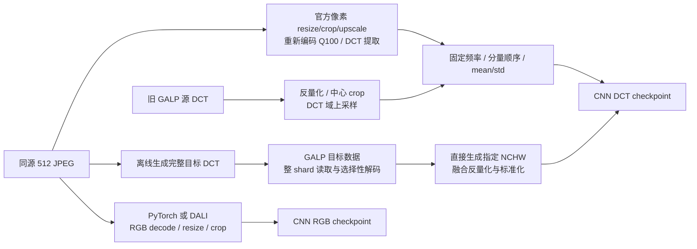
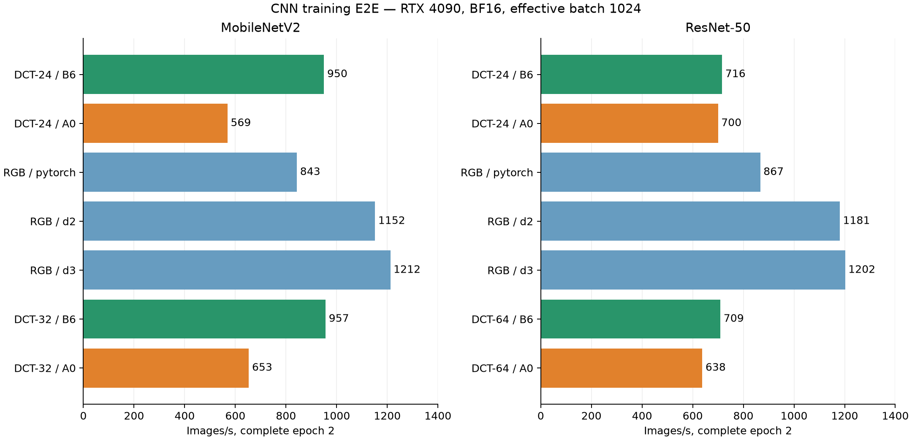
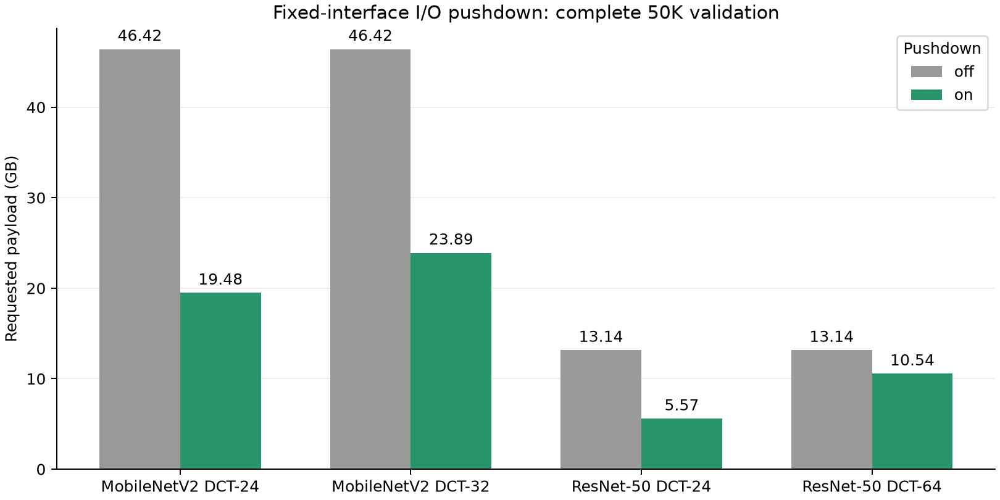
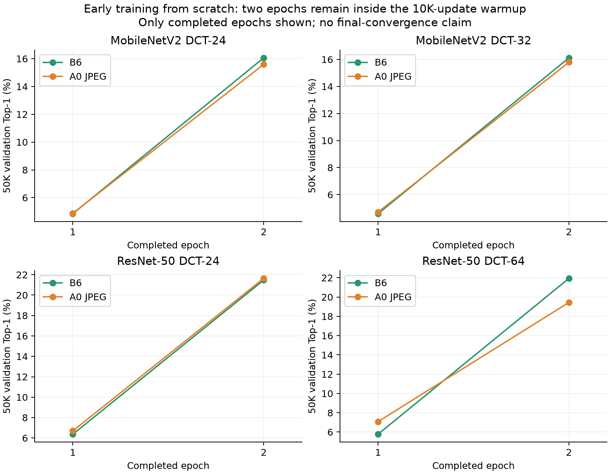
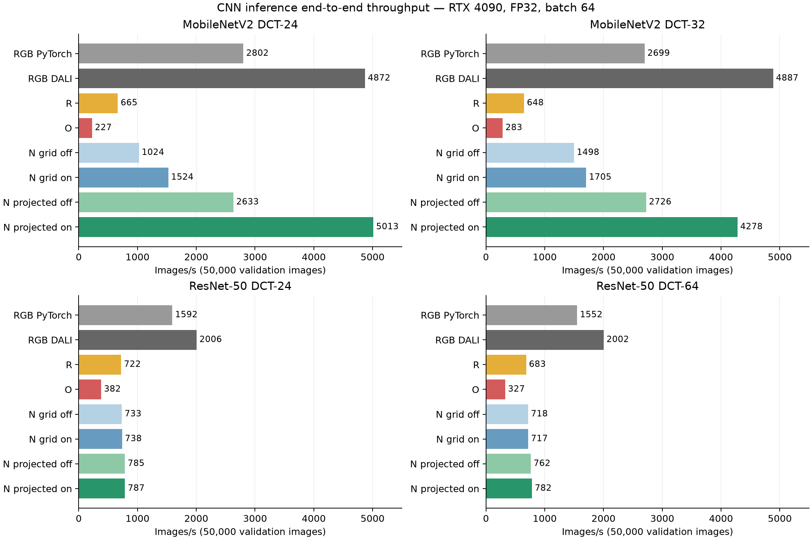
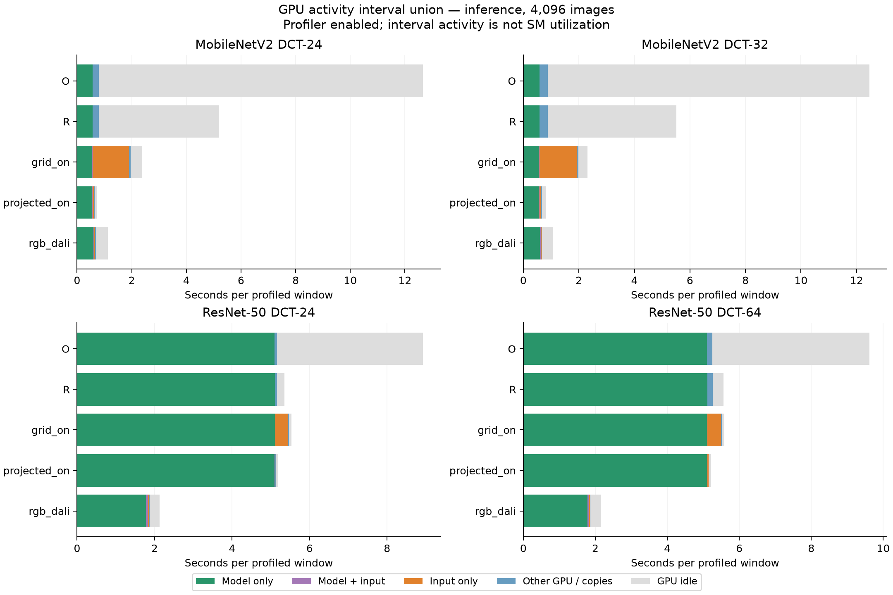
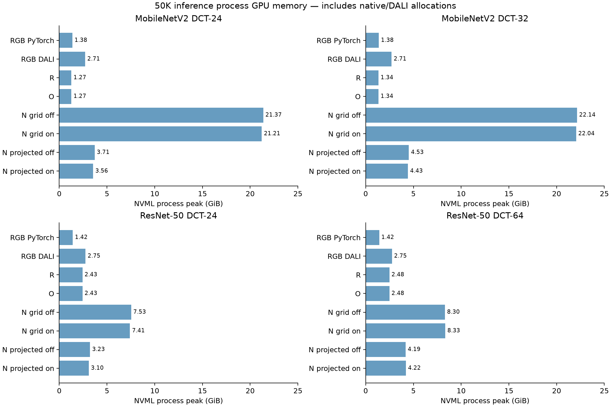

# GALP on CNN：端到端训练、推理与 I/O 性能报告

日期：2026-09-15
硬件：NVIDIA GeForce RTX 4090（24 GiB）；双路 Xeon Gold 5318Y，96 个逻辑 CPU
软件：PyTorch 2.11.0+cu128，torchvision 0.26.0+cu128，CUDA 12.8
数据集：ImageNet-1K，训练集 1,281,167 张，验证集 50,000 张
模型：MobileNetV2 DCT24/32、ResNet-50 DCT24/64，以及对应 RGB 模型

## 摘要

GALP 的 block-major 数据路径已在四个官方 CNN DCT 配置上完成推理和两轮从零训练。
推理采用同一配置的同一官方 DCT checkpoint 比较参考路径 R、新目标表示 N 与旧数据适配 O；
训练采用相同初始化、优化器和 DCT 增强数学，比较标准逐图 crop/global shuffle 的 A0 与
grouped crop/delayed shuffle 的 B6。两条训练路径有意保留各自的 crop/order 策略，不能称为逐样本增强完全等价。

本次推理复测的 40 个任务全部通过，包括 32 条完整 50K 路径、4 组 model-only 和 32 个 Nsight 窗口。
训练完成 14 条路径 × 2 epoch，以及 14 组 data-only 和 14 个训练 Nsight 窗口。
推理复测开始前等待 4090 无其他计算进程，运行中约每秒采样，未记录到其他计算进程竞争。
上轮 OOM 或竞争时段的推理补测不进入本报告主表；训练及其诊断没有同等粒度的独占监控，主机 page cache 也未受控。

主要结论是：**MobileNetV2 获得显著输入路径收益，ResNet-50 更接近模型计算上限；收益不能仅由压缩率解释。**

| 配置 | B6 训练 img/s | B6/A0 训练加速 | E2 Top-1：B6−A0 | N 推理 img/s | R/N 推理加速 | N 与 R 预测 |
| --- | --- | --- | --- | --- | --- | --- |
| MobileNetV2 DCT24 | 950.24 | 1.669× | 0.468 pp | 5,013.23 | 7.538× | 50K 完全一致 |
| MobileNetV2 DCT32 | 956.54 | 1.464× | 0.324 pp | 4,278.30 | 6.601× | 50K 完全一致 |
| ResNet-50 DCT24 | 716.11 | 1.023× | -0.170 pp | 786.61 | 1.089× | 50K 完全一致 |
| ResNet-50 DCT64 | 709.43 | 1.112× | 2.496 pp | 782.16 | 1.145× | 50K 完全一致 |

N 默认指 **projected + coefficient I/O pushdown on**。MobileNetV2 DCT24 的 N 为 9.97 s/50K，
RGB DALI 为 10.26 s；DCT32 的 N 为 11.69 s，RGB DALI 为 10.23 s。两者属于不同输入域和 checkpoint，
这里只比较完整系统，不把比值当作 reader 或压缩器的纯收益。

两轮训练仍处于 10,000-update warmup 内。本报告支持“当前早期训练未观察到明显发散”，
**不支持最终收敛不劣、统计等价或论文最终精度复现**。

## 1. 实验问题与证据结构

1. GALP 能否在保持官方 DCT 输入与预测的同时，消除在线目标 DCT 构造成本？
2. 固定频率的读取下推与直接生成所需布局，分别降低了多少 I/O、显存和端到端时间？
3. B6 的 grouped crop 与 delayed shuffle 能否驱动 CNN 训练，早期精度与标准 A0 有何差异？
4. 不同 CNN 的瓶颈是 CPU 输入、GPU DCT 变换、内存流量，还是模型计算？

| 证据 | 范围 | 可支持的解释 | 限制 |
| --- | --- | --- | --- |
| 训练 E2E | 14 路 × 完整 E1/E2 | 同样本数训练吞吐；E2 为主要 warm observation | 单次 epoch，非长期性能分布 |
| 收敛对照 | 4 个 DCT 配置 × A0/B6 × 2 epoch | 共同数据与初始化下的早期行为 | crop/order 不同；单 seed；仍在 warmup |
| 推理 E2E | 4 配置 × 8 路 × 50K | 相同 DCT checkpoint 下的 R/N/O；RGB 系统参照 | 每条主表只有一次完整运行，不报告 repeat CV 或 p95 |
| 训练/推理 Nsight | 16,384 / 4,096 张窗口 | GPU 活动、idle、overlap 和 copy bytes | profiler 开启；不能替代未插桩的完整 E2E |
| 进程内存 | 全部完整训练与推理 | NVML 含 native/DALI 的进程峰值 | 采样峰值；RSS 总和重复计算共享页 |

## 2. CNN 模型与数据路径

### 2.1 模型输入与计算量

模型是 **MobileNetV2，不是 MobileNetV3**。DCT 通道数是 Y、Cb、Cr 合计；以下仅覆盖本轮固定配置，
不是对可用架构或所有可能通道预算的穷举。MACs 按真实前向的 Conv/Linear 输出形状累计，不含其他算子。

| 模型 | 输入 C×H×W | Y/Cb/Cr 通道 | 参数 M | Conv/Linear GMAC/image | 驻留输入 FP32 ms/batch64 |
| --- | --- | --- | --- | --- | --- |
| MobileNetV2 DCT24 | 24×112×112 | 16/4/4 | 3.504 | 0.287 | 8.814 |
| MobileNetV2 DCT32 | 32×112×112 | 22/5/5 | 3.504 | 0.290 | 9.019 |
| ResNet-50 DCT24 | 24×56×56 | 16/4/4 | 25.535 | 13.565 | 79.942 |
| ResNet-50 DCT64 | 64×56×56 | 44/10/10 | 25.547 | 13.566 | 80.006 |
| MobileNetV2 RGB | 3×224×224 | RGB | 3.505 | 0.301 | 9.791 |
| ResNet-50 RGB | 3×224×224 | RGB | 25.557 | 4.089 | 28.534 |

ResNet DCT 的官方计算图在更大空间网格上执行后续层，约 13.56 GMAC/image，RGB 约 4.09 GMAC。
因此同属 ResNet-50 不代表同一计算工作量；固定通道选择不会自动降低后续主干 MAC。

RGB 使用 DCTNet 仓库引用的官方 RGB 权重。实验 wrapper 为仓库中缺少 forward 的基类补上标准 RGB forward，
并恢复 RGB stride；严格加载全部权重。DCT 模型保持官方结构。它不是把 DCT checkpoint 接到 RGB 网络。

### 2.2 推理 R、N、O 与 RGB



R 复用官方 OpenCV BGR loader 和参考算子：ResNet Resize 512、crop 448；MobileNet Resize 1024、crop 896；
均使用 bilinear upscale、JPEG quality 100、4:2:0 重新编码。Y 来自原 crop 分支，Cb/Cr 来自 2× 分支，
最终三个分量分别都是 56×56 或 112×112 blocks。

N 保存三个分量各完整 64 个自然频率的量化 int16 及正确量化表，位于模型标准化之前。
本数据的 Q100 量化表全为 1；仍明确只反量化一次，GALP zigzag 列索引显式映射至自然序 `u×8+v`。
`grid` 先形成完整 192 通道等价浮点网格再整理；`projected` 直接写选定通道的标准化 NCHW。
每个 shard 激活一次，49 个 shard 后按 batch64 推理，保留原 ordinal，最多一个当前 shard 和一个预取 shard。

O 解码旧 512/4:2:0 数据：Y 64² 中心裁至 56²，Cb/Cr 32² 裁至 28²，再在 DCT 域上采样至 56²；
MobileNet 继续把三个分量从 56² 放大至 112²。此适配器不做 round/clamp，不运行 RGB-no-more 224 profile 或 patch 换基。
它与官方像素放大再重新编码不同，R 与 O 不要求逐值相等。

### 2.3 训练 A0 与 B6

A0 从同源 JPEG 提取已反量化 DCT，以 16 个 DataLoader worker 执行逐图 crop/resize 和 global shuffle，
之后使用与 B6 共享的 GPU RandAugment/标准化/Mixup 实现。B6 从现有 premixed block-major 源 DCT 出发，
使用 G=1024 的 grouped crop、M=4 的 4096-image closed pool、delayed shuffle 和双 context lookahead。
训练 resize 需要源频率混合，保留全部源依赖，再输出固定模型需要的通道；不能将输出频率索引直接用于删除源频率。

通用优化包括：同几何调度复用、一次处理整组、增大每次 kernel 工作量、投影输出、原位增强与标准化。
输出网格、通道索引和 mean/std 来自 profile，不在 native runtime 中按 CNN 类名分支。
训练只为增强依赖保留所需的额外转置频率，使用 microbatch int16 scratch，避免完整 192 通道 float pool 和第二份 float 输出 pool。

## 3. 实验设置与公平性

### 3.1 训练设置

| 属性 | 设置 |
| --- | --- |
| 初始化 | 随机初始化，seed 11997733；构造官方模型后重置所有参数层；无 fine-tuning |
| 训练长度 | 每条路径完整 2 epoch；每轮 1,281,167 个不同样本，尾批保留；每轮后 50K validation |
| Batch / optimizer | 64 × accumulation16 = 1024；每轮 1252 次更新；AdamW＋独立 weight decay |
| Schedule / precision | 沿用 SwinV2 300-epoch 配方、10,000-update warmup；BF16 autocast＋Inductor；TF32 off |
| 计时 | E1 包含首次编译；E2 为主要 warm observation；每轮验证另计 |
| 数值与增强 | DCT resize 后 round 到整数并限制 int16；RandAugment clamp [-1024,1016]；标准化后 Mixup |
| CPU / native | A0 与 RGB PyTorch 16 workers，worker 内 torch1线程；DALI4线程；模型主进程 torch8线程 |
| B6 | M4 双 context，transform blocks/launch 32768；不重新压缩训练集 |
| Audit | 首100次更新同步检查；后续递延有限性检查；epoch 末检查参数和样本覆盖 |

A0/B6 共享模型、seed、源图像、频率与标准化、增强数学、optimizer/scheduler，但 crop/order 有意不同。
因此二者的准确率差衡量完整训练配置，不是仅替换 reader 的等语义 A/B。
RGB PyTorch/DALI D2 复用 Transformer 的计划 crop/flip；D3 使用 DALI-native crop/order。
RGB 训练是 224 RGB、mean/std 0.5、hard labels，不使用 DCT RandAugment/Mixup，不作为 DCT 收敛控制。

### 3.2 推理与测量边界

推理 batch64，FP32、TF32 off，每路完整50K，逐配置的 R/N/O 严格加载同一官方 DCT checkpoint；RGB 使用对应 RGB checkpoint。
R/O/RGB PyTorch 使用64个输入 workers；DALI的 workers 参数为其内部线程数，不能视为64个同类进程。
N 使用 native shard reader、4个 rowgroup prefetch workers、64-rowgroup decode batching 和512 MiB workset。
推理主表为单次完整运行，模型 warmup 排除，输入文件到 logits 的 E2E 包括 reader/loader 在线阶段；
进程启动、导入和模型构造另在 process wall/memory 口径中体现。

推理 Nsight 在16,384张 warmup 后捕获4,096张；训练在首个4096-image pool 后捕获16,384张，
这些训练窗口仍包含首100次更新的严格 audit。GPU 活跃时间使用 kernel/copy 区间并集，idle 不是 SM 利用率。
各内部阶段存在重叠，不能相加或从 wall 中相减得到模型常数。

page cache 未清空；其结果是当前机器与缓存状态下的系统观察。独立队列只管理自己的任务，
运行前检查和约1秒的进程采样不能构成硬件独占锁，也不能排除亚秒竞争或其他GPU任务造成的共享CPU/I/O影响。

## 4. 训练端到端性能

### 4.1 完整 Epoch 2

| 模型 | Pipeline | E2 wall s | img/s | E1 img/s | 输入等待 s | 模型 stream s |
| --- | --- | --- | --- | --- | --- | --- |
| MobileNetV2 DCT24 | B6 | 1,348.26 | 950.24 | 862.36 | 872.90 | 471.92 |
| MobileNetV2 DCT24 | A0 JPEG | 2,250.68 | 569.24 | 477.90 | 940.09 | 1,243.84 |
| MobileNetV2 RGB | rgb_pytorch | 1,519.47 | 843.17 | 824.03 | 127.36 | 1,286.08 |
| MobileNetV2 RGB | rgb_d2 | 1,112.43 | 1,151.68 | 1,125.72 | 113.23 | 933.58 |
| MobileNetV2 RGB | rgb_d3 | 1,056.86 | 1,212.24 | 1,179.73 | 29.27 | 991.34 |
| MobileNetV2 DCT32 | B6 | 1,339.37 | 956.54 | 901.62 | 851.94 | 482.23 |
| MobileNetV2 DCT32 | A0 JPEG | 1,960.48 | 653.50 | 482.24 | 516.86 | 1,362.39 |
| ResNet-50 DCT24 | B6 | 1,789.06 | 716.11 | 697.14 | 1.54 | 1,777.64 |
| ResNet-50 DCT24 | A0 JPEG | 1,829.81 | 700.16 | 694.46 | 775.03 | 1,766.77 |
| ResNet-50 RGB | rgb_pytorch | 1,477.94 | 866.86 | 842.31 | 128.04 | 1,253.95 |
| ResNet-50 RGB | rgb_d2 | 1,085.05 | 1,180.75 | 1,149.27 | 132.80 | 918.85 |
| ResNet-50 RGB | rgb_d3 | 1,065.85 | 1,202.02 | 1,213.92 | 42.98 | 1,008.20 |
| ResNet-50 DCT64 | B6 | 1,805.92 | 709.43 | 692.44 | 1.57 | 1,794.61 |
| ResNet-50 DCT64 | A0 JPEG | 2,008.34 | 637.92 | 633.49 | 688.13 | 1,891.46 |



图1：完整第二轮训练吞吐，DCT 同域对照与 RGB 系统参照分开呈现。同目录提供可导出的 PDF。

MobileNetV2 的 B6 输入等待约占 E2 的64%；相对于 A0，吞吐提高46%–67%，但仍低于 RGB DALI。
ResNet B6 的输入等待只有约1.5秒/epoch，模型 stream 时间接近整个epoch，因此更快 reader 只能带来有限 E2E 改善。

`model stream` 是 CUDA event 覆盖的流时间，不是 kernel 活跃时间；它包含主线程发射、audit 和流上其他工作的影响。
A0 的输入等待与模型流时间可以重叠，例如 ResNet DCT24 两项相加超过 wall，不能据此判断计时错误或相加分配百分比。

### 4.2 Model-only 与 data-only

训练 model-only 是固定64张 GPU 驻留输入的独立校准：先105次更新 warmup，再120次更新、122,880次样本呈现，
包含 forward/backward/optimizer/audit。**该校准从官方预训练权重开始，更新后丢弃；完整两轮训练则从零开始。**
它只用于计算工作诊断，不是同一训练状态的严格上限。

Data-only 每路20,480张。下表同时列完整短测和剔除首pool后的4个pool；后者避免把 DataLoader/DALI 启动成本误作稳态瓶颈。
它仍是短窗口，不是完整epoch，也不能用不同窗口的 E2E 减去 data-only。

| 模型 | 路径 | data-only 全5 pool img/s | 后4 pool img/s | 训练 model-only img/s |
| --- | --- | --- | --- | --- |
| MobileNetV2 DCT24 | jpeg | 513.39 | 542.58 | 3,315.40 |
| MobileNetV2 DCT24 | native | 953.89 | 965.91 | 3,315.40 |
| MobileNetV2 RGB | rgb_d2 | 447.94 | 6,035.63 | 3,201.49 |
| MobileNetV2 RGB | rgb_d3 | 1,472.47 | 5,912.93 | 3,201.49 |
| MobileNetV2 RGB | rgb_pytorch | 477.49 | 2,881.46 | 3,201.49 |
| MobileNetV2 DCT32 | jpeg | 477.99 | 502.90 | 3,244.50 |
| MobileNetV2 DCT32 | native | 946.21 | 958.36 | 3,244.50 |
| ResNet-50 DCT24 | jpeg | 1,924.57 | 2,278.44 | 754.28 |
| ResNet-50 DCT24 | native | 3,196.93 | 3,389.00 | 754.28 |
| ResNet-50 RGB | rgb_d2 | 442.70 | 6,040.63 | 1,876.50 |
| ResNet-50 RGB | rgb_d3 | 1,470.27 | 6,035.22 | 1,876.50 |
| ResNet-50 RGB | rgb_pytorch | 471.30 | 2,456.61 | 1,876.50 |
| ResNet-50 DCT64 | jpeg | 1,492.56 | 1,770.45 | 752.67 |
| ResNet-50 DCT64 | native | 3,090.37 | 3,257.12 | 752.67 |

MobileNet B6 data-only 后4 pool 约958–966 img/s，与完整 E2 的950–957 img/s 接近，
而独立模型校准约3245–3315 img/s，说明数据端仍是主要优化方向。
ResNet B6 data-only 约3257–3389 img/s，模型校准约753–754 img/s，完整训练约709–716 img/s，
进一步压缩输入时间的绝对空间较小。以上不是全局最优配置证明。

### 4.3 训练 Nsight critical path

| 模型 | 路径 | 窗口 s | GPU input s | model活跃 s | idle s | input/model重叠 s | 窗口H2D MiB |
| --- | --- | --- | --- | --- | --- | --- | --- |
| MobileNetV2 DCT24 | jpeg | 30.050 | 0.888 | 3.656 | 24.613 | 0.000 | 18,816.8 |
| MobileNetV2 DCT24 | native | 15.897 | 7.015 | 3.737 | 5.632 | 0.628 | 3,140.1 |
| MobileNetV2 DCT24 | rgb_d2 | 17.118 | 0.036 | 4.067 | 12.192 | 0.005 | 6,189.9 |
| MobileNetV2 DCT24 | rgb_d3 | 16.504 | 0.036 | 4.056 | 11.589 | 0.005 | 6,193.4 |
| MobileNetV2 DCT24 | rgb_pytorch | 23.659 | 0.000 | 3.981 | 19.218 | 0.000 | 9,408.1 |
| MobileNetV2 DCT32 | jpeg | 32.663 | 0.933 | 3.700 | 26.769 | 0.000 | 26,656.9 |
| MobileNetV2 DCT32 | native | 16.060 | 7.138 | 3.810 | 5.649 | 0.682 | 3,140.1 |
| ResNet-50 DCT24 | jpeg | 24.772 | 0.198 | 21.556 | 2.765 | 0.000 | 4,704.8 |
| ResNet-50 DCT24 | native | 23.964 | 4.289 | 22.251 | 1.233 | 3.847 | 1,528.2 |
| ResNet-50 DCT24 | rgb_d2 | 16.561 | 0.044 | 8.619 | 7.297 | 0.021 | 6,189.9 |
| ResNet-50 DCT24 | rgb_d3 | 16.696 | 0.044 | 8.621 | 7.434 | 0.019 | 6,193.4 |
| ResNet-50 DCT24 | rgb_pytorch | 23.121 | 0.000 | 8.549 | 14.102 | 0.000 | 9,408.1 |
| ResNet-50 DCT64 | jpeg | 27.660 | 0.259 | 21.579 | 5.128 | 0.000 | 14,113.3 |
| ResNet-50 DCT64 | native | 24.051 | 4.578 | 22.388 | 1.116 | 4.081 | 1,528.2 |


图2：16,384张训练窗口的GPU活动区间分解；重叠单独列出，灰色为无GPU活动。同目录提供可导出的 PDF。

B6 MobileNet 的 GPU input 约7.0–7.1秒，model 活跃约3.7–3.8秒，仍有约5.6秒 idle。
ResNet B6 的 model 活跃约22.3秒，input/model 重叠约3.8–4.1秒，idle 约1.1–1.2秒。
模型越重，越容易隐藏下一pool的准备；这与完整epoch输入等待的差异一致。

DALI 表中的 input 只统计其 GPU kernel 活动；nvJPEG、H2D 和其他 copy 另有区间，不能把很小的 input 值解释为零预处理成本。
图中保留其他GPU活动，避免把未归入 input/model 的工作误作 idle。

### 4.4 Native pool 准备与共享调度

| 配置 | 计划累计 s | active-output 调度 s | DCT transform累计 s | pool准备累计 s | 暴露 activation wait s |
| --- | --- | --- | --- | --- | --- |
| MobileNetV2 DCT24 | 76.53 | 436.91 | 677.60 | 1,346.42 | 872.87 |
| MobileNetV2 DCT32 | 57.01 | 433.93 | 683.10 | 1,335.86 | 851.72 |
| ResNet-50 DCT24 | 57.15 | 108.06 | 362.89 | 629.16 | 1.30 |
| ResNet-50 DCT64 | 57.12 | 108.10 | 374.64 | 652.49 | 1.37 |

内部累计计时可能嵌套，表中不得求和。四个配置均激活313个pool并使用最多两个context。
MobileNet112网格的调度和DCT变换成本明显高于ResNet56网格；当前共享几何复用已消除大量重复工作，仍没有消除真实的上采样计算。
此前 MobileNet DCT24 的同16,384张 trace 从31.31秒降至15.71秒，主要来自扩大 kernel 工作批量和调度复用；
这是历史优化前后诊断，不混入本次各路径主表。

## 5. 存储、I/O 下推与数据移动

### 5.1 离线目标数据与存储成本

训练复用现有106.946 GB premixed FLS源布局；源训练JPEG inventory约50.601 GB，
FLS约为2.114倍。本轮没有重新压缩训练集。
推理N母数据分别保存三个分量的完整64频率，50K各49个shard；量化系数和量化表回读检查通过，样本映射一致。
下面是实际生成任务记录，生成 worker 时间和编码时间为跨任务累计，不与wall相加。

| 目标 | 样本 | shard | 生成wall s | img/s | 生成worker/shard并行/编码线程 | 生成worker累计 s | 编码累计 s | 生成记录磁盘 GB |
| --- | --- | --- | --- | --- | --- | --- | --- | --- |
| ResNet：3×64×56×56 | 50000 | 49 | 258.35 | 193.54 | 16/16/4 | 936.85 | 1,884.82 | 13.339 |
| MobileNet：3×64×112×112 | 50000 | 49 | 2,749.47 | 18.19 | 16/4/8 | 3,348.80 | 6,601.06 | 47.056 |

源validation JPEG inventory为2.052 GB。N专用目标表示的存储代价很大，尤其是112网格；
生成记录的磁盘大小不等于后续新增access sidecar后的所有文件总和。完整频率母数据便于固定模型复用，
但不是所有模型通用输入，不能把其存储代价与GALP无损编码收益混在一起。
目前只有有限并发校准与实际任务记录，没有证明编码配置达到全机最优；大网格的生成/编码仍是主要离线成本。

### 5.2 B6 训练 crop pushdown

四个CNN配置的第二轮源读取计数完全一致，说明源数据选择不依赖backbone：

| 计数层次 | E2 实测 | 解释 |
| --- | --- | --- |
| 完整源blocks | 7,871,490,048 | 512/4:2:0，每图6144个源block |
| 进入transform的源blocks | 4,187,759,520 | 53.202% retention |
| 选择/触及rowgroup完整vectors | 4,089,642 / 5,648,603 | 72.401% retention |
| 触及rowgroup完整payload | 74.568 GB | 已排除未触及rowgroup |
| 精确选择payload | 55.384 GB | 范围选择下界 |
| 实际payload范围读取 | 57.865 GB | 约1.0448×相对精确选择；非SSD设备流量 |
| Workset DMA | 84.264 GB | 包含压缩数据与执行metadata |
| 重复物理读取计数 | 0 | native报告无重复读取 |

B6相对触及rowgroup的完整payload少读22.40%，源block工作减少46.80%。
读取下推、输出通道投影和输出网格大小是不同层次；本轮训练不能按最终通道数直接删掉resize所需的源频率。

### 5.3 推理固定频率 I/O 下推与物化消融

| 配置 | off请求 GB | on请求 GB | 请求减少 | off DMA GB | on DMA GB | projected off/on E2E加速 |
| --- | --- | --- | --- | --- | --- | --- |
| MobileNetV2 DCT24 | 46.417 | 19.479 | 58.04% | 50.396 | 20.310 | 1.904× |
| MobileNetV2 DCT32 | 46.417 | 23.894 | 48.52% | 50.396 | 25.121 | 1.570× |
| ResNet-50 DCT24 | 13.145 | 5.572 | 57.61% | 14.112 | 5.762 | 1.002× |
| ResNet-50 DCT64 | 13.145 | 10.541 | 19.81% | 14.112 | 11.183 | 1.026× |



图3：同一完整目标数据上的固定频率I/O下推，统计实际请求范围。同目录提供可导出的 PDF。

下推已到文件payload范围层，不只是选择性解码或少上传。当前列布局按三个分量所需频率的并集选择，
不能把模型合计24/32/64通道直接理解为只读24/32/64个独立物理分量列。
on/off在同一母数据上产生相同最终输入和50K预测；ResNet中少读字节没有等比例转换为吞吐，因为其模型已占主要时间。

`requested bytes`是reader发出的文件范围；没有清空page cache，不等于NVMe流量。
本轮进程采样另记录`read_bytes/read_chars`，但边界覆盖进程启动和IPC，且短命worker可能漏采，
不将它们外推为精确SSD收益。R→N包含离线预计算；只有同N数据的off/on才用于隔离固定列下推收益。

## 6. 训练收敛

### 6.1 四个 DCT 配置的两轮配对结果

每个数字来自该轮后完整50K验证；验证统一使用对应N目标表示。训练DCT域crop/resize与官方参考像素变换并不等价，
但A0和B6共享验证路径，因此比较口径一致。

| 模型 | Epoch | A0 Top-1% | B6 Top-1% | Δ pp | A0 Top-5% | B6 Top-5% | A0 CE | B6 CE |
| --- | --- | --- | --- | --- | --- | --- | --- | --- |
| MobileNetV2 DCT24 | 1 | 4.878 | 4.846 | -0.032 | 14.962 | 14.910 | 5.4861 | 5.5351 |
| MobileNetV2 DCT24 | 2 | 15.596 | 16.064 | 0.468 | 36.082 | 36.440 | 4.3269 | 4.2977 |
| MobileNetV2 DCT32 | 1 | 4.708 | 4.590 | -0.118 | 14.752 | 14.130 | 5.5271 | 5.5812 |
| MobileNetV2 DCT32 | 2 | 15.794 | 16.118 | 0.324 | 36.154 | 36.396 | 4.3100 | 4.2850 |
| ResNet-50 DCT24 | 1 | 6.694 | 6.370 | -0.324 | 19.480 | 18.340 | 5.2182 | 5.2870 |
| ResNet-50 DCT24 | 2 | 21.646 | 21.476 | -0.170 | 45.748 | 45.388 | 3.8512 | 3.8449 |
| ResNet-50 DCT64 | 1 | 7.080 | 5.774 | -1.306 | 20.306 | 17.506 | 5.1588 | 5.3581 |
| ResNet-50 DCT64 | 2 | 19.446 | 21.942 | 2.496 | 42.550 | 45.930 | 4.1855 | 3.8134 |



图4：单seed前两轮50K验证精度，仍处于学习率warmup阶段。同目录提供可导出的 PDF。

第二轮B6−A0 Top-1差分别为+0.468、+0.324、−0.170和+2.496 pp。
ResNet DCT24的Top-1略低而CE略好；ResNet DCT64的早期优势也不能直接推断为最终优势。
完成两轮只能证明训练可运行、数值稳定和当前早期表现，尚不能满足“最终收敛不劣”的强要求。

### 6.2 RGB 训练参照

RGB路径的第二轮Top-1、Top-5、CE列在下表，只用于检查其训练进展，不与DCT增强recipe混作收敛控制。

| 模型 | RGB路径 | Top-1% | Top-5% | CE |
| --- | --- | --- | --- | --- |
| MobileNetV2 RGB | rgb_pytorch | 19.236 | 40.554 | 4.0798 |
| MobileNetV2 RGB | rgb_d2 | 19.460 | 40.934 | 4.0675 |
| MobileNetV2 RGB | rgb_d3 | 18.704 | 40.132 | 4.1126 |
| ResNet-50 RGB | rgb_pytorch | 22.898 | 45.836 | 3.8758 |
| ResNet-50 RGB | rgb_d2 | 23.808 | 47.220 | 3.7987 |
| ResNet-50 RGB | rgb_d3 | 22.520 | 46.560 | 3.8590 |

## 7. 推理端到端性能

### 7.1 完整50K、全部baseline

以下均为本次无已检测GPU竞争的重测；每个配置中的RGB行使用相同RGB checkpoint重复运行，
不是额外的RGB通道预算。吞吐、精度与计时按同一行的实际结果对应。

#### MobileNetV2 DCT24

| 路径 | wall s | img/s | Top-1% | Top-5% | CE | 输入等待 s | 模型 s |
| --- | --- | --- | --- | --- | --- | --- | --- |
| RGB PyTorch | 17.85 | 2,801.70 | 70.746 | 89.676 | 1.1985 | 2.38 | 11.10 |
| RGB DALI | 10.26 | 4,871.78 | 70.788 | 89.694 | 1.1966 | 0.23 | 8.26 |
| R | 75.18 | 665.10 | 69.440 | 88.940 | 1.2461 | 58.07 | 10.40 |
| O | 220.24 | 227.03 | 67.652 | 87.996 | 1.3234 | 202.54 | 10.44 |
| N grid off | 48.82 | 1,024.19 | 69.440 | 88.940 | 1.2461 | 37.05 | 8.72 |
| N grid on | 32.82 | 1,523.69 | 69.440 | 88.940 | 1.2461 | 13.20 | 15.24 |
| N projected off | 18.99 | 2,633.32 | 69.440 | 88.940 | 1.2461 | 10.85 | 7.42 |
| N projected on | 9.97 | 5,013.23 | 69.440 | 88.940 | 1.2461 | 1.82 | 7.49 |

#### MobileNetV2 DCT32

| 路径 | wall s | img/s | Top-1% | Top-5% | CE | 输入等待 s | 模型 s |
| --- | --- | --- | --- | --- | --- | --- | --- |
| RGB PyTorch | 18.52 | 2,699.08 | 70.746 | 89.676 | 1.1985 | 3.62 | 10.35 |
| RGB DALI | 10.23 | 4,886.68 | 70.788 | 89.694 | 1.1966 | 0.21 | 8.27 |
| R | 77.15 | 648.12 | 70.428 | 89.670 | 1.1968 | 57.66 | 11.12 |
| O | 176.72 | 282.94 | 69.520 | 89.248 | 1.2384 | 162.01 | 8.30 |
| N grid off | 33.39 | 1,497.67 | 70.428 | 89.670 | 1.1968 | 17.92 | 13.07 |
| N grid on | 29.33 | 1,704.82 | 70.428 | 89.670 | 1.1968 | 3.04 | 22.28 |
| N projected off | 18.34 | 2,725.85 | 70.428 | 89.670 | 1.1968 | 9.97 | 7.73 |
| N projected on | 11.69 | 4,278.30 | 70.428 | 89.670 | 1.1968 | 3.34 | 7.70 |

#### ResNet-50 DCT24

| 路径 | wall s | img/s | Top-1% | Top-5% | CE | 输入等待 s | 模型 s |
| --- | --- | --- | --- | --- | --- | --- | --- |
| RGB PyTorch | 31.40 | 1,592.43 | 74.784 | 92.308 | 1.0095 | 2.25 | 23.94 |
| RGB DALI | 24.93 | 2,005.72 | 74.870 | 92.288 | 1.0063 | 0.23 | 22.94 |
| R | 69.24 | 722.11 | 75.386 | 92.884 | 1.0009 | 2.91 | 63.04 |
| O | 131.03 | 381.60 | 75.718 | 92.986 | 0.9899 | 65.16 | 62.72 |
| N grid off | 68.22 | 732.90 | 75.386 | 92.884 | 1.0009 | 0.34 | 66.92 |
| N grid on | 67.75 | 737.98 | 75.386 | 92.884 | 1.0009 | 0.28 | 66.61 |
| N projected off | 63.69 | 785.01 | 75.386 | 92.884 | 1.0009 | 0.27 | 62.87 |
| N projected on | 63.56 | 786.61 | 75.386 | 92.884 | 1.0009 | 0.21 | 62.74 |

#### ResNet-50 DCT64

| 路径 | wall s | img/s | Top-1% | Top-5% | CE | 输入等待 s | 模型 s |
| --- | --- | --- | --- | --- | --- | --- | --- |
| RGB PyTorch | 32.22 | 1,551.75 | 74.784 | 92.308 | 1.0095 | 3.31 | 23.78 |
| RGB DALI | 24.97 | 2,002.49 | 74.870 | 92.288 | 1.0063 | 0.25 | 22.98 |
| R | 73.17 | 683.38 | 75.272 | 92.746 | 1.0064 | 4.40 | 63.60 |
| O | 153.06 | 326.66 | 74.172 | 92.216 | 1.0589 | 82.29 | 65.51 |
| N grid off | 69.69 | 717.51 | 75.272 | 92.746 | 1.0064 | 0.51 | 67.18 |
| N grid on | 69.74 | 716.94 | 75.272 | 92.746 | 1.0064 | 0.52 | 67.13 |
| N projected off | 65.59 | 762.31 | 75.272 | 92.746 | 1.0064 | 0.51 | 63.65 |
| N projected on | 63.93 | 782.16 | 75.272 | 92.746 | 1.0064 | 0.24 | 63.00 |



图5：完整50K推理吞吐，包含RGB、官方参考、旧适配和四种N执行方式。同目录提供可导出的 PDF。

MobileNet R的输入等待约58秒，而N projected on降至1.8–3.3秒；这是其大幅E2E收益的直接表现。
ResNet R已经主要被约63秒模型时间限制，N projected on为63.6–63.9秒，因此相对R只提高约9%–14%。
RGB ResNet的模型时间约23秒，不能要求GALP通过输入优化补偿DCT模型约3.3倍的Conv/Linear计算量。

O不重写旧数据，但当前CPU适配链路耗时明显：MobileNet O的输入等待162–203秒，ResNet为65–82秒。
其Top-1相对R分别为−1.788、−0.908、+0.332、−1.100 pp。O可作为兼容已有存储的路径，
当前实现不适合作为追求吞吐的默认路径；也不支持“所有模型精度都不降”的结论。

### 7.2 GPU critical path 与完整网格物化



图6：4,096张推理窗口的GPU活动分解；选择代表性路径解释输入与模型瓶颈。同目录提供可导出的 PDF。

MobileNet DCT24从grid on切换projected on，GPU input活跃从1.345秒降至0.065秒/4096张，
model活跃维持约0.57秒，窗口从2.382秒降至0.715秒。DCT32对应input从1.344秒降至0.072秒。
优化消除了完整192通道浮点网格和后续gather/permute/normalization的主要流量，直接生成模型所需输出布局。

ResNet projected on的model活跃约5.11秒，窗口约5.19–5.22秒，GPU idle仅约0.065–0.069秒。
此时进一步下推仍节省I/O与中间存储，吞吐提升自然较小。这不是GALP没有做下推，也不是已证明全局最优。

R/O的GPU input列为0，表示输入主要在CPU执行；不能理解为它们没有预处理成本。
固定模型的model-only应当相近，但在线model事件可受并发输入kernel和流竞争影响，grid与projected间的model计时差不能当作网络MAC变化。

### 7.3 全路径推理 Nsight 数值

| 模型 | 路径 | 窗口 s | GPU input s | model活跃 s | idle s | input/model重叠 s | 窗口H2D MiB |
| --- | --- | --- | --- | --- | --- | --- | --- |
| MobileNetV2 DCT24 | O | 12.666 | 0.000 | 0.568 | 11.875 | 0.000 | 4,704.0 |
| MobileNetV2 DCT24 | R | 5.185 | 0.000 | 0.573 | 4.389 | 0.000 | 4,704.0 |
| MobileNetV2 DCT24 | grid_off | 2.346 | 1.219 | 0.565 | 0.392 | 0.005 | 3,389.1 |
| MobileNetV2 DCT24 | grid_on | 2.382 | 1.345 | 0.573 | 0.424 | 0.014 | 1,583.7 |
| MobileNetV2 DCT24 | projected_off | 1.179 | 0.093 | 0.564 | 0.410 | 0.006 | 3,281.7 |
| MobileNetV2 DCT24 | projected_on | 0.715 | 0.065 | 0.568 | 0.078 | 0.015 | 1,560.1 |
| MobileNetV2 DCT24 | rgb_dali | 1.123 | 0.055 | 0.632 | 0.435 | 0.028 | 3,082.8 |
| MobileNetV2 DCT24 | rgb_pytorch | 1.370 | 0.000 | 0.616 | 0.641 | 0.000 | 2,352.0 |
| MobileNetV2 DCT32 | O | 12.463 | 0.000 | 0.579 | 11.587 | 0.000 | 6,272.0 |
| MobileNetV2 DCT32 | R | 5.507 | 0.000 | 0.587 | 4.623 | 0.000 | 6,272.0 |
| MobileNetV2 DCT32 | grid_off | 2.418 | 1.221 | 0.580 | 0.448 | 0.004 | 3,389.0 |
| MobileNetV2 DCT32 | grid_on | 2.316 | 1.344 | 0.588 | 0.337 | 0.014 | 1,940.1 |
| MobileNetV2 DCT32 | projected_off | 1.191 | 0.112 | 0.579 | 0.384 | 0.007 | 3,353.4 |
| MobileNetV2 DCT32 | projected_on | 0.822 | 0.072 | 0.581 | 0.151 | 0.013 | 1,821.2 |
| MobileNetV2 DCT32 | rgb_dali | 1.076 | 0.057 | 0.633 | 0.397 | 0.030 | 3,082.8 |
| MobileNetV2 DCT32 | rgb_pytorch | 1.421 | 0.000 | 0.615 | 0.692 | 0.000 | 2,352.0 |
| ResNet-50 DCT24 | O | 8.931 | 0.000 | 5.099 | 3.773 | 0.000 | 1,176.0 |
| ResNet-50 DCT24 | R | 5.356 | 0.000 | 5.102 | 0.195 | 0.000 | 1,176.0 |
| ResNet-50 DCT24 | grid_off | 5.576 | 0.379 | 5.112 | 0.079 | 0.008 | 1,096.4 |
| ResNet-50 DCT24 | grid_on | 5.535 | 0.349 | 5.112 | 0.070 | 0.009 | 448.3 |
| ResNet-50 DCT24 | projected_off | 5.205 | 0.039 | 5.113 | 0.064 | 0.014 | 1,096.4 |
| ResNet-50 DCT24 | projected_on | 5.190 | 0.024 | 5.109 | 0.065 | 0.012 | 448.3 |
| ResNet-50 DCT24 | rgb_dali | 2.132 | 0.075 | 1.833 | 0.262 | 0.052 | 3,082.8 |
| ResNet-50 DCT24 | rgb_pytorch | 2.299 | 0.000 | 1.819 | 0.367 | 0.000 | 2,352.0 |
| ResNet-50 DCT64 | O | 9.614 | 0.000 | 5.101 | 4.361 | 0.000 | 3,136.0 |
| ResNet-50 DCT64 | R | 5.565 | 0.000 | 5.109 | 0.306 | 0.000 | 3,136.0 |
| ResNet-50 DCT64 | grid_off | 5.600 | 0.407 | 5.114 | 0.072 | 0.009 | 1,096.4 |
| ResNet-50 DCT64 | grid_on | 5.583 | 0.390 | 5.117 | 0.071 | 0.010 | 867.4 |
| ResNet-50 DCT64 | projected_off | 5.232 | 0.060 | 5.117 | 0.065 | 0.013 | 1,096.4 |
| ResNet-50 DCT64 | projected_on | 5.217 | 0.041 | 5.118 | 0.069 | 0.015 | 867.4 |
| ResNet-50 DCT64 | rgb_dali | 2.147 | 0.072 | 1.833 | 0.279 | 0.051 | 3,082.8 |
| ResNet-50 DCT64 | rgb_pytorch | 2.229 | 0.000 | 1.819 | 0.295 | 0.000 | 2,352.0 |

### 7.4 进程内存与显存

推理与训练均采用NVML进程显存约100 ms采样；该值包含Torch之外的native/DALI分配。
Torch allocated/reserved是其他口径，不能直接相加。下列推理RSS为完整进程生命周期峰值，
包括启动与预取；进程树RSS总和重复计算共享页，不是独占物理内存或PSS。

| 模型 | 路径 | NVML GiB | 主进程RSS GiB | 进程树RSS总和 GiB |
| --- | --- | --- | --- | --- |
| MobileNetV2 DCT24 | RGB PyTorch | 1.379 | 5.437 | 58.267 |
| MobileNetV2 DCT24 | RGB DALI | 2.715 | 2.813 | 2.813 |
| MobileNetV2 DCT24 | R | 1.271 | 12.247 | 76.809 |
| MobileNetV2 DCT24 | O | 1.271 | 15.187 | 85.634 |
| MobileNetV2 DCT24 | N grid off | 21.371 | 2.081 | 2.081 |
| MobileNetV2 DCT24 | N grid on | 21.215 | 2.051 | 2.051 |
| MobileNetV2 DCT24 | N projected off | 3.713 | 2.028 | 2.028 |
| MobileNetV2 DCT24 | N projected on | 3.557 | 1.952 | 1.952 |
| MobileNetV2 DCT32 | RGB PyTorch | 1.379 | 6.131 | 58.987 |
| MobileNetV2 DCT32 | RGB DALI | 2.715 | 2.813 | 2.813 |
| MobileNetV2 DCT32 | R | 1.342 | 11.022 | 76.441 |
| MobileNetV2 DCT32 | O | 1.342 | 9.186 | 81.471 |
| MobileNetV2 DCT32 | N grid off | 22.139 | 2.065 | 2.065 |
| MobileNetV2 DCT32 | N grid on | 22.045 | 2.028 | 2.028 |
| MobileNetV2 DCT32 | N projected off | 4.525 | 2.013 | 2.013 |
| MobileNetV2 DCT32 | N projected on | 4.432 | 1.987 | 1.987 |
| ResNet-50 DCT24 | RGB PyTorch | 1.418 | 9.042 | 64.362 |
| ResNet-50 DCT24 | RGB DALI | 2.754 | 2.855 | 2.855 |
| ResNet-50 DCT24 | R | 2.432 | 5.244 | 66.769 |
| ResNet-50 DCT24 | O | 2.432 | 3.509 | 69.665 |
| ResNet-50 DCT24 | N grid off | 7.533 | 1.892 | 1.892 |
| ResNet-50 DCT24 | N grid on | 7.408 | 1.895 | 1.895 |
| ResNet-50 DCT24 | N projected off | 3.227 | 1.847 | 1.847 |
| ResNet-50 DCT24 | N projected on | 3.102 | 1.824 | 1.824 |
| ResNet-50 DCT64 | RGB PyTorch | 1.418 | 9.041 | 64.205 |
| ResNet-50 DCT64 | RGB DALI | 2.754 | 2.856 | 2.856 |
| ResNet-50 DCT64 | R | 2.482 | 8.800 | 70.326 |
| ResNet-50 DCT64 | O | 2.482 | 5.393 | 73.321 |
| ResNet-50 DCT64 | N grid off | 8.303 | 1.933 | 1.933 |
| ResNet-50 DCT64 | N grid on | 8.334 | 1.925 | 1.925 |
| ResNet-50 DCT64 | N projected off | 4.186 | 1.918 | 1.918 |
| ResNet-50 DCT64 | N projected on | 4.217 | 1.903 | 1.903 |



图7：推理NVML进程显存峰值；projected输出避免完整192通道浮点网格。同目录提供可导出的 PDF。

MobileNet grid消耗约21–22 GiB，projected on约3.56/4.43 GiB，下降约80%–83%。
ResNet grid约7.4–8.3 GiB，projected on约3.10/4.22 GiB。
这说明只看Torch allocator会漏掉大量native内存，也说明完整网格物化确实是重要成本。

训练的完整两轮进程峰值如下，包含各轮验证，与早先8192张probe的峰值不是同一口径。

| 训练模型 | 路径 | NVML GiB | Torch allocated GiB | Torch reserved GiB | 主进程RSS GiB |
| --- | --- | --- | --- | --- | --- |
| MobileNetV2 DCT24 | B6 | 14.311 | 1.606 | 2.414 | 6.655 |
| MobileNetV2 DCT24 | A0 JPEG | 5.123 | 1.678 | 2.486 | 7.673 |
| MobileNetV2 RGB | rgb_pytorch | 3.027 | 1.747 | 2.555 | 6.534 |
| MobileNetV2 RGB | rgb_d2 | 3.312 | 1.711 | 2.518 | 6.842 |
| MobileNetV2 RGB | rgb_d3 | 3.312 | 1.711 | 2.518 | 6.521 |
| MobileNetV2 DCT32 | B6 | 17.377 | 1.645 | 2.449 | 6.616 |
| MobileNetV2 DCT32 | A0 JPEG | 4.684 | 1.747 | 2.553 | 7.680 |
| ResNet-50 DCT24 | B6 | 12.525 | 6.485 | 8.354 | 5.289 |
| ResNet-50 DCT24 | A0 JPEG | 9.227 | 6.503 | 8.373 | 3.927 |
| ResNet-50 RGB | rgb_pytorch | 4.443 | 3.042 | 3.971 | 6.045 |
| ResNet-50 RGB | rgb_d2 | 4.729 | 3.008 | 3.934 | 6.350 |
| ResNet-50 RGB | rgb_d3 | 4.729 | 3.008 | 3.934 | 6.031 |
| ResNet-50 DCT64 | B6 | 17.062 | 6.500 | 8.371 | 5.332 |
| ResNet-50 DCT64 | A0 JPEG | 9.914 | 6.555 | 8.426 | 4.998 |

B6完整训练NVML峰值约12.5–17.4 GiB，明显高于A0的约4.7–9.9 GiB，是维持大pool、预取和GPU变换的成本。
原位投影已经减少额外float pool，但它不意味着B6内存小于逐图CPU baseline。

### 7.5 正确性

16条N执行路径各自50K预测与同配置R完全一致，Top-1/Top-5一致；CE只存在约10⁻⁹量级归约差异。
原始目标数据生成记录确认量化系数与量化表无损回读，抽样输入/logits检查另保留原始验证产物。
这支持“本合同下GALP保存和读取没有改变参考预测”，不外推为任意JPEG/DCT接口的完全等价。
O使用不同DCT域几何，不要求输入或预测与R一致；RGB PyTorch/DALI也有decoder/resize实现差异。

## 8. 与 ViT-Ti、SwinV2-T 的关系

本报告沿用SwinV2报告的证据结构，补齐CNN的训练、推理、data-only、Nsight和进程内存。
共同的可迁移边界是block-major存储、crop-before-materialize、压缩workset上传、native调度和profile驱动的输出投影，
不依赖ViT token拓扑、Swin窗口结构或CNN类名。

四个CNN配置的B6第二轮均读取57.865 GB payload、源block retention 53.202%，与SwinV2的同源布局计数相符。
这体现数据选择规则的可迁移性，不意味着性能也必须相同。CNN采用DCTNet的56/112分量网格，
SwinV2训练采用28/14分量网格；数据输出大小与模型计算窗口均不同。

SwinV2报告中的严格DCT pair共享crop/order；本CNN A0/B6有意比较global/per-image与grouped/delayed策略。
SwinV2的15-epoch配对收敛证据也强于本CNN的2-epoch warmup证据。因此不把跨报告绝对吞吐或非劣结论直接移植。

## 9. 可展示的结论与限制

### 9.1 证据支持的结论

- 四个官方DCT CNN配置均可由GALP驱动；完整训练和推理没有样本丢失或重复映射。
- N保持同checkpoint的50K预测，与R相比MobileNet获6.60–7.54×推理加速，ResNet获1.09–1.14×。
- 固定频率下推已减少实际文件请求范围约19.8%–58.0%；这与预计算收益可分别观察。
- projected布局显著减少GPU输入kernel工作和进程显存；MobileNet约80%–83%的grid显存峰值下降是直接证据。
- B6的完整E2训练相对A0提高1.02–1.67×；MobileNet仍受数据供给约束，ResNet主要受模型约束。

### 9.2 尚不能支持的结论

- 两轮warmup不能证明最终收敛不劣；单seed不能证明统计等价。
- 不同RGB/DCT计算图和checkpoint的比值不是纯reader/codec加速比。
- 有限并发校准、单次50K及单epoch观察不能证明全局最优、稳定p95或跨机器泛化。
- reader范围字节不等于SSD流量；NVML采样峰值不是理论最大峰值；RSS总和不是PSS。
- kernel/copy区间的idle不是SM利用率；累计阶段计时不相加。
- 推理复测未观察到其他GPU计算进程，仍不能排除亚秒竞争或共享CPU/I/O影响；训练没有同等独占审计。

### 9.3 下一步优先级

若目标是部署吞吐，优先采用N projected＋固定接口I/O下推；O保留为不重写旧数据的兼容方案。
若目标是CNN训练系统优化，优先处理MobileNet112网格的CPU调度和GPU DCT变换供给，
而不是继续压缩已被ResNet计算隐藏的几毫秒输入等待。
若目标是正式声明收敛不劣，应先扩大A0/B6共同训练前缀至warmup之后；本次报告不以两轮结果替代这一证据。

## 10. 原始证据与可复现性

### 10.1 实际路径与运行入口

| 对象 | 实际路径 |
| --- | --- |
| 报告对应推理运行 | [rtx4090_cnn_memory_isolated_20260915](/home/tangyuxin/gfastlanes/FastLanes/galp/data/system_rgbnomore/e2e_v3/runs/dctnet_mobilenet24/rtx4090_cnn_memory_isolated_20260915) |
| 完整CSV与原始汇总 | [rtx4090_cnn_complete_20260914](/home/tangyuxin/gfastlanes/FastLanes/galp/data/system_rgbnomore/e2e_v3/runs/dctnet_mobilenet24/rtx4090_cnn_complete_20260914) |
| 同源图像 | [imagenet_512](/home/tangyuxin/gfastlanes/FastLanes/galp/data/system_rgbnomore/e2e_v3/imagenet_512) |
| 训练/验证manifest | [training_manifests_official_v3](/home/tangyuxin/gfastlanes/FastLanes/galp/data/system_rgbnomore/e2e_v3/training_manifests_official_v3) |
| 56网格目标数据 | [dct_major_dctnet_static64](/home/tangyuxin/gfastlanes/FastLanes/galp/data/system_rgbnomore/e2e_v3/dct_major_dctnet_static64) |
| 112网格目标数据 | [dct_major_dctnet_mobilenet32](/home/tangyuxin/gfastlanes/FastLanes/galp/data/system_rgbnomore/e2e_v3/dct_major_dctnet_mobilenet32) |
| 源训练premix | [uniform_premix](/mnt/nvme2/home/tangyuxin/pls-experiments/physical-layout-full-premix-orgseed-20260810/uniform_premix) |
| 官方checkpoint | [checkpoints](/home/tangyuxin/gfastlanes/FastLanes/galp/data/system_rgbnomore/e2e_v2/checkpoints) |
| 实验代码 | [dct_pushdown_inference](/home/tangyuxin/gfastlanes/FastLanes/galp/experiments/dct_pushdown_inference) |

模型目录依次为`dctnet_mobilenet24`、`dctnet_mobilenet32`、`dctnet_static24`、`dctnet_static64`。
以上不是新的数据管理体系：继续使用`e2e_v3/runs/<模型>/<运行名>`、原ordinal和manifest映射。
原始数据和旧失败运行均保留；报告只选定完成且通过竞争检查的本次推理复测。

```bash
cd /home/tangyuxin/gfastlanes/FastLanes
# 已完成任务按原入口复用结果，部分训练可由已保存epoch checkpoint接续
bash galp/experiments/dct_pushdown_inference/native_training_matrix.sh full rtx4090_native_training_optimized_20260914 B6 4 32768
bash galp/experiments/dct_pushdown_inference/cnn_training_baselines.sh full rtx4090_cnn_training_baselines_20260914
# 复用本次推理结果；新测量应指定独立memory-run名，保留现有产物
/home/tangyuxin/miniconda3/envs/fastlanes-cuda/bin/python galp/experiments/dct_pushdown_inference/complete_cnn_suite.py --inference-only --memory-run rtx4090_cnn_memory_isolated_20260915 --wait-for-gpu
# 重新汇总与生成报告；只处理现有结果，不启动GPU实验
MPLCONFIGDIR=/home/tangyuxin/tmp/matplotlib /home/tangyuxin/miniconda3/envs/fastlanes-cuda/bin/python galp/experiments/dct_pushdown_inference/report_cnn_suite.py --inference-run rtx4090_cnn_memory_isolated_20260915
MPLCONFIGDIR=/home/tangyuxin/tmp/matplotlib /home/tangyuxin/miniconda3/envs/fastlanes-cuda/bin/python galp/experiments/dct_pushdown_inference/plot_cnn_suite.py
MPLCONFIGDIR=/home/tangyuxin/tmp/matplotlib /home/tangyuxin/miniconda3/envs/fastlanes-cuda/bin/python galp/experiments/dct_pushdown_inference/write_cnn_performance_report.py
```

### 10.2 数值合同、数据表和时间线

- [cnn_inference.csv](/home/tangyuxin/gfastlanes/FastLanes/galp/data/system_rgbnomore/e2e_v3/runs/dctnet_mobilenet24/rtx4090_cnn_complete_20260914/cnn_inference.csv)

- [cnn_training.csv](/home/tangyuxin/gfastlanes/FastLanes/galp/data/system_rgbnomore/e2e_v3/runs/dctnet_mobilenet24/rtx4090_cnn_complete_20260914/cnn_training.csv)

- [cnn_inference_memory.csv](/home/tangyuxin/gfastlanes/FastLanes/galp/data/system_rgbnomore/e2e_v3/runs/dctnet_mobilenet24/rtx4090_cnn_complete_20260914/cnn_inference_memory.csv)

- [cnn_trace_breakdown.csv](/home/tangyuxin/gfastlanes/FastLanes/galp/data/system_rgbnomore/e2e_v3/runs/dctnet_mobilenet24/rtx4090_cnn_complete_20260914/cnn_trace_breakdown.csv)

- [cnn_data_only.csv](/home/tangyuxin/gfastlanes/FastLanes/galp/data/system_rgbnomore/e2e_v3/runs/dctnet_mobilenet24/rtx4090_cnn_complete_20260914/cnn_data_only.csv)

逐模型N结果中的`model_profile`完整保存频率列表、分量顺序、mean/std和checkpoint路径；以下链接可直接核对，而不根据DCT编号猜测合同。

| 配置 | 输入合同/完整N结果 | B6 E2原始结果 | A0 E2原始结果 | B6训练时间线 |
| --- | --- | --- | --- | --- |
| MobileNetV2 DCT24 | [model_profile](/home/tangyuxin/gfastlanes/FastLanes/galp/data/system_rgbnomore/e2e_v3/runs/dctnet_mobilenet24/rtx4090_cnn_memory_isolated_20260915/full/native_projected_on/N_50000.json) | [epoch_1.json](/home/tangyuxin/gfastlanes/FastLanes/galp/data/system_rgbnomore/e2e_v3/runs/dctnet_mobilenet24/rtx4090_native_training_optimized_20260914/B6_full_m4_inplace/epoch_1.json) | [epoch_1.json](/home/tangyuxin/gfastlanes/FastLanes/galp/data/system_rgbnomore/e2e_v3/runs/dctnet_mobilenet24/rtx4090_cnn_training_baselines_20260914/jpeg_full/epoch_1.json) | [PNG / 同目录PDF与nsys](/home/tangyuxin/gfastlanes/FastLanes/galp/data/system_rgbnomore/e2e_v3/runs/dctnet_mobilenet24/rtx4090_cnn_training_baselines_20260914/native_profile/timeline.png) |
| MobileNetV2 DCT32 | [model_profile](/home/tangyuxin/gfastlanes/FastLanes/galp/data/system_rgbnomore/e2e_v3/runs/dctnet_mobilenet32/rtx4090_cnn_memory_isolated_20260915/full/native_projected_on/N_50000.json) | [epoch_1.json](/home/tangyuxin/gfastlanes/FastLanes/galp/data/system_rgbnomore/e2e_v3/runs/dctnet_mobilenet32/rtx4090_native_training_optimized_20260914/B6_full_m4_inplace/epoch_1.json) | [epoch_1.json](/home/tangyuxin/gfastlanes/FastLanes/galp/data/system_rgbnomore/e2e_v3/runs/dctnet_mobilenet32/rtx4090_cnn_training_baselines_20260914/jpeg_full/epoch_1.json) | [PNG / 同目录PDF与nsys](/home/tangyuxin/gfastlanes/FastLanes/galp/data/system_rgbnomore/e2e_v3/runs/dctnet_mobilenet32/rtx4090_cnn_training_baselines_20260914/native_profile/timeline.png) |
| ResNet-50 DCT24 | [model_profile](/home/tangyuxin/gfastlanes/FastLanes/galp/data/system_rgbnomore/e2e_v3/runs/dctnet_static24/rtx4090_cnn_memory_isolated_20260915/full/native_projected_on/N_50000.json) | [epoch_1.json](/home/tangyuxin/gfastlanes/FastLanes/galp/data/system_rgbnomore/e2e_v3/runs/dctnet_static24/rtx4090_native_training_optimized_20260914/B6_full_m4_inplace/epoch_1.json) | [epoch_1.json](/home/tangyuxin/gfastlanes/FastLanes/galp/data/system_rgbnomore/e2e_v3/runs/dctnet_static24/rtx4090_cnn_training_baselines_20260914/jpeg_full/epoch_1.json) | [PNG / 同目录PDF与nsys](/home/tangyuxin/gfastlanes/FastLanes/galp/data/system_rgbnomore/e2e_v3/runs/dctnet_static24/rtx4090_cnn_training_baselines_20260914/native_profile/timeline.png) |
| ResNet-50 DCT64 | [model_profile](/home/tangyuxin/gfastlanes/FastLanes/galp/data/system_rgbnomore/e2e_v3/runs/dctnet_static64/rtx4090_cnn_memory_isolated_20260915/full/native_projected_on/N_50000.json) | [epoch_1.json](/home/tangyuxin/gfastlanes/FastLanes/galp/data/system_rgbnomore/e2e_v3/runs/dctnet_static64/rtx4090_native_training_optimized_20260914/B6_full_m4_inplace/epoch_1.json) | [epoch_1.json](/home/tangyuxin/gfastlanes/FastLanes/galp/data/system_rgbnomore/e2e_v3/runs/dctnet_static64/rtx4090_cnn_training_baselines_20260914/jpeg_full/epoch_1.json) | [PNG / 同目录PDF与nsys](/home/tangyuxin/gfastlanes/FastLanes/galp/data/system_rgbnomore/e2e_v3/runs/dctnet_static64/rtx4090_cnn_training_baselines_20260914/native_profile/timeline.png) |

训练profile目录为`<模型>/rtx4090_cnn_training_baselines_20260914/<backend>_profile`，
推理profile目录为`<模型>/rtx4090_cnn_memory_isolated_20260915/profiles/<route>`；各自保留`.nsys-rep`、SQLite与breakdown JSON。
报告图表来自这些实际文件，不使用估计值填补未测数据。本次没有新增训练或新的GPU性能实验。

## 11. 结论

CNN结果表明GALP的收益受模型与目标DCT网格共同决定。对MobileNetV2，官方参考输入构造成本远大于模型计算，
离线目标表示、文件范围下推和直接投影可以把完整推理降低到约10–12秒/50K。
对ResNet-50 DCT，主干本身约63秒/50K，输入优化可以减少I/O和显存，却不能抵消官方DCT计算图的较大MAC。

训练中，B6以更大的GPU内存预算换取并行准备和源crop下推。四个配置都完成了两轮全量训练，
相对A0的吞吐改善从2%到67%不等。MobileNet仍有明确的数据端优化空间，ResNet已主要由模型决定。
目前最稳妥的展示结论是：**推理语义保持、输入执行优化和早期训练可行性均有实测证据；最终收敛不劣仍待更长配对训练验证。**
