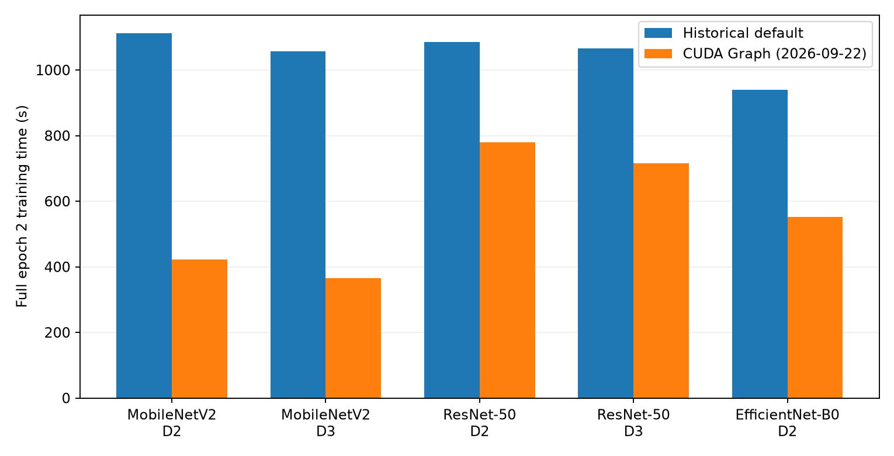

# DALI CUDA Graph：完整训练补测（2026-09-22）

## 覆盖与测量口径

补齐原 CNN 报告的 MobileNetV2 / ResNet-50 RGB DALI D2、D3，以及 eFUN 报告的 RGB EfficientNet-B0 DALI D2，共 **5 条路径 × 2 个完整 epoch**。MobileNetV2 DCT24/32 共用同一 RGB 模型；ResNet DCT24/64 同理，不重复运行同一个 RGB 对照。原来的 B6、JPEG、RGB PyTorch 与推理结果保持为历史测量。

硬件沿用原 RTX 4090（`GPU-40c637bd-acf5-ea1a-0df8-617138228467`）。每轮训练 1,281,167 个不同样本、1,252 次更新，并完成 50,000 张验证；尾批保留。相同初始化 seed 11997733、BF16 autocast、TF32 off、microbatch64 × accumulation16、pool4096、torch8线程。CNN DALI 为4线程/预取2；EfficientNet-B0沿用已调优16线程/预取4，并保留初始50K验证。

新增项是 `--compile-mode reduce-overhead`，启用 PyTorch 模型 forward/backward 的 CUDA Graph，配合持久梯度缓冲及每 microbatch 的 step 标记。DALI 的异步数据流水线本来已开启；其数据流图不是模型 CUDA Graph。loss、optimizer、检查和完整输入流水线没有整体捕获进一个 Graph。模型结构、输入尺寸和 FLOPs 未减少，也没有增加 DCT 频率下推。

本次 DALI 复测不依赖 native CUDA 优化。训练计时包含 epoch 准备、输入、模型、更新和边界同步；E1还包含首次编译/捕获与尾批新形状执行。验证、Python导入、runner初始化和checkpoint写出另计。E2作为主要吞吐口径；输入等待和model stream可重叠，不能相加。

## 1. 完整端到端结果

| 模型 | DALI | 轮次 | 历史 default s | Graph s | 历史时间比 | Graph img/s |
|---|---|---|---|---|---|---|
| MobileNetV2 | rgb_d2 | 1 | 1138.08 | 499.85 | 2.28× | 2563.12 |
| MobileNetV2 | rgb_d2 | 2 | 1112.43 | 422.36 | 2.63× | 3033.36 |
| MobileNetV2 | rgb_d3 | 1 | 1085.98 | 417.03 | 2.60× | 3072.13 |
| MobileNetV2 | rgb_d3 | 2 | 1056.86 | 365.14 | 2.89× | 3508.73 |
| ResNet-50 † | rgb_d2 | 1 | 1114.77 | 874.54 | 1.27× | 1464.97 |
| ResNet-50 | rgb_d2 | 2 | 1085.05 | 779.19 | 1.39× | 1644.24 |
| ResNet-50 † | rgb_d3 | 1 | 1055.40 | 771.71 | 1.37× | 1660.17 |
| ResNet-50 | rgb_d3 | 2 | 1065.85 | 715.67 | 1.49× | 1790.16 |
| EfficientNet-B0 † | rgb_d2 | 1 | 949.10 | 722.58 | 1.31× | 1773.04 |
| EfficientNet-B0 | rgb_d2 | 2 | 938.80 | 552.35 | 1.70× | 2319.47 |



表中的比值是相同GPU、配方和样本数的跨日期测量，并非本轮交错重复的单因素加速实验。旧CNN训练未做同等粒度GPU占用监控；旧EfficientNet-B0调优结果记录过同卡额外进程，不能把其比值全部归因于Graph。page cache未清空，也不排除共享CPU/I/O变化。本表†行在训练计时内记录到额外GPU PID，保留作带占用标记的E1观测。原ResNet D2/D3的E2分别为826.940/725.188秒，同样有额外PID，不进入主比较。本表ResNet E2采用后续从本次E1 checkpoint恢复的完整重放：在epoch计时前预热64/15图模型Graph，随后恢复模型、optimizer、scheduler和RNG，再处理完整E2；重放训练CE及50K验证指标与原E2一致。主表五条E2的100ms GPU采样均只记录到各自目标进程；五条profile也单独核验。

## 2. 第二轮计时分项

| 模型 | DALI | epoch准备 s | 输入等待 s | 模型 stream s | 训练E2E s | 50K验证 s |
|---|---|---|---|---|---|---|
| MobileNetV2 | rgb_d2 | 41.29 | 152.60 | 328.07 | 422.36 | 61.99 |
| MobileNetV2 | rgb_d3 | 11.13 | 126.98 | 330.99 | 365.14 | 74.25 |
| ResNet-50 | rgb_d2 | 41.20 | 494.14 | 685.94 | 779.19 | 61.39 |
| ResNet-50 | rgb_d3 | 9.78 | 459.53 | 687.38 | 715.67 | 61.12 |
| EfficientNet-B0 | rgb_d2 | 44.19 | 217.18 | 451.16 | 552.35 | 20.87 |

`model stream` 是CUDA event覆盖时间，含主机提交间隙、同步及资源竞争，不是模型kernel净执行时间。模型更快后，之前被遮住的输入等待可能增加；这不意味着输入算法本身变慢。

## 3. CUDA Graph 与 GPU breakdown

每条从本次第一轮checkpoint恢复，先运行4,096张，再捕获16,384张（更新1,257–1,272）。Nsight启用 `--cuda-graph-trace=node`。所有窗口均观察到真实 `cudaGraphLaunch`，没有未归属kernel；busy+idle等于捕获窗口。下表来自开启profiler的窗口，正式吞吐以上面的无profiler整轮结果为准。

| 模型 | DALI | Graph launches | 窗口 s | 无profiler同池 s | 模型kernel s | 输入kernel s | 重叠 s | H2D s | GPU idle s |
|---|---|---|---|---|---|---|---|---|---|
| MobileNetV2 | rgb_d2 | 512 | 6.584 | 4.824 | 3.874 | 0.242 | 0.204 | 0.467 | 2.524 |
| MobileNetV2 | rgb_d3 | 512 | 5.994 | 4.487 | 3.881 | 0.250 | 0.215 | 0.436 | 1.973 |
| ResNet-50 | rgb_d2 | 512 | 9.749 | 9.426 | 8.540 | 0.256 | 0.226 | 0.615 | 1.086 |
| ResNet-50 | rgb_d3 | 512 | 9.294 | 9.004 | 8.539 | 0.265 | 0.236 | 0.598 | 0.660 |
| EfficientNet-B0 | rgb_d2 | 512 | 7.657 | 6.492 | 5.352 | 0.177 | 0.118 | 0.898 | 1.750 |

输入/模型/H2D使用活动区间并集，彼此可能重叠；DALI CPU解码不计入输入GPU kernel。profiler会增加提交开销，表中同时列出第二轮相同池的无profiler时间，不能用捕获窗口替代端到端排名。

## 4. 数值与完整性

| 模型 | DALI | 轮次 | Graph训练CE | 旧训练CE | Graph Top-1% | 旧Top-1% | Graph验证CE |
|---|---|---|---|---|---|---|---|
| MobileNetV2 | rgb_d2 | 1 | 6.15453606 | 6.15453606 | 7.500 | 7.500 | 5.15443329 |
| MobileNetV2 | rgb_d2 | 2 | 4.73877449 | 4.73877449 | 19.460 | 19.460 | 4.06751450 |
| MobileNetV2 | rgb_d3 | 1 | 6.15259486 | 6.15259486 | 7.552 | 7.552 | 5.15000948 |
| MobileNetV2 | rgb_d3 | 2 | 4.74801568 | 4.74801568 | 18.704 | 18.704 | 4.11256248 |
| ResNet-50 | rgb_d2 | 1 | 5.66247921 | 5.66247921 | 12.528 | 12.528 | 4.69838331 |
| ResNet-50 | rgb_d2 | 2 | 4.14369828 | 4.14369828 | 23.808 | 23.808 | 3.79873111 |
| ResNet-50 | rgb_d3 | 1 | 5.65873145 | 5.65873145 | 11.358 | 11.358 | 4.85543710 |
| ResNet-50 | rgb_d3 | 2 | 4.15192126 | 4.15192126 | 22.520 | 22.520 | 3.85895729 |
| EfficientNet-B0 | rgb_d2 | 1 | 6.19563843 | 6.19563843 | 7.352 | 7.352 | 5.13709975 |
| EfficientNet-B0 | rgb_d2 | 2 | 4.72264428 | 4.72264428 | 21.234 | 21.234 | 3.87217438 |

五条路径均完成2轮，每条路径共2,504次参数更新；每轮样本总数与唯一样本数均为1,281,167，50K验证完整，有限值检查通过。两轮仍属于早期训练，不能据此判断最终收敛。

## 5. 原始结果与重跑

每个完整训练目录保留 `command.json`、`run.log`、`training.json`、两个epoch JSON/checkpoint和GPU进程采样；对应 `*_profile/` 保留Nsight、SQLite、breakdown及PNG/PDF时间线。

- MobileNetV2 / rgb_d2：[Graph](/home/tangyuxin/gfastlanes/FastLanes/galp/data/system_rgbnomore/e2e_v3/runs/dctnet_mobilenet24/rtx4090_dali_graph_20260922/rgb_d2_full)；[历史default](/home/tangyuxin/gfastlanes/FastLanes/galp/data/system_rgbnomore/e2e_v3/runs/dctnet_mobilenet24/rtx4090_cnn_training_baselines_20260914/rgb_d2_full)；[profile](/home/tangyuxin/gfastlanes/FastLanes/galp/data/system_rgbnomore/e2e_v3/runs/dctnet_mobilenet24/rtx4090_dali_graph_20260922/rgb_d2_profile)。

- MobileNetV2 / rgb_d3：[Graph](/home/tangyuxin/gfastlanes/FastLanes/galp/data/system_rgbnomore/e2e_v3/runs/dctnet_mobilenet24/rtx4090_dali_graph_20260922/rgb_d3_full)；[历史default](/home/tangyuxin/gfastlanes/FastLanes/galp/data/system_rgbnomore/e2e_v3/runs/dctnet_mobilenet24/rtx4090_cnn_training_baselines_20260914/rgb_d3_full)；[profile](/home/tangyuxin/gfastlanes/FastLanes/galp/data/system_rgbnomore/e2e_v3/runs/dctnet_mobilenet24/rtx4090_dali_graph_20260922/rgb_d3_profile)。

- ResNet-50 / rgb_d2：[Graph](/home/tangyuxin/gfastlanes/FastLanes/galp/data/system_rgbnomore/e2e_v3/runs/dctnet_static24/rtx4090_dali_graph_20260922/rgb_d2_full)；[历史default](/home/tangyuxin/gfastlanes/FastLanes/galp/data/system_rgbnomore/e2e_v3/runs/dctnet_static24/rtx4090_cnn_training_baselines_20260914/rgb_d2_full)；[profile](/home/tangyuxin/gfastlanes/FastLanes/galp/data/system_rgbnomore/e2e_v3/runs/dctnet_static24/rtx4090_dali_graph_20260922/rgb_d2_profile)。

  E2主结果：[完整checkpoint重放](/home/tangyuxin/gfastlanes/FastLanes/galp/data/system_rgbnomore/e2e_v3/runs/dctnet_static24/rtx4090_dali_graph_20260922/rgb_d2_e2_replay)。

- ResNet-50 / rgb_d3：[Graph](/home/tangyuxin/gfastlanes/FastLanes/galp/data/system_rgbnomore/e2e_v3/runs/dctnet_static24/rtx4090_dali_graph_20260922/rgb_d3_full)；[历史default](/home/tangyuxin/gfastlanes/FastLanes/galp/data/system_rgbnomore/e2e_v3/runs/dctnet_static24/rtx4090_cnn_training_baselines_20260914/rgb_d3_full)；[profile](/home/tangyuxin/gfastlanes/FastLanes/galp/data/system_rgbnomore/e2e_v3/runs/dctnet_static24/rtx4090_dali_graph_20260922/rgb_d3_profile)。

  E2主结果：[完整checkpoint重放](/home/tangyuxin/gfastlanes/FastLanes/galp/data/system_rgbnomore/e2e_v3/runs/dctnet_static24/rtx4090_dali_graph_20260922/rgb_d3_e2_replay)。

- EfficientNet-B0 / rgb_d2：[Graph](/home/tangyuxin/gfastlanes/FastLanes/galp/data/system_rgbnomore/e2e_v3/runs/efun/rtx4090_dali_graph_20260922/rgb_d2_full)；[历史default](/home/tangyuxin/gfastlanes/FastLanes/galp/data/system_rgbnomore/e2e_v3/runs/efun/dali_tuning_20260916/rgb_d2_clean_full)；[profile](/home/tangyuxin/gfastlanes/FastLanes/galp/data/system_rgbnomore/e2e_v3/runs/efun/rtx4090_dali_graph_20260922/rgb_d2_profile)。

汇总数据：[训练CSV](assets/dali_graph_20260922/training.csv)、[profile CSV](assets/dali_graph_20260922/profiles.csv)、[图PDF](assets/dali_graph_20260922/epoch2.pdf)。

重跑时使用新输出目录，避免覆盖现有结果。下面示例复用保存的完整命令；其他路径只需替换源目录和 `DCTNET_PROFILE`（`mobilenet24`、`resnet24`或`efun`）：

```bash
cd /home/tangyuxin/gfastlanes/FastLanes
export CUDA_VISIBLE_DEVICES=GPU-40c637bd-acf5-ea1a-0df8-617138228467
export DCTNET_PROFILE=mobilenet24
export OMP_NUM_THREADS=1 OPENBLAS_NUM_THREADS=1 MKL_NUM_THREADS=1
export PYTHONDONTWRITEBYTECODE=1 TMPDIR="$HOME/tmp/dctnet" MPLCONFIGDIR="$HOME/tmp/matplotlib"
/home/tangyuxin/miniconda3/envs/fastlanes-cuda/bin/python - <<'REPLAY'
import json,subprocess
from pathlib import Path
source=Path('galp/data/system_rgbnomore/e2e_v3/runs/dctnet_mobilenet24/rtx4090_dali_graph_20260922/rgb_d2_full')
cmd=json.loads((source/'command.json').read_text())
cmd[cmd.index('--output-dir')+1]=str(source.with_name('rgb_d2_full_repeat'))
subprocess.run(cmd,check=True)
REPLAY
```


## 6. 补齐此前有界训练窗口

以下均为RTX 4090、MobileNetV2 RGB、BF16、有效batch1024，取更新113–192的81,920张。pool4096从本次完整第一轮提取同一前缀；pool1024另跑原196,608张有界测试。pool不是模型microbatch：DALI和模型仍每次64张。

| DALI | pool图数 | 旧default s | Graph s | Graph输入等待 s | Graph模型stream s |
|---|---|---|---|---|---|
| rgb_d2 | 4096 | 68.569 | 24.163 | 10.088 | 20.763 |
| rgb_d3 | 4096 | 62.678 | 23.144 | 7.118 | 21.567 |
| rgb_d3 | 1024 | 69.848 | 24.054 | 7.324 | 21.022 |

这些值不包含启动且不是完整epoch；与完整第二轮表分别报告。旧B6来自较早实现及default编译模式，不能用它与本次DALI Graph计算双方最佳配置的加速比。[窗口CSV](assets/dali_graph_20260922/bounded.csv)。

## 7. 已有 H100 / PRO 6000 Graph 对照

这两张卡已有DALI D3 Graph有界训练结果，本次未重复其已有覆盖，也未混入RTX 4090完整epoch表：

- [H100 default/Graph](/home/tangyuxin/gfastlanes/FastLanes/galp/data/system_rgbnomore/e2e_v3/runs/b6_kernel_optimization_20260918/h100_comparison/REPORT.md)
- [PRO 6000 default/Graph](/home/tangyuxin/gfastlanes/FastLanes/galp/data/system_rgbnomore/e2e_v3/runs/b6_kernel_optimization_20260918/pro6000_comparison/REPORT.md)
- [PRO 6000 最新B6优化与DALI Graph](/home/tangyuxin/gfastlanes/FastLanes/galp/data/system_rgbnomore/e2e_v3/runs/b6_stats_reuse_20260921/REPORT.md)

## 8. 剩余覆盖与下一步

截至9月23日核查，9条 DALI 路径均已完成 Graph 配置下的训练重测。CNN/RGB EfficientNet 的5条路径已确认真实 Graph 重放；ViT/Swin 的4条路径待独立 profiling。GALP block-major 已完成7/7项Graph配置重测；ViT/Swin E2分别为538.215/959.316秒，两次进程采样只有训练进程。完整结果与并发标记见[总报告第4.3节](ALL_MODELS_SYSTEM_PERFORMANCE_REPORT_2026-09-16.md#43-galp-block-major-graph-完整重测结果)。GALP七项的实际Graph重放仍待独立profiling。JPEG和RGB PyTorch仍为历史测量。

ViT 已按历史 FP32 性能口径从 E1 checkpoint 预热并测完整 E2，使用历史工作树 `/home/tangyuxin/tmp/dctnet/vit_graph_b479bb` 保留原检查策略。主仓库重构改变了 Swin profiling 契约中的模块路径、数据清单哈希和运行代码指纹；需先对齐复现环境，再执行旧 profiling 命令。以下脚本作为已有入口保留，不表示 profiling 已验证可运行。

当前会话无法连接 NVIDIA 驱动，因此没有启动新的 GPU 测试。在可用 GPU 的宿主终端执行以下既有脚本；它们固定使用上述 RTX 4090 UUID，记录 GPU 占用，并按非零退出码停止。Swin 和 ViT 脚本会跳过已完成路径；按用户指定，仅忽略可执行文件名为 `PHJ_GDS_13` 的进程，仍保留完整进程采样。DALI ViT已经完成，无需重跑；以下为既有入口记录，profiling命令仍需先核对：

```bash
cd /home/tangyuxin/gfastlanes/FastLanes
set -e
export PYTHONDONTWRITEBYTECODE=1 TMPDIR="$HOME/tmp/dctnet"
export MPLCONFIGDIR="$HOME/tmp/matplotlib"
/home/tangyuxin/miniconda3/envs/fastlanes-cuda/bin/python -u "$HOME/tmp/dctnet/run_vit_graph_20260922.py"
/home/tangyuxin/miniconda3/envs/fastlanes-cuda/bin/python -u "$HOME/tmp/dctnet/profile_transformer_graph_20260922.py"
```

训练成功时分别输出 `SWIN COMPLETE d2/d3`、`VIT COMPLETE d2/d3`，四份 `results.json` 的 `all_completed` 为真；profile 成功时输出各路径的非零 `GRAPH REPLAYS` 及 `TRANSFORMER PROFILES COMPLETE`。返回这些终端摘要和 `benchmark_results/dali_graph_training_20260922/` 中的结果即可继续汇总；若失败，返回对应 `run.log` 末尾错误。

## 9. SwinV2-T Graph 训练结果

D2/D3 的 `all_completed` 均为真；每条路径完成 2,504 次更新，每轮 1,281,167 个唯一样本，初始和每轮验证均为 50,000 张。编译模式为 `reduce-overhead`。

| 路径 | E1 秒 | E2 秒 | E2 images/s | E2 Top-1% |
|---|---:|---:|---:|---:|
| D2 | 1184.120 | 1030.794 | 1242.89 | 17.350 |
| D3 | 910.221 | 894.051 | 1432.99 | 18.632 |

D2 的采样还记录到 GALP 测试及其他计算进程，耗时作为带并发标记的观测；D3 除训练进程外仅记录到用户指定忽略的 `PHJ_GDS_13`。忽略该进程是运行准入规则，不构成其完全无性能影响的测量证据。训练损失与历史 default 结果并非逐值一致；目前只确认训练和验证完整完成，不声称逐值等价或最终收敛等价。Swin 两条路径的真实 Graph launch 与 GPU breakdown 仍待 profile。

原始结果：[D2](../../../../benchmark_results/dali_graph_training_20260922/swinv2/d2/results.json)、[D3](../../../../benchmark_results/dali_graph_training_20260922/swinv2/d3/results.json)。

## 10. ViT-Ti Graph 完整 E2

两条路径均于9月22日晚完成，从历史 E1 checkpoint 恢复；结果中 E1 记录为继承数据，只有 E2 属于本轮 Graph 重测。每条新测 E2 覆盖1,281,167张训练及50,000张验证，最终累计2,504次更新。

| 路径 | E2 秒 | images/s | Top-1% | Top-5% | 验证 CE |
|---|---:|---:|---:|---:|---:|
| DALI D2 RGB | 618.335 | 2071.96 | 10.936 | 26.968 | 4.843388 |
| DALI D3 RGB | 533.138 | 2403.07 | 10.550 | 26.326 | 4.874724 |

两条路径采样除各自训练进程外仅记录到 `PHJ_GDS_13`；它按用户要求不阻止启动，采样仍完整保留。实际 Graph 重放待 Nsight 确认。原始结果：[D2](../../../../benchmark_results/dali_graph_training_20260922/vitti/d2/results.json)、[D3](../../../../benchmark_results/dali_graph_training_20260922/vitti/d3/results.json)。
