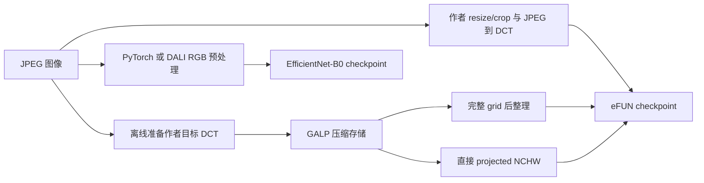

# GALP on eFUN：端到端训练、推理与 I/O 性能报告

整理日期：2026-09-16。本文汇总 RTX 4090 上的 eFUN / EfficientNet-B0 实验，章节与
[CNN 报告](CNN_SYSTEM_PERFORMANCE_REPORT_2026-09-15.md)、
[SwinV2-T 报告](SWINV2_SYSTEM_PERFORMANCE_REPORT_2026-09-13.md)对应。
完整训练与推理来自 2026-09-15–16；DALI 主结果采用 9 月 16 日的配置调优、推理交叉确认、
完整训练复测及新 Nsight 分析。本文只整理既有结果。

## 摘要

eFUN 使用全部 192 个 DCT 通道，为检验压缩态传输和输出布局提供了一个不裁剪频率的对照。
在 50,000 张 ImageNet-512 验证图上，GALP projected 路径用时 10.730 秒，作者 JPEG→DCT
参考路径用时 41.873 秒，在线推理加速约 **3.90×**；两者全部预测一致，Top-1 均为 75.428%。
频率读取下推开关没有改变请求字节量，不能把这一收益解释为减少频率或模型计算。

从零训练的第二轮中，GALP B6 为 **2,418.16 images/s**，JPEG A0 为 **923.72 images/s**，
实测比值 **2.62×**。JPEG 采用无同卡额外计算进程记录的复测结果。A0/B6 同时改变裁剪及顺序策略，
这一比值描述完整训练系统，而非仅替换 reader 的效果。两轮后的 Top-1 分别为 19.464% 和 19.372%，
仍处于学习率 warmup，不能据此判断最终收敛。

RGB EfficientNet-B0 的 DALI 推理采用 4 线程、预取深度 4，三次确认的中位数为
11.733 秒/50K，Top-1 为 76.770%。相较该基线，eFUN/GALP 快约 1.09×，Top-1 低
1.342 个百分点；这是一组不同模型的系统权衡。DALI 训练采用 16 线程、预取深度 4，
E2 为 1364.69 images/s，但复测仍记录到短时同卡额外进程，不能将其作为受控调优收益。
Nsight 显示 eFUN 同域路径的模型 kernel 数相同，收益主要表现为输入等待、GPU 空闲和 H2D 传输减少。

## 1. 实验问题与证据结构

本报告考察三个相互关联的问题：离线准备 DCT 能否减少在线输入成本；直接输出模型所需布局能否
减少整理工作；这种输入路径能否用于完整训练。eFUN 始终保留 Y/Cb/Cr 各 64 个频率，因而还能区分
输出布局收益与频率选择收益。

| 实验 | 工作量 | 用途与边界 |
| --- | --- | --- |
| 预训练推理 | 4 条 eFUN 路径、2 条 RGB 路径，各 50K | DALI 取三次交叉确认中位数，其余为既有单次运行；未统一重复次数 |
| 从零训练 | 4 条路径，各 2 个完整 epoch | 相同训练样本数下的系统吞吐与早期精度；DALI 复测带并发占用标记，不是最终收敛 |
| 推理 Nsight | 每路径 4,096 图，64 次 forward | 局部窗口的 kernel、拷贝和空闲时间 |
| 训练 Nsight | 每路径 16,384 图，256 microbatches、16 次更新 | 从第一轮 checkpoint 恢复后的执行组成；不能替代完整 epoch |
| Model-only | 120 次测量更新，122,880 次图像呈现 | 驻留输入下的训练计算校准，不含输入准备 |

完整运行耗时和插桩窗口分别报告。GPU 空闲指本进程没有 kernel/memcpy/memset 活动的区间，
不是硬件 SM 利用率；各阶段可以重叠，不能直接相加还原总时间。

## 2. eFUN 模型与数据路径

### 2.1 模型配置与来源

eFUN 来自 Goldberg 等人的 [Rethinking FUN: Frequency-Domain Utilization Networks](https://arxiv.org/abs/2012.03357)
及[作者实现](https://github.com/kfirgoldberg/FUN)，本地 revision 为
`6c2b5f4a43a2b514163ff1f3f114d4feeb174d3c`。
RGB 对照来自 [Torchvision EfficientNet-B0](https://docs.pytorch.org/vision/stable/models/generated/torchvision.models.efficientnet_b0.html)。

| 属性 | eFUN DCT | EfficientNet-B0 RGB |
| --- | --- | --- |
| 实现 | 作者 `efun` / `EfficientFUN` | Torchvision `efficientnet_b0` |
| 参数量 | 4,233,448 | 5,288,548 |
| 输入，不含 batch | 192×28×28；Y/Cb/Cr 各 64 通道 | 3×224×224 |
| 主体 | MBConv、SE、Swish；stage 输出通道×模块数为 128×3→160×6→192×1 | EfficientNet-B0 MBConv 主干 |
| Head / 输出 | head 1280，1000 类 | head 1280，1000 类 |
| 推理权重 | 作者 `efun.pth`，严格加载 `state_dict`，不选 EMA | `IMAGENET1K_V1`，`efficientnet_b0_rwightman-7f5810bc.pth` |
| 训练初始化 | 重置参数后从零训练 | 重置参数后从零训练 |

eFUN-L/S/S+ 的结构及参数量已核查，但没有本系统的训练或完整推理结果，不进入性能表。
作者在 V100、batch 1 上报告的 FPS 也不与本报告的 RTX 4090、batch 64 混用。

### 2.2 推理路径

作者推理预处理为 bicubic Resize(256)、CenterCrop(224)、ToTensor/ToPILImage、Q100 JPEG，
再提取 DCT。当前 jpeg2dct 会将输入转码为 4:2:0，适配器调用作者的 `_upsample_and_concat`
把色度恢复到 28×28。模型输入不做 mean/std 标准化。GALP 保存这一参考流程产生的整数模型值，
使用恒等量化表；该表不是转码后源 JPEG 的量化表。

`grid` 先产生完整网格再整理，`projected` 直接写模型所需 NCHW。下推开关两侧都读取全部频率。
RGB 推理使用官方权重的 bicubic resize、中心裁剪及 ImageNet mean/std；DALI 的解码与重采样
不假定和 PIL 逐元素相同。

### 2.3 训练路径

JPEG A0 逐图提取 DCT、独立裁剪并采用全局 shuffle；GALP B6 从已有 block-major DCT 出发，
每 1024 图共享几何决策，每 4 组形成 4096 图的封闭池并延迟打乱。
两者共享模型初始化、频率、增强数学和优化器，但裁剪关联性与顺序不同。
RGB PyTorch 与 DALI D2 使用相同的逐样本裁剪/翻转决策和顺序，作为独立 RGB 对照。

## 3. 实验设置与公平性

### 3.1 训练设置

| 属性 | 设置 |
| --- | --- |
| 硬件 | RTX 4090；GPU UUID `40c637bd-acf5-ea1a-0df8-617138228467` |
| 数据 | 每轮 1,281,167 张 ImageNet-512 训练图；初始及每轮后 50K 验证 |
| 初始化 / 长度 | 从零初始化；seed 11997733；每路径 2 轮 |
| Batch / precision | microbatch 64；累积 16；有效 batch 1024；BF16 autocast＋Inductor |
| 优化器 | AdamW，LR 0.003，betas=(0.9,0.999)，epsilon=1e−8；内置 decay=0 |
| 衰减 / clipping | 独立 weight decay 1e−4；梯度裁剪 norm=1 |
| 调度 | 300-epoch cosine horizon；10,000-update warmup；两轮共 2504 次更新 |
| DCT 增强 | 随机裁剪缩放、水平翻转、整数取整；RandAugment N=2/M=3、11 bins；Mixup α=0.2 |
| RGB 增强 | 随机裁剪缩放及翻转；bilinear、mean/std=.5；hard labels，无 RandAugment/Mixup |
| CPU 并行 / 预取 | JPEG/PyTorch 16 workers；DALI D2 16 threads、预取深度 4；旧配置为 4/2 |
| 计时 | 含 epoch 准备及训练循环；首轮含首次编译；验证单独计时 |

这些是系统对照配方，不是作者的 450-epoch RMSpropTF 配方。RGB 的系统训练/验证预处理也不同于
预训练推理所用的 bicubic/ImageNet 归一化，因此训练初期准确率不应直接与预训练推理相比较。

### 3.2 推理与采集设置

推理采用 50K ImageNet-512 验证图、FP32、TF32 关闭、batch 64；JPEG/PyTorch 使用 16 workers，
RGB DALI 使用 4 threads、预取深度 4。模型 warmup 排除；计时从输入文件到 logits，
GALP 包含 reader 启动，不含离线转换。DALI 主结果取三次交叉确认的中位运行，其他路径为既有
单次完整运行；未强制冷 page cache。

训练主表的 JPEG 结果来自无同卡竞争记录的复测，GALP/PyTorch 来自原矩阵，DALI 来自调优后的
完整复测。JPEG 复测期间的 2871 次定向采样仅记录该训练 PID；原 JPEG 耗时不参与比值。
DALI 新运行中仍有约 21 秒和 4 秒的额外进程占用，表中以 † 标记；目录名 `clean` 不表示无干扰。
即使没有同卡竞争记录，也不能排除共享 CPU/I/O 影响。
Nsight 是独立采集；两份新 DALI trace 的采样仅记录对应进程，不能据此认定完整训练也无干扰。

### 3.3 DALI 配置选择与确认范围

扫描范围为 4/8/16 线程与预取深度 2/4 的六种组合，固定 checkpoint、顺序、增强、batch 和精度。
推理筛选每配置三次 50K；训练先测一次，从相同 E1 checkpoint 恢复，排除首池后测量 49,152 图，
再对旧配置和最快候选各补两次。该范围不能证明全局最优。

| 测试 | 旧配置 | 新配置 | 重复观测与解释 |
| --- | --- | --- | --- |
| 推理交叉确认 | 16/2：11.929、11.941、11.904 秒 | 4/4：11.719、11.733、11.782 秒 | 中位数 11.929→11.733 秒，耗时少 1.64%；六次预测与原 DALI 一致 |
| 训练短窗确认 | 4/2：44.398、88.300、46.889 秒 | 16/4：31.443、70.300、42.033 秒 | 中位数耗时少 10.36%，但波动明显；不代替完整 epoch |

早期推理扫描波动较大，因此不用扫描的最好/最坏值宣称加速。训练完整复测 E2 相比旧配置
耗时少 23.97%，但两次调优后的完整运行均记录到同卡额外进程，不能把全部变化归因于线程/预取设置。
扫描及确认数据见第 10 节的调优目录。

## 4. 训练端到端性能

### 4.1 完整 Epoch 1/2

| 路径 | E1 秒 | E2 秒 | E2 images/s | E2 输入等待秒 | E2 模型流秒 |
| --- | ---: | ---: | ---: | ---: | ---: |
| eFUN JPEG A0，复测 | 1434.106 | 1386.967 | 923.72 | 81.816 | 1255.389 |
| eFUN GALP B6 | 557.899 | 529.811 | 2418.16 | 1.010 | 511.917 |
| RGB PyTorch | 1830.422 | 1761.882 | 727.16 | 120.651 | 1538.952 |
| RGB DALI D2，16/4 † | 949.099 | 938.800 | 1364.69 | 90.819 | 809.089 |

数值来自各路径 `epoch_0.json` / `epoch_1.json`；文件中的 epoch 从 0 开始。
GALP/JPEG 的 E1、E2 吞吐比依次为 2.57×、2.62×，两轮总时间比为 2.59×。
RGB DALI/PyTorch 的 E2 观测比值为 1.88×，但 DALI 带已知同卡占用，不能作为受控加速比。
† 对应复测记录到额外 PID 253019（16:37:38–16:37:59）和 296074（16:48:41–16:48:45）；
不能因占用短暂就假定影响为零。旧 DALI 4/2 的 E1/E2 为 1294.526/1234.752 秒，
仅保留为历史参照。阶段计时存在重叠，模型流时间包含提交及依赖空隙，
不是纯 GPU kernel 时间；不能从两个模型流时间之差推出算术工作减少。

### 4.2 Model-only 与短测范围

eFUN model-only 在 64 张驻留 GPU 输入上重复更新，5 次 warmup 后测量 120 次更新，
122,880 次图像呈现耗时 42.609 秒，对应 2883.87 images/s。它采用 BF16/compile，
但测量区间包含 95 次严格检查和 25 次延后检查，与完整 E2 的检查阶段不同，不能视为完全匹配的硬上限。

两池、8192 图的 JPEG/B6 诊断采用未 compile 路径，并受到同时进行的 CPU 离线工作影响，
不进入主性能表。native A0 全局随机读取的短测在首池耗时 423.951 秒后未完成两池实验，
也不能作为已完成的完整训练基线。本报告没有四条路径同口径的独立 data-only 上限表。

### 4.3 训练 Nsight 分解

每条窗口覆盖 16,384 图，从第一轮 checkpoint 恢复，首池预热后捕获全局更新 1257–1272。
DALI 行采用 9 月 16 日完成的 16/4 新采集，其余路径沿用原采集。

| 路径 | 窗口秒 | 模型 kernel 秒 | 输入 kernel 秒 | GPU 空闲秒（占比） | H2D GB |
| --- | ---: | ---: | ---: | ---: | ---: |
| eFUN JPEG A0 | 19.065 | 3.798 | 0.118 | 14.694（77.1%） | 9.868 |
| eFUN GALP B6 | 8.799 | 3.832 | 1.322 | 3.970（45.1%） | 1.224 |
| RGB PyTorch | 23.738 | 5.496 | 0 | 17.782（74.9%） | 9.865 |
| RGB DALI D2，16/4 | 14.252 | 5.361 | 0.147 | 8.220（57.7%） | 6.512 |

eFUN 两路模型 kernel 数均为 210,768，执行时间接近。GALP 增加了 GPU 输入工作，
但 H2D 少约 87.6%，GPU 空闲明显缩短。DALI 的 nvJPEG kernel 已计入输入，RGB 两路模型
kernel 数均为 344,368，避免将 decoder 工作误归到模型。
新 DALI trace 有 34,048 个输入 kernel，输入与模型重叠 0.066 秒。

图 1：GALP B6 的实际训练采集窗口；[JPEG](../../../data/system_rgbnomore/e2e_v3/runs/efun/nsys_20260915/training/jpeg/timeline.png)、
[RGB PyTorch](../../../data/system_rgbnomore/e2e_v3/runs/efun/nsys_20260915/training/rgb_pytorch/timeline.png)、
[RGB DALI，16/4](../../../data/system_rgbnomore/e2e_v3/runs/efun/dali_tuning_20260916/profiles/training/timeline.png)使用同类图表。

[旧 DALI 时间线](../../../data/system_rgbnomore/e2e_v3/runs/efun/nsys_20260915/training/rgb_d2/timeline.png)
记录的 39.536 秒是历史异常窗口，对应旧配置无 profiler 同池时间 15.670 秒；2.52× 不是受控测得的
纯 profiler 开销，也不是上表新采集的结果。旧异常未通过 CPU sampling/context-switch 隔离原因，
保留作诊断，不再作为当前 DALI 分解。

新采集的模型 kernel 时间仍与 RGB PyTorch 接近，但窗口时间与 GPU 空闲较少。它反映该窗口的执行
组成，不能替代完整 E2 或证明配置变化的因果收益。训练 `input.pool_wait` 仅覆盖取池，不包含所有
microbatch 获取，不能将这一 NVTX 区间接近零解释成没有输入等待。

## 5. 存储、I/O 下推与数据移动

### 5.1 离线目标表示

| 项目 | eFUN 50K 目标数据 |
| --- | ---: |
| 生成时间 | 533.47 秒 |
| 分片数 | 49 |
| 数据 footprint | 约 5.35 GB |
| 访问索引 | 约 4.86 MB |
| 推理压缩 payload 请求量 | 5,274,114,488 bytes |

GB/MB 为十进制单位。离线时间及额外存储不计入在线推理加速；所有 GALP 推理变体请求相同 payload。
请求量是应用层压缩数据计数，不是冷盘物理读量。没有 paired cold-cache 数据，不能推导冷 SSD 排名。

### 5.2 全频率输入与布局收益

eFUN 保留 192 个通道，所以 projected/on 与 projected/off 不构成频率裁剪消融。
grid→projected 的收益来自直接生成所需布局：完整 50K 的主线程整理时间从 0.333 秒降至
约 0.00137 秒，在线时间从 11.800 秒降至 10.730 秒。模型输入尺寸不变。

推理 Nsight 中，JPEG→GALP projected/off 的 H2D 从 2.466 GB 降至 0.448 GB，少约 81.8%；
训练窗口中相应下降约 87.6%。两种百分比来自不同样本数和执行路径，不能互换，也不能当作磁盘 I/O 降幅。

## 6. 训练收敛

| 路径 | 初始 Top-1 | E1 Top-1 | E2 Top-1 | E2 Top-5 | E2 验证 CE |
| --- | ---: | ---: | ---: | ---: | ---: |
| eFUN JPEG A0，复测 | 0.104% | 8.012% | 19.372% | 41.744% | 4.040935 |
| eFUN GALP B6 | 0.104% | 7.666% | 19.464% | 41.654% | 4.050337 |
| RGB PyTorch | 0.100% | 7.434% | 20.924% | 44.068% | 3.889383 |
| RGB DALI D2，16/4 | 0.100% | 7.352% | 21.234% | 44.218% | 3.872174 |

调优后 DALI 的训练 CE 和两轮验证数值均与旧配置一致；第 4.1 节的并发标记针对性能解释。
两组模型都从接近随机准确率开始学习。E2 的 GALP−JPEG 为 +0.092 个百分点，DALI−PyTorch
为 +0.310 个百分点。单 seed、两轮且仍在 warmup 的结果只支持早期训练可运行，
不支持统计等价、最终准确率优势或作者配方复现。跨 RGB/DCT 的准确率还受架构和增强差异影响。

## 7. 推理端到端性能

### 7.1 完整 50K

| 模型与路径 | 在线秒 | Top-1 | Top-5 | 模型 forward 累计秒 |
| --- | ---: | ---: | ---: | ---: |
| eFUN JPEG 参考 R | 41.873 | 75.428% | 92.622% | 14.273 |
| eFUN GALP grid/off | 11.800 | 75.428% | 92.622% | 10.729 |
| eFUN GALP projected/off | 10.730 | 75.428% | 92.622% | 10.021 |
| eFUN GALP projected/on | 10.738 | 75.428% | 92.622% | 10.027 |
| RGB EfficientNet-B0 PyTorch | 22.338 | 76.774% | 93.238% | 12.989 |
| RGB EfficientNet-B0 DALI，4/4 | 11.733 | 76.770% | 93.262% | 10.332 |

DALI 行来自三次交叉确认的中位运行 `w4_q4_r1`，包括该次运行的 forward 计时；其余行为既有单次结果。
GALP projected/off 相对 R 为 3.90×；DALI 相对同 RGB checkpoint 的 PyTorch 为 1.90×。
projected 开关间仅相差约 8 ms/50K，单次测量不支持稳定的快慢结论。
与 RGB DALI 比较时，约 1.09× 的速度比伴随 1.342 个百分点的 Top-1 差距，不能归结为单一 reader 优势。

### 7.2 推理 Nsight

| 路径 | 窗口秒 | 模型 kernel 秒 | 输入 kernel 秒 | GPU 空闲秒（占比） | H2D GB |
| --- | ---: | ---: | ---: | ---: | ---: |
| eFUN JPEG R | 2.725 | 0.777 | 0 | 1.835（67.3%） | 2.466 |
| GALP grid/off | 0.953 | 0.774 | 0.114 | 0.057（6.0%） | 0.448 |
| GALP projected/off | 0.866 | 0.774 | 0.031 | 0.057（6.6%） | 0.448 |
| GALP projected/on | 0.867 | 0.775 | 0.032 | 0.058（6.7%） | 0.448 |
| RGB PyTorch | 1.527 | 0.787 | 0 | 0.627（41.1%） | 2.466 |
| RGB DALI，4/4 | 0.952 | 0.802 | 0.075 | 0.101（10.6%） | 3.232 |

每条为 4096 图，DALI 行采用新 4/4 采集。四条 eFUN 路径的模型 kernel 数均为 12,352；RGB 两路均为 19,264。
grid→projected 将输入 kernel 数从 52 降至 28，输入 GPU 时间从 0.114 秒降至约 0.031 秒。
RGB DALI 的模型与拷贝重叠为 0.140 秒，PyTorch 为 0；DALI 的 H2D 反而更多，
因此该 RGB 比较的收益应结合 GPU 空闲与重叠解释，不能统一归因于传输减少。

图 2：projected/off 的实际推理窗口分解；
[新 DALI 分解图](../../../data/system_rgbnomore/e2e_v3/runs/efun/dali_tuning_20260916/profiles/inference/breakdown.png)
对应上表 4/4 配置。窗口时间不能替代 50K 主表。

### 7.3 显存与正确性

| GALP 输出布局 | Torch peak allocated，MiB |
| --- | ---: |
| grid/off | 1201.68 |
| projected/off | 469.43 |
| projected/on | 469.43 |

这些值来自完整 50K JSON 的 Torch allocator 计数，**不包含 native 分配**，不能当作总进程显存。
本文未补造与 CNN 报告同口径的全路径 NVML/RSS 峰值表。

三条 GALP 路径的全部预测均与 R 一致。RGB DALI/PyTorch 的全量预测一致率为 99.244%，
Top-1 差 −0.004 个百分点，属于解码/缩放实现差异。源数据是 ImageNet-512 重编码图，
不能将与作者公开准确率的差距直接解释为模型复现失败。

## 8. 与 ViT-Ti、SwinV2-T 和 CNN 的关系

eFUN 补充了一个全频率、频域 CNN 的观测点：即使不删除任何频率，离线准备和 projected 输出仍能
明显缩短在线输入路径。DCTNet 的24/32/64通道推理则能研究固定频率选择；两类实验回答不同问题。
训练 crop pushdown 与推理固定频率 pushdown 也应区分。

各报告的模型、精度、输入尺寸、worker 数和日期不同。ViT 使用 FP32 训练，eFUN/Swin/CNN
使用 BF16；不能把跨报告吞吐比当作更换 backbone 后的受控扩展性结论。

## 9. 结论适用范围

结果支持：在指定 50K 验证数据与作者输入数学下，GALP 保持 eFUN 预测并缩短在线推理；
两轮从零训练可完成完整数据覆盖；Nsight 支持输入供给、布局整理和传输成本变化的解释。

结果不支持：频率裁剪收益、模型算术工作减少、最终收敛等价、多 seed 精度优势、冷缓存存储排名，
或 eFUN 对 RGB EfficientNet-B0 的无条件优势。DALI 推理的新配置仅在有限扫描及三次交叉确认下
显示小幅改善，不代表全局最优。DALI 完整训练复测仍有同卡额外进程，1.88× 是相对 RGB PyTorch
的观测比值，不能作为受控调优收益；新 Nsight 窗口无额外进程记录不消除这一限制。

## 10. 原始证据与可复现性

| 内容 | 原始资料 |
| --- | --- |
| 完整配置、家族模型和结果说明 | [eFUN 原汇总](../../../experiments/dct_pushdown_inference/EFUN_RESULTS_AND_TRAINING_ZH.md) |
| 模型来源、预处理与运行命令 | [EFUN.md](../../../experiments/dct_pushdown_inference/EFUN.md)；[作者模型定义](../../../experiments/dct_pushdown_inference/FUN/timm/models/eFUN.py) |
| JPEG 训练主结果 | [复测目录](../../../data/system_rgbnomore/e2e_v3/runs/efun/training_v1_jpeg_rerun_20260915/jpeg_full/)；[E2 JSON](../../../data/system_rgbnomore/e2e_v3/runs/efun/training_v1_jpeg_rerun_20260915/jpeg_full/epoch_1.json) |
| GALP/PyTorch 训练及旧 DALI 记录 | [training_v1](../../../data/system_rgbnomore/e2e_v3/runs/efun/training_v1/)；[GALP E2](../../../data/system_rgbnomore/e2e_v3/runs/efun/training_v1/native_full/epoch_1.json) |
| DALI 训练主结果，带并发标记 | [16/4 完整复测目录](../../../data/system_rgbnomore/e2e_v3/runs/efun/dali_tuning_20260916/rgb_d2_clean_full/)；[E2 JSON](../../../data/system_rgbnomore/e2e_v3/runs/efun/dali_tuning_20260916/rgb_d2_clean_full/epoch_1.json) |
| eFUN 完整推理 | [full](../../../data/system_rgbnomore/e2e_v3/runs/efun/rtx4090_20260915/full/)；[projected/off JSON](../../../data/system_rgbnomore/e2e_v3/runs/efun/rtx4090_20260915/full/projected_off/N_50000.json) |
| RGB PyTorch 推理及旧 DALI 结果 | [EfficientNet-B0 原结果目录](../../../data/system_rgbnomore/e2e_v3/runs/efun/rtx4090_20260915/rgb_efficientnet_b0/) |
| DALI 推理主结果 | [4/4 三次确认的中位运行](../../../data/system_rgbnomore/e2e_v3/runs/efun/dali_tuning_20260916/inference_confirmation/w4_q4_r1/RGB_dali_50000.json) |
| DALI 配置扫描及交叉确认 | [调优目录](../../../data/system_rgbnomore/e2e_v3/runs/efun/dali_tuning_20260916/)；[measurements.json](../../../data/system_rgbnomore/e2e_v3/runs/efun/dali_tuning_20260916/measurements.json)、[selected.json](../../../data/system_rgbnomore/e2e_v3/runs/efun/dali_tuning_20260916/selected.json) |
| Nsight 与逐路径分析 | [原 10 路采集目录](../../../data/system_rgbnomore/e2e_v3/runs/efun/nsys_20260915/)；[替换 DALI 两路的新采集](../../../data/system_rgbnomore/e2e_v3/runs/efun/dali_tuning_20260916/profiles/)；各路径含原始报告、SQLite、breakdown 和图表 |
| 离线目标数据 | [dct_major_efun](../../../data/system_rgbnomore/e2e_v3/dct_major_efun/) |

训练脚本与配置保留在原实验目录。重建本报告的数值只需读取已有 JSON 和分析文件，不需要重新启动训练。
本文没有把探针、未完成 native A0 或受干扰的原 JPEG 运行混入主表。

## 11. 结论

eFUN 的结果表明，GALP 的收益可以在全部频率保留时出现：压缩态传输、GPU 物化和直接布局输出
共同改善了输入供给。50K 同域推理保持预测一致，在线加速约3.90×；两轮训练 E2 的系统比值约2.62×。
这些结果与模型 kernel 工作量基本不变的观测一致。最终收敛与跨模型精度权衡仍需分别看待，
不能由输入路径提速替代它们的证据。
