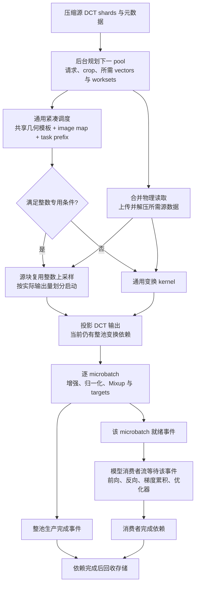
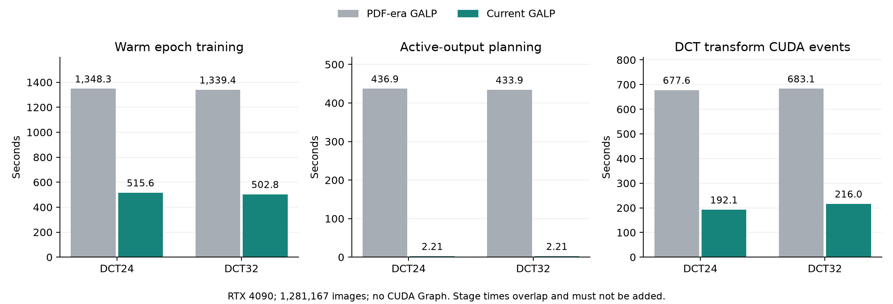
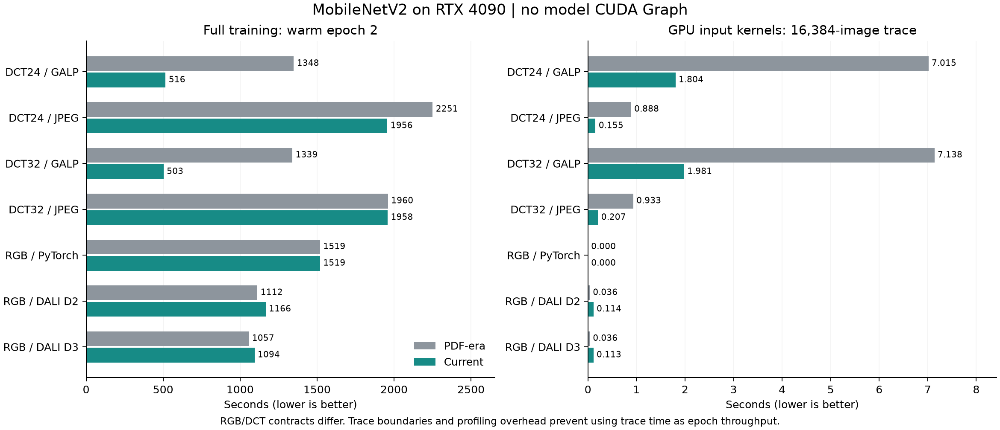
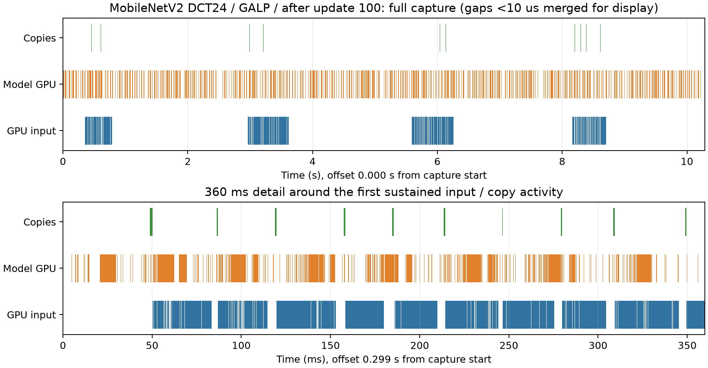

# MobileNetV2：GALP 输入等待、优化与重测

实验日期：2026-09-28 至 2026-09-29。参照 [Fastlanes4ML-21.pdf](../../../docs/presentations/Fastlanes4ML-21.pdf) 第 34–35 个 PDF 页面。

**结论：原先的长时间 input waiting 已在本次 MobileNetV2 B6 负载上大幅消除，主要原因是重复的 CPU 输出调度、GPU 上采样工作以及过宽的交付依赖，而不是磁盘读取或解压。** 通用紧凑调度、条件化整数源块复用和按真实依赖交付，使 DCT24/32 暖态训练从 1348/1339 s 降至 516/503 s，相对本次 JPEG 基线的吞吐为 3.79/3.89 倍。GPU 输入工作仍存在；标准窗口中的 input kernel 活动下降约 74%/72%，剩余开销集中在整数变换与模型执行期间的发射和空闲间隙。

已完成 7 组各两轮完整训练与验证、7 项标准 Nsight 采样及 1 项额外暖态采样。全部使用模型 `torch.compile(default)`，8 次 trace 中 CUDA Graph launch 均为 0。

## 1. 问题与实验范围

本报告回答三个问题：原先 input waiting 为什么长；哪些修改消除了不必要的输入工作和等待；当前系统如何交付数据，以及端到端收益是否伴随 input kernel 开销下降。

主要比较 MobileNetV2 DCT24、DCT32 的 GALP B6 与 JPEG A0。RGB PyTorch、DALI D2、DALI D3 为同模型家族的系统参考。A0 采用逐图 crop/global shuffle，B6 采用 grouped crop/delayed shuffle，二者不是逐样本增强与顺序完全一致的等价实现；RGB 的输入表示、模型入口和增强合同也不同。

本轮保持模型 **torch.compile(default)，不使用 CUDA Graph**。只测训练及其输入性能，不重跑与本问题无直接关系的预训练模型推理矩阵。

| 项目 | 配置 |
|---|---|
| 软件 | Python 3.11.15；PyTorch 2.11.0+cu128；torchvision 0.26.0+cu128；DALI 2.2.0（CUDA 13） |
| GPU | NVIDIA GeForce RTX 4090，GPU 0；各路径串行运行 |
| 数据 | ImageNet 训练集 1,281,167 张；每轮完整验证 50,000 张 |
| 输入 | 同源 imagenet_512；DCT24/32 为 24/32 × 112 × 112，RGB 为 3 × 224 × 224 |
| 初始化与训练 | seed 11997733；从零初始化；BF16 autocast；microbatch 64；累积 16，有效 batch 1024 |
| 样本组织 | shard 通常 1024 张，尾 shard 143 张；M4，pool 至多 4096 张；保留尾批 |
| GALP 启动预算 | 每次变换至多 32768 个逻辑输出块，沿用注册 CTA 上限 512 |
| CPU 并行 | Torch 8 线程；JPEG/PyTorch 16 workers；DALI D2/D3 4 threads、prefetch depth 2 |
| 端到端 | 每条路径从头训练 2 epoch，主表使用第 2 轮；验证时间单列，不计入训练 epoch 时间 |
| Nsight | 单独运行，预热首个 pool 后捕获 16,384 张；匹配现有 PDF 实验入口 |

历史结果中的数据位置为 `/mnt/nvme2/home/tangyuxin/pls-experiments/.../uniform_premix`，本轮使用仓库内的当前物化数据。DCT24/32 本轮与历史 E2 的逐 pool rowgroup 数、所选 vector 数、源块数、逻辑输出块数、读取字节数及上传字节数全部一致。历史比较反映系统版本演进，不作为唯一变量受控的代码消融；当前 A0/B6 对照另行列出。

不清空 OS page cache，因此不是冷盘测试。GPU 0 启动时没有其他计算进程；另一个 GPU 上有既有任务，共享主机资源的影响不能从 GPU 独占推断为不存在。单次两轮实验不能替代重复运行的统计分布，也不用于证明最终收敛。

## 2. 原先 input waiting 为什么长

### 2.1 等待输入不等于等待磁盘

训练线程的 input waiting 记录获取 pool/microbatch 时暴露的主机等待。其背后可能是 CPU 规划、文件读取、GPU 上传/解压/变换、增强、生产者交付或同步。相反，消费者已拿到对象后，通过 CUDA event 等待生产者的时间可以出现在模型流上，未必计入主机 input waiting。

所以，主机等待降到很低只能说明交付不再长期阻塞 CPU，不能单独证明输入 GPU 工作免费，也不能把 input waiting 和各阶段时间直接相加。

JPEG A0 的逐图 DCT crop/resize 由 CPU workers 完成，GALP 则在 GPU 上执行这些变换。A0 的 input kernel 时间短，不代表其输入总成本低；GALP 的 input kernel 时间较长与端到端更快可以同时成立。MobileNet 模型较轻，更难掩盖输入 GPU 工作，因此既要正确重叠，也要减少实际重复计算。

PDF 的完整暖态第二轮及对应历史 JSON 给出：

| 历史 GALP 指标 | DCT24 | DCT32 |
|---|---:|---:|
| 训练端到端 s | 1348.257 | 1339.370 |
| 主机 input waiting s | 872.898 | 851.941 |
| 活跃输出调度累计 s | 436.912 | 433.928 |
| 常规规划累计 s | 76.532 | 57.015 |
| 变换阶段 CUDA event 累计 s | 677.595 | 683.096 |
| 同步读取累计 s | 4.109 | 3.599 |
| 解压 CUDA event 累计 s | 0.873 | 0.874 |
| 上传 CUDA event 累计 s | 13.827 | 13.476 |

历史记录已经启用 2 个上下文的预取，完成了 313 次 pool 准备；不是完全没有后台预取。DCT24 的 `activation_wait_ms` 累计 872.873 s，几乎解释全部 872.898 s 主机输入等待。问题在于下一 pool 的准备与交付没有及时完成。`prepare_materialize_ms` 累计 1240.366 s，包含物化期间的主机调度、GPU 工作及同步，不是纯 kernel 时间；当前同项为 221.515 s。

这些阶段存在流水重叠和不同计时边界，不构成端到端时间的加法分解。但数量级明确排除了“主要是文件读取或解压慢”的解释，指向 CPU 输出调度、DCT 上采样及交付依赖。

### 2.2 重复几何没有被充分表达为共享工作

MobileNet 的输出网格为 112 × 112，三个分量在一个 4096 张的 pool 中共有 154,140,672 个逻辑输出块。B6 中许多图像共享 crop/resize 几何。如果按每幅图像、每个输出位置反复确定来源与 workset 所有权，规划量会随庞大的输出网格展开，而不是随不同几何的数量增长。

早期全批共享几何路径也不够：混合 crop、跨 shard 和不同采样形状仍需要可表达这些情况的紧凑通用调度，不能假设整个 pool 具有同一几何。

### 2.3 GPU 输入变换比模型本身更重

PDF 中相同 16,384 张的 profiler 窗口，DCT24 的 GALP 输入 kernel 活动为 7.015 s，模型 kernel 为 3.737 s；DCT32 对应为 7.138 s 和 3.810 s。输入不只是解压，而是解量化、频率域 crop/resize、投影、增强、归一化和 Mixup。

整数上采样中，同一个源 DCT 块生成多个输出块。以输出块为工作单位，会重复定位、读取源系数和计算可复用的中间结果。仅输出 24/32 个通道也不意味着 resize 只依赖这些源系数：频率混合仍可能需要全部 64 个源系数。

### 2.4 过小的 kernel 与过宽的同步边界

整数源块复用实现后，旧切分方式仍将整个 pool 的最大展开倍数用于所有任务。例如，少数高倍数任务会压低低倍数任务的单次处理量。结果是很多小 kernel，以及主机发射开销、GPU kernel 间隙和与模型的调度竞争。

交付方面，后处理结束时等待整个 pool，会把消费者尚不需要的数据变成前置依赖；pool 边界的全设备同步还会等待下一 pool 的后台输入工作。这两类等待必须按真实的数据依赖缩小，不能简单删除所有同步。

## 3. 已实施的优化

| 修改 | 如何减少开销 | 保留的合同 |
|---|---|---|
| 通用紧凑调度 | 相同几何复用局部输出模板，通过 image map 和 task prefix 映射；混合模板仍进入统一 workset 任务流 | 随机/重复请求、跨 shard、不同采样形状、padding、任意合法系数选择 |
| 条件明确的整数上采样 kernel | 每个源块定位、加载和解量化一次，复用 phase 中间结果生成整块输出 tile | 源频率依赖完整；按原数学顺序保留关键舍入行为；不满足条件走通用路径 |
| 按实际展开量切分 | 累加每个源任务实际产生的输出块数，达到预算才启动下一 kernel；复用原有统计遍历 | 保留逻辑输出块预算、CTA 上限和完整源 tile，不因单个大倍数任务限制整个 pool |
| microbatch 就绪事件 | 特征和 Mixup targets 都完成后记录事件，消费者流只等待自己需要的 microbatch | 数据与标签一起就绪；尾批正确；仍保留整池完成事件控制存储生命周期 |
| 缩小 pool 边界同步 | 训练端同步当前消费者流，避免无关后台输入流被全设备同步排空 | 生产者和消费者的存储租约仍负责释放时机；异常路径保留必要等待 |

整数专用路径目前要求投影输出、完整输入系数、无下采样、各存在分量的 up factor 在 1–16 内、输出网格可被 tile 整除，并且每个 tile 能装入启动预算。恒等分量等不满足条件的情况保留既有路径。没有为了 MobileNet 移除通用算法，也没有全局采用上一轮试验的 262144/1024 配置。

主要实现位置：

- [通用调度与整数任务压缩](../../../src/jpeg/jpeg_dct_planner.cpp)
- [任务切分与 CUDA 启动](../../../src/jpeg/jpeg_dct_device.cu)
- [通用与整数变换 kernel](../../../src/jpeg/jpeg_dct_transform_kernels.cu)
- [后处理及 microbatch 事件](../../../src/api/direct_dct_pls_postprocess.cu)
- [Torch 消费者依赖](../../../torch/direct_dct_pls_torch.cpp)
- [训练循环](../../dct_models/training_pls.py)

## 4. 优化后的系统 overview



后台生产下一 pool 与当前 pool 的训练可以重叠；microbatch 后处理就绪后即可进入模型。**本实现并未把整个 DCT 变换改成逐 microbatch 流水**：前面的整池变换依赖仍存在。图中的就绪事件表示逻辑依赖，不表示 CPU 对每个事件阻塞等待。

## 5. 效果与测量口径

### 5.1 本轮完整训练



图中阶段时间可以重叠，不能相加；灰色为 PDF 版本，绿色为本轮完整暖态 E2。另附 [PDF 矢量图](assets/mobilenet_input_20260928/galp_before_after.pdf)。

全部 7 条路径均从零训练两轮，不使用 CUDA Graph。E1 含首次编译及预热，E2 为主要比较轮次；两列都包含轮次内部的 pool 边界和输入准备，验证不计入训练时间。

| 配置 | E1 s | E2 s | E2 images/s | E2 input waiting s | NVML 峰值 MiB |
|---|---:|---:|---:|---:|---:|
| [DCT24 GALP](../../../data/system_rgbnomore/e2e_v3/runs/dctnet_mobilenet24/rtx4090_mobilenet_input_20260928/native_full/epoch_1.json) | 577.880 | 515.630 | 2484.7 | 1.084 | 13726 |
| [DCT32 GALP](../../../data/system_rgbnomore/e2e_v3/runs/dctnet_mobilenet32/rtx4090_mobilenet_input_20260928/native_full/epoch_1.json) | 568.688 | 502.849 | 2547.8 | 1.215 | 16770 |
| [DCT24 JPEG](../../../data/system_rgbnomore/e2e_v3/runs/dctnet_mobilenet24/rtx4090_mobilenet_input_20260928/jpeg_full/epoch_1.json) | 2383.820 | 1956.444 | 654.8 | 643.067 | 5246 |
| [DCT32 JPEG](../../../data/system_rgbnomore/e2e_v3/runs/dctnet_mobilenet32/rtx4090_mobilenet_input_20260928/jpeg_full/epoch_1.json) | 2834.770 | 1958.461 | 654.2 | 509.995 | 4796 |
| [RGB PyTorch](../../../data/system_rgbnomore/e2e_v3/runs/dctnet_mobilenet24/rtx4090_mobilenet_input_20260928/rgb_pytorch_full/epoch_1.json) | 1550.256 | 1519.258 | 843.3 | 130.380 | 3100 |
| [RGB DALI D2](../../../data/system_rgbnomore/e2e_v3/runs/dctnet_mobilenet24/rtx4090_mobilenet_input_20260928/rgb_d2_full/epoch_1.json) | 1194.764 | 1166.381 | 1098.4 | 112.326 | 3392 |
| [RGB DALI D3](../../../data/system_rgbnomore/e2e_v3/runs/dctnet_mobilenet24/rtx4090_mobilenet_input_20260928/rgb_d3_full/epoch_1.json) | 1059.991 | 1093.528 | 1171.6 | 37.767 | 3392 |

活跃输出调度由历史的 436.912/433.928 s 降到 2.209/2.208 s，约下降 99.5%；变换阶段 event 累计由 677.595/683.096 s 降到 192.052/216.001 s，分别下降 71.7%/68.4%。这支持 CPU 重复规划和 GPU 变换阶段均得到改善，但 event 降幅不等于纯 kernel 降幅。

全部 7 条路径的每个 epoch 均覆盖全部 1,281,167 个唯一训练样本并执行 50K 验证；两条 GALP 路径的 GPU 0 内存采样只观察到各自的训练进程。相对 PDF，DCT24/32 端到端耗时分别下降 61.8%/62.5%，主机输入等待下降 99.88%/99.86%。DCT24 第一个 pool 占 E2 输入等待约 0.799 s，其余 312 个 pool 合计约 0.284 s。

本轮 JPEG DCT24/32 的暖态 E2 分别为 1956.444/1958.461 s，吞吐为 654.8/654.2 images/s，主机 input waiting 为 643.067/509.995 s，50K 验证 Top-1 为 15.596%/15.794%。对应 GALP 的端到端吞吐分别为其 **3.79/3.89 倍**。这些加速比使用本轮重跑的基线，而非 PDF 的 2250.678/1960.483 s。JPEG 的进程显存峰值为 5246/4796 MiB，低于 GALP 的 13726/16770 MiB；GALP 通过驻留 pool 与预取获得吞吐，同时承担更高显存占用。

RGB PyTorch 本轮暖态 E2 为 1519.258 s、843.3 images/s、主机 input waiting 130.380 s，验证 Top-1 为 19.236%。训练耗时与 PDF 的 1519.472 s 接近。RGB 与 DCT 的入口、增强及验证合同不同，其吞吐和 Top-1 不构成完全同语义的实现对照。

历史 E2 Top-1 分别为 16.064%/16.118%，本轮为 15.968%/15.834%，差值 −0.096/−0.284 个百分点。单 seed、两轮 warmup 内的训练不能判断最终精度等价；本报告不把性能改善写成准确率改善。

RGB DALI D2/D3 的本轮 E2 为 1166.381/1093.528 s，PDF 中为 1112.430/1056.861 s。本轮 DCT24 GALP 相对这两项 RGB 参考的吞吐分别为 2.26/2.12 倍；这是不同输入合同下的系统对比，不能据此声称所有预处理与模型工作相同。

所有路径的 E2 验证均为 50,000 张，结果与验证耗时如下。RGB 与 DCT 的验证入口不同；这些两轮结果只用于披露实验状态，不作为收敛或精度优劣结论。

| 配置 | E2 验证 Top-1 % | 验证 s（不计入训练） |
|---|---:|---:|
| DCT24 GALP | 15.968 | 16.354 |
| DCT32 GALP | 15.834 | 17.542 |
| DCT24 JPEG | 15.596 | 16.936 |
| DCT32 JPEG | 15.794 | 17.570 |
| RGB PyTorch | 19.236 | 19.084 |
| RGB DALI D2 | 19.460 | 62.021 |
| RGB DALI D3 | 18.704 | 78.476 |

两种配置的 E2 变换启动数均为 1,471,629，与对应 PDF 版本一致。因此整套优化相对 PDF 的收益不能解释为简单减少 launch 数：通用调度消除了 CPU 重复展开，源块复用减少 GPU 重复计算，交付依赖缩小减少暴露等待。5.3 节的启动数下降则是后续整数专用路径内部的一项局部对照。

首轮 pool_index 284 有 3215 张，耗时 56.786 s，但输入等待仅 0.678 ms、读取 13.844 ms、变换 event 386.804 ms，不能将该慢点归为输入 I/O。尾批首次执行与静态形状编译产生新变体的特征一致；没有单独编译 trace，不将整段时间精确归因为编译。E2 中同样大小的尾部 pool 仅约 1.242 s，说明该长停顿不是稳定的输入瓶颈。

结果目录：

`galp/data/system_rgbnomore/e2e_v3/runs/dctnet_mobilenet{24,32}/rtx4090_mobilenet_input_20260928/`

### 5.2 本轮 input kernel 与 GPU 时间线

标准窗口沿用 PDF 的入口：预热首个 4096 张 pool 后捕获 16,384 张，即更新 5–20，仍处于前 100 次严格训练检查期间。完整 E2 的主要更新已离开该检查阶段。因此捕获窗口用于 GPU 活动归类，不作为暖态 epoch 吞吐分母；profiler 也会增加主机与 worker 开销。

| 配置（链接原始统计） | 窗口 s | input kernel s | model kernel s | GPU idle s | 输入/模型重叠 s | H2D GB |
|---|---:|---:|---:|---:|---:|---:|
| [DCT24 GALP](../../../data/system_rgbnomore/e2e_v3/runs/dctnet_mobilenet24/rtx4090_mobilenet_input_20260928/native_profile/breakdown.json) | 10.318 | 1.804 | 3.780 | 5.353 | 0.677 | 0.986 |
| [DCT32 GALP](../../../data/system_rgbnomore/e2e_v3/runs/dctnet_mobilenet32/rtx4090_mobilenet_input_20260928/native_profile/breakdown.json) | 10.636 | 1.981 | 3.869 | 5.443 | 0.729 | 0.986 |
| [DCT24 JPEG](../../../data/system_rgbnomore/e2e_v3/runs/dctnet_mobilenet24/rtx4090_mobilenet_input_20260928/jpeg_profile/breakdown.json) | 51.351 | 0.155 | 3.639 | 46.647 | 0.000 | 19.731 |
| [DCT32 JPEG](../../../data/system_rgbnomore/e2e_v3/runs/dctnet_mobilenet32/rtx4090_mobilenet_input_20260928/jpeg_profile/breakdown.json) | 57.023 | 0.207 | 3.715 | 51.805 | 0.000 | 27.952 |
| [RGB PyTorch](../../../data/system_rgbnomore/e2e_v3/runs/dctnet_mobilenet24/rtx4090_mobilenet_input_20260928/rgb_pytorch_profile/breakdown.json) | 22.303 | 0.000 | 3.990 | 17.853 | 0.000 | 9.865 |
| [RGB DALI D2](../../../data/system_rgbnomore/e2e_v3/runs/dctnet_mobilenet24/rtx4090_mobilenet_input_20260928/rgb_d2_profile/breakdown.json) | 17.151 | 0.114 | 4.002 | 12.270 | 0.020 | 6.491 |
| [RGB DALI D3](../../../data/system_rgbnomore/e2e_v3/runs/dctnet_mobilenet24/rtx4090_mobilenet_input_20260928/rgb_d3_profile/breakdown.json) | 16.368 | 0.113 | 4.002 | 11.583 | 0.019 | 6.494 |

input kernel 和 model kernel 均使用 GPU 活动区间并集；H2D 单列，输入与模型可以重叠。GPU idle 指没有被采集到的 kernel/copy/memset 活动，不等于 SM 利用率。

**输入 kernel 过重的问题显著缓解，但没有消失。** DCT24/32 的窗口内 input kernel 从 PDF 的 7.015/7.138 s 降到 1.804/1.981 s，分别下降约 74.3%/72.3%。当前模型 kernel 为 3.780/3.869 s，输入/模型 GPU 活动比由约 1.87 降到 0.48/0.51。它已不再表现为“输入 GPU 工作比模型还重”。

当前 JPEG DCT24/32 的 input kernel 只有 0.155/0.207 s，仍短于 GALP；但 JPEG 的频率域 resize 在 CPU workers 完成，不能用这个 GPU 指标代表其完整输入成本。两条路径共享当前后处理库，A0 也不是冻结的旧版本代码。本轮完整训练中的 3.79/3.89 倍优势来自整条输入与训练流水，而非声称 GALP 每项 GPU 指标都更小。

整数上采样仍是 GALP 输入 GPU 工作的主体：DCT24/32 的整数变换分别为 1.577/1.679 s，占输入 kernel 活动约 87%/85%。每个标准窗口均启动 18,816 次，块大小 128 线程，62 个寄存器/线程、8460 字节静态共享内存，记录的 local memory 为 0。解压与文件读取没有成为主要耗时项。

标准窗口中的 GPU idle 为 5.353/5.443 s，约占窗口 52%/51%；其中 4.076/4.144 s 出现在下一项 GPU 活动的主机发射调用之前，4.327/4.427 s 与模型前向/反向主机区间重合。两者重叠，不能相加；每个窗口模型启动 268,896 个 kernel。它们指向模型主机执行、发射与同步路径的残余开销，但不证明所有 GPU 队列始终为空，也不意味着这些 idle 都可无代价消除。标准窗口还包含严格检查，暖态判断需参照下一段。

为区分严格检查与正常训练，额外对 DCT24 GALP 预热 102,400 张（25 个 pool），捕获更新 101–116 的 16,384 张。该 [暖态原始统计](../../../data/system_rgbnomore/e2e_v3/runs/dctnet_mobilenet24/rtx4090_mobilenet_input_20260928/native_steady_profile/breakdown.json) 给出：

| 暖态采样指标 | 测量值 |
|---|---:|
| 捕获窗口 | 10.290 s |
| input kernel / model kernel | 1.925 / 3.783 s |
| 输入与模型 GPU 重叠 | 0.728 s |
| GPU idle | 5.249 s，约 51.0% |
| 主机取 pool 等待 | 0.489 ms |
| 主机获取 microbatch 区间累计 | 4.196 ms |
| 主机 pool 同步区间累计 | 0.205 ms |
| D2H | 0 次 |
| 模型 kernel 数 | 256,496 |

该窗口中 4.069 s idle 出现在下一项活动的主机发射调用之前，4.476 s 与模型前向/反向主机区间重合；10–100 μs 的小间隙累计 3.789 s。**离开严格检查后，长输入交付等待仍未重新出现，模型执行中的主机调度与大量小 kernel 间隙仍然明显。** 这是当前 trace 支持的剩余瓶颈定位，不能把全部间隙归为输入 kernel，也不能直接承诺消除它们后的加速率。

暖态整数变换为 1.687 s，约占 input kernel 的 88%，仍是输入 GPU 工作的主要部分；完整 DCT 变换的整池依赖也仍然存在。没有必要根据这些结果把优化重点转回磁盘或解压。通用路径功能已有回归覆盖，但本轮不宣称所有模型、任意通用负载都获得相同收益。

该 profiler 窗口的 10.290 s 与 5.3 节独立未采样短测的 6.524 s 不相同，差异包含观测开销和运行波动。因此 GPU idle 的比例仅描述采样窗口，不直接外推为完整 E2 中可回收的比例。

**捕获边界需要单独解释。** 历史 DCT24 窗口包含 15,438 次通用变换启动，本轮包含 18,816 次整数变换启动；历史 H2D 为 3.293 GB，本轮约 0.986 GB。预取推进和同步边界变化使窗口内工作集合不完全相同，以上百分比是观察到的窗口活动降幅，不是逐 kernel 配对的算法加速率。完整 E2 的读取量、上传量及变换启动总数仍与历史逐 pool 一致，因此不能把窗口 H2D 下降解释成数据压缩率提高或整个 epoch 上传量减少。



另附 [对比图 PDF](assets/mobilenet_input_20260928/baselines_and_input_kernels.pdf)。左图为完整 E2，右图为标准 profiler 窗口；两图不是同一个时间分母。



暖态时间线显示输入在后台成段执行，模型活动之间仍有大量间隙。全窗口图仅为显示合并小于 10 μs 的间隙，统计量使用原始区间；另附 [时间线 PDF](assets/mobilenet_input_20260928/galp_steady_timeline.pdf)。

### 5.3 已完成的切分前后短测，不替代本轮完整实验

下表来自此前相同 32768/512 参数的 DCT24 对照，均未使用 CUDA Graph。统计第 26–29 个 pool，共 16,384 张，避开首次编译与前 100 次严格检查。

| 指标 | 实际展开量切分前 | 切分后 |
|---|---:|---:|
| 端到端 s | 7.994 | 6.524 |
| 吞吐 images/s | 2049.5 | 2511.3 |
| 变换启动次数 / pool | 25284 | 4704.75 |
| 变换阶段 event ms / pool | 714.840 | 610.705 |
| 主机等待 ms / 16,384 张 | 4.267 | 3.745 |
| 进程 GPU 峰值 MiB | 13358 | 13358 |

这组短测的耗时下降 18.4%，吞吐提高 22.5%，启动次数减少 81.4%。两组训练平均 CE 都为 6.92095631566541，全部 29 个 pool 的读取量、解码量一致。变换阶段 event 包含 kernel 间隙与并发影响，不等于纯 input kernel 时间。

这里的“切分前”已经包含通用紧凑调度和整数源块复用，并不是 PDF 版本。81.4% 的启动数下降只归属于实际展开量切分这一局部对照；不能将该百分比写成相对 PDF 的启动数下降。源块复用减少每个输出块的重复计算，实际展开量切分解决专用路径采用最坏倍数预算后出现的过度切分，两者作用不同。

原始记录：[切分前](/home/tangyuxin/tmp/galp-input-bottleneck-20260928-170118/training_32768_512/epoch_0.json)、[切分后](/home/tangyuxin/tmp/galp-launch-after-20260928-180445/epoch_0.json)。此前最近一次、但发生在切分修改前的 [Nsight](/home/tangyuxin/tmp/galp-input-bottleneck-20260928-170118/steady_profile/breakdown.json) 记录输入 kernel 2.404 s；该值不冒充最新版测量。

## 6. 正确性与复现

本轮启动前，以下三项 GPU 回归测试全部通过：

- `JpegDct.ProjectedAugmentationPreservesSequentialStatistics`
- `JpegDct.TransformedGridSupportsArbitraryCoefficientSelections`
- `JpegDct.PlanlessDeviceMatchesLegacyAcrossGeneralityMatrix`

此前 13 项 `JpegDctBlockMajorPlan.*` CPU 测试通过。GPU 测试覆盖投影输出、任意通道次序、归一化、翻转、不同采样/空间顺序，以及非整除启动预算下的输出与 CTA 限制。它们支持数值正确性，不替代所有通用负载的性能回归。

从仓库根目录运行完整矩阵：

```bash
export CUDA_VISIBLE_DEVICES=0
export PYTHON=/home/tangyuxin/miniconda3/envs/fastlanes-cuda/bin/python
export TORCHINDUCTOR_CACHE_DIR="$HOME/tmp/torchinductor_tangyuxin"
bash galp/benchmarks/dct_models/cnn_training_baselines.sh full \
  rtx4090_mobilenet_input_20260928 \
  'mobilenet24:native mobilenet32:native mobilenet24:jpeg mobilenet32:jpeg mobilenet24:rgb_pytorch mobilenet24:rgb_d2 mobilenet24:rgb_d3'
```

脚本沿用默认 `compile-mode=default`，结果记录中再次确认。复测时使用新的结果目录名称，避免复用已有完成结果。使用同一入口的 `profile` 模式单独采集 Nsight。

补充暖态采样使用同一 `training_pls` 入口，在标准 profile 参数外设置 `--profile-warmup-images 102400`；其余保持 `--condition B6 --segments-per-pool 4 --transform-blocks-per-launch 32768 --transform-ctas-per-launch 512 --compile-mode default`。原始 trace 与导出数据位于上述结果目录的 `native_steady_profile/`。
