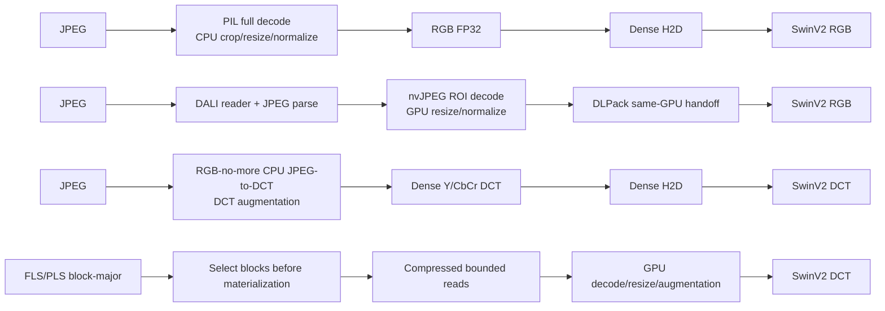

# GALP on SwinV2-T：端到端训练、推理与 I/O 性能报告

日期：2026-09-13
硬件：NVIDIA GeForce RTX 4090（24 GiB）
软件：PyTorch 2.11.0+cu128，CUDA 12.8
数据集：ImageNet-1K，训练集 1,281,167 张，验证集 50,000 张

## 摘要

本报告考察 GALP 的 block-major B6 数据路径能否从 ViT-Ti 迁移到计算量更大的
SwinV2-T，并在保持模型语义和收敛行为的同时改善端到端训练与推理性能。结果给出
了肯定答案，但训练与推理使用两个不同、各自合理的 SwinV2-T 配置，不能把它们
解释为同一 checkpoint 上的两项测试：

- 训练使用 `rgbnomore-swinv2-t-dct-224-v1`，输入 224、window 7、DCT-native
  grouped/sub-block stem、28.34M 参数和 BF16。它与现有 224-crop B6 物理布局匹配，
  用于从随机初始化测试收敛和端到端训练吞吐。
- 推理使用 `rgbnomore-swinv2-t-256-window8-v1`，输入 256、window 8、FP32，
  加载 RGB-no-more 发布的 RGB 与 DCT 两个 300-epoch checkpoint。DCT checkpoint
  在完整 50,000 张 ImageNet validation 上达到 79.37% Top-1，RGB checkpoint 在
  PyTorch 路径上达到 79.006% Top-1。

训练的主要结果来自每条 pipeline 的完整 warm Epoch 2。GALP Native B6 达到
**1,386.43 img/s**，分别是 recipe-matched RGB-no-more DCT、DALI D2 和 PyTorch
的 **2.56x、1.32x 和 2.01x**。DALI D3 使用 DALI-native shuffle/crop/flip，达到
1,148.48 img/s；它是性能上界，不是与 B6 或 D2 完全等语义的 baseline。五条路径
的 model-only 校准均在 1,358--1,388 img/s，说明端到端差异主要来自输入路径及其
与模型执行的交互，而不是 SwinV2 主干本身。

推理在完整 validation、batch 50、5 个 repeat 上运行；聚合排除 cold repeat 0。
GALP 达到 **1,044.01 img/s**，比严格同域、同 checkpoint 的 RGB-no-more DCT
快 **1.130x**。DALI 达到 1,068.56 img/s，比同域 PyTorch RGB 快 1.244x。DALI
与 GALP 的绝对吞吐只相差 2.35%，但两者使用不同输入域和不同 checkpoint，因此
只能作为系统级参考，不能解释成 codec 或 reader 的纯速度差异。

训练中的 B6 crop pushdown 确实减少了工作：Epoch 2 只选择 72.40% 的向量；相对
整幅 512x512 图像，实际送入 fixed transform 的源 block 为 53.20%，即减少
46.80%。对被触及 rowgroup 的 74.568 GB 压缩 payload，精确选择下界为
55.384 GB，bounded coalescing 实际读取 57.865 GB，read amplification 为
1.0448x。Native pool preparation 的 96.93% 被模型计算隐藏，暴露给训练主线程的
输入等待只有 11.56 s，占 epoch wall time 的 1.25%。

当前证据可以支持“GALP 的 DCT-native B6 方案已经通用于 SwinV2-T，并在训练与
推理中均优于严格同域的 RGB-no-more baseline”。它还不能支持三个更强的结论：

1. 当前未完成 224/window-7 模型的 300-epoch 最终精度；现有单 seed 证据只用于
   用于检验前 15 个 epoch 是否出现收敛速度退化；结果未观察到退化。Native B6 的长前缀另保留到 epoch 78，
   最近一次定期 validation 为 epoch 75。
2. 当前 SwinV2 结果没有 Nsight Systems 全 epoch trace，因而没有 SwinV2 专属的
   GPU idle、PCIe copy 数量和 kernel-overlap 百分比。
3. 运行时未采集块设备层的 `read_bytes`，所以本文的 disk-read 数字是 reader/FLS
   计数器给出的逻辑或有界物理范围读取，不是操作系统 page cache 之后真正抵达
   NVMe 的流量。

## 1. 实验问题与证据结构

报告围绕四个问题组织。

1. B6 是否能够驱动 SwinV2-T 有效训练，而不依赖 ViT 特有的模型实现？
2. 与 RGB-no-more、DALI 和 PyTorch 相比，B6 的端到端训练性能如何？
3. 在官方 300-epoch SwinV2-T checkpoint 上，四条推理路径的吞吐、时延、精度和
   资源占用如何？
4. 性能差异能否由读取量、crop pushdown、CPU/GPU materialization、H2D 和重叠
   行为解释？

不同证据回答不同问题，不能互相替代。

| 证据 | 模型配置 | 运行长度 | 能支持的结论 | 不能支持的结论 |
| --- | --- | --- | --- | --- |
| 训练收敛对照 | 224/W7 DCT，BF16 | Native/standard DCT 公共前缀 E0--E15 | 单 seed 下是否出现明显发散或曲线位移 | 跨 seed 统计等价、300-epoch 最终精度 |
| Native 长训练前缀 | 224/W7 DCT，BF16 | 训练到 E78，validation 记录到 E75 | B6 可持续训练、长前缀精度趋势 | 官方预训练精度、与 reference 的 E15 之后配对比较 |
| 训练性能矩阵 | 224/W7 DCT 或 RGB，BF16 | 完整 E1/E2；E2 为主要 warm observation | equal-image 系统吞吐与阶段计数 | 长期吞吐分布、最终精度 |
| 推理 E2E | 256/W8，FP32，官方 E300 checkpoint | 50,000 张 x 5 repeat | 同域端到端吞吐、时延、精度、RSS 和 Torch 显存 | 训练吞吐、跨域纯 pipeline 差异 |

## 2. SwinV2-T 模型与数据路径

### 2.1 模型配置

| 属性 | 训练 DCT 模型 | 推理 DCT 模型 | 推理 RGB 模型 |
| --- | --- | --- | --- |
| 注册名 | `rgbnomore-swinv2-t-dct-224-v1` | `rgbnomore-swinv2-t-256-window8-v1` | 同一推理注册项的 RGB 分支 |
| 输入域 | JPEG DCT | JPEG DCT | RGB |
| 输入分辨率 | 224 | 256 | 256 |
| Window size | 7 | 8 | 8 |
| Stage depths | [2, 2, 6, 2] | [2, 2, 6, 2] | [2, 2, 6, 2] |
| Embedding dims | [96, 192, 384, 768] | [96, 192, 384, 768] | [96, 192, 384, 768] |
| Attention heads | [3, 6, 12, 24] | [3, 6, 12, 24] | [3, 6, 12, 24] |
| DCT/RGB 参数量 | 28,344,850 | 28,344,850 | 28,347,154 |
| Precision | BF16 autocast | FP32 | FP32 |
| 权重 | 随机初始化，用于训练实验 | E300，SHA-256 `f4b7...c22` | E300，SHA-256 `af720...dc0c` |

DCT stem 接收 Y 与 Cb/Cr 的量化 DCT block grid。224 配置的 Y grid 为
`1x28x28x8x8`，Cb/Cr grid 为 `2x14x14x8x8`；256 配置分别为
`1x32x32x8x8` 与 `2x16x16x8x8`。因此 DCT-native stem 保持统一的模型侧
`(Y, CbCr)` 接口，模型 registry 只负责构造模型，物理布局、PLS 调度和训练循环
不依赖 backbone 类型。这是从 ViT 迁移到 SwinV2 后仍然成立的通用边界。

### 2.2 四条数据路径

GALP 的差异不只是把 JPEG decoder 换成另一个 decoder。它把 JPEG entropy 工作
移到离线布局构建阶段，在 dense tensor 形成前完成 block 选择，并把压缩 workset
传到 GPU 后再 materialize DCT 输入。代价是离线转换、专用 DCT stem、额外 FLS
存储和较小的算子生态。

## 3. 实验设置与公平性

### 3.1 训练设置

训练性能矩阵对每条 pipeline 处理完全相同的 1,281,167 个逻辑样本，不丢弃尾部：

| 属性 | 值 |
| --- | --- |
| GPU | RTX 4090，UUID `40c637bd-acf5-ea1a-0df8-617138228467` |
| Seed | 11997733 |
| Microbatch | 64 images |
| Gradient accumulation | 16 |
| Effective regular optimizer batch | 1,024 images |
| Microbatches/epoch | 20,019 |
| Optimizer updates/epoch | 1,252 |
| Precision | BF16 autocast |
| Optimizer/scheduler | AdamW；10,000-update warmup；300-epoch cosine horizon |
| Timing | E1 cold observation；E2 primary warm observation；validation 不计入训练吞吐 |
| Audit | `runtime-first-100`；统一 policy hash `cc31...d16e` |

GALP 和 RGB-no-more DCT 共享模型初始状态、premixed mapping、closed-pool 样本顺序、
DCT RandAugment、Mixup、优化器、scheduler 和精度。这一 pair 是最严格、也是本文
训练结果的主要对比。

DALI D2 和 PyTorch 共享 RGB 模型初始状态、canonical order、逐样本 planned
crop/flip、优化器和 scheduler，是严格 RGB pair。DALI D3 共享模型和优化 recipe，
但使用 DALI-native shuffle、`image_random_crop` 和 `coin_flip`；它只用于给出 DALI
自身的性能上界。

DCT pair 与 RGB pair 的输入域、参数量、增强 recipe 和 crop/order 均不同。跨 pair
比较回答的是“完整训练系统在各自合理 recipe 下运行多快”，不回答“只替换 reader
能加速多少”。

### 3.2 推理设置

| 属性 | 值 |
| --- | --- |
| Dataset | 完整 ImageNet-1K validation，50,000 张 512x512 JPEG |
| Batch | 50，1,000 batch/repeat，不丢尾部 |
| Repeats | 5；保留 repeat 0，聚合 repeat 1--4 |
| Precision | FP32 |
| Workers | 8；不同 pipeline 的 worker 抽象不同 |
| Sample order | 同一 canonical manifest ordinal |
| DCT checkpoint | `imgnetSwinDCT_ep300_79.4.pth`，115,404,785 bytes |
| RGB checkpoint | `imgnetSwinRGB_ep300_79.0.pth`，115,413,809 bytes |
| Page cache | 不受控；因此结果是 warm-cache/system E2E，不是 cold-NVMe benchmark |

GALP 与 RGB-no-more 使用相同 DCT checkpoint 和 DCT preprocessing contract，输入
tensor 与 logits 经过数值验证。DALI 与 PyTorch 使用相同 RGB checkpoint 和高层
resize/crop/range recipe；nvJPEG 与 PIL/torchvision 产生实现级数值差异，因此该 pair
是同模型系统比较，但不是逐元素完全相同的 preprocessing 实现。

## 4. 训练端到端性能

### 4.1 Warm Epoch 2 总体结果

| Pipeline | 域 | Epoch wall (s) | img/s | 相对 GALP | GALP 加速比 | 每 epoch 节省时间 |
| --- | --- | ---: | ---: | ---: | ---: | ---: |
| **GALP Native B6** | DCT | **924.08** | **1,386.43** | 1.000 | 1.000x | -- |
| RGB-no-more DCT | DCT | 2,368.96 | 540.81 | 0.390 | **2.564x** | **24.08 min** |
| DALI D2 | RGB | 1,221.34 | 1,048.98 | 0.757 | **1.322x** | **4.95 min** |
| DALI D3 ceiling | RGB | 1,115.53 | 1,148.48 | 0.828 | **1.207x** | **3.19 min** |
| PyTorch | RGB | 1,854.40 | 690.88 | 0.498 | **2.007x** | **15.51 min** |

同域 pair 的结论更强：GALP 比 RGB-no-more DCT 快 2.564x；DALI D2 比 PyTorch
快 1.518x。DALI-native D3 又比严格 D2 快 1.095x；两者 decoder 相同，因此这
9.5% 的差异反映了放松 canonical order 和改用 native augmentation 的组合影响，
不能进一步归因于其中某一个因素。

### 4.2 Cold-to-warm 行为

| Pipeline | Epoch 1 img/s | Epoch 2 img/s | Warm uplift |
| --- | ---: | ---: | ---: |
| GALP Native B6 | 1,263.48 | 1,386.43 | +9.73% |
| RGB-no-more DCT | 517.10 | 540.81 | +4.59% |
| DALI D2 | 866.09 | 1,048.98 | +21.12% |
| DALI D3 | 1,094.70 | 1,148.48 | +4.91% |
| PyTorch | 684.99 | 690.88 | +0.86% |

D2 的 cold penalty 最大，主要包含严格 order/crop planning 和 DALI pipeline 初始化。
因此不应把 Epoch 1 与另一条 pipeline 的 Epoch 2 混合比较。

### 4.3 Model-only 校准

Model-only 使用固定、已驻留 GPU 的 tensor，包含 forward、loss、backward、gradient
clipping、optimizer、独立 weight decay、scheduler 和同一 audit policy；不包含读取、
decode、augmentation 或 H2D。每条校准测量 120 个 optimizer update，共 122,880 张。

| Pipeline 对应模型 | Model-only img/s | ms/microbatch | E2E / model-only |
| --- | ---: | ---: | ---: |
| GALP DCT | 1,377.06 | 46.476 | 100.68%* |
| RGB-no-more DCT | 1,388.03 | 46.109 | 38.96% |
| DALI D2 RGB | 1,358.38 | 47.115 | 77.22% |
| DALI D3 RGB | 1,373.42 | 46.599 | 83.62% |
| PyTorch RGB | 1,381.78 | 46.317 | 49.999% |

`*` GALP E2E 比独立 model-only 校准高 0.68% 不表示输入处理有负开销。两个测量窗口
独立，输入与模型工作可重叠，且存在频率/温度和 audit realization 差异；model-only
只能作为诊断参照，禁止从 E2E 时间中相减。

五个 model-only 结果的跨度只有 2.18%。相比之下，E2E 最大与最小吞吐相差
2.56x。因此 SwinV2 计算图不是不同 pipeline 之间的主要差异来源。

### 4.4 Epoch 2 critical-path breakdown

以下百分比均以各自 epoch wall 为分母。它们描述不同观察窗口，存在重叠，不能相加。

| Pipeline | Prep | 暴露输入等待 | Audit | Boundary sync | 其他可重叠内部工作 |
| --- | ---: | ---: | ---: | ---: | --- |
| GALP B6 | 3.73 s (0.40%) | 11.56 s (1.25%) | 44.35 s (4.80%) | 0 | pool prepare 约 364.4 s，96.93% 隐藏 |
| RGB-no-more DCT | 390.87 s (16.50%) | 126.68 s (5.35%) | 0.044 s | 0 | augmentation 2,652.81 s；read+decode 1,238.93 s；preprocess 198.77 s |
| DALI D2 | 99.26 s (8.13%) | 9.18 s (0.75%) | 28.58 s (2.34%) | 0.00013 s | DALI operator 内部时间不可见；DLPack host handoff 4.29 s |
| DALI D3 | 9.76 s (0.88%) | 4.00 s (0.36%) | 33.69 s (3.02%) | 0.00036 s | DALI operator 内部时间不可见；DLPack host handoff 5.61 s |
| PyTorch | 93.49 s (5.04%) | 5.32 s (0.29%) | 78.57 s (4.24%) | 0.00020 s | decode 1,970.53 CPU-s；augmentation 1,618.40 CPU-s；preprocess 712.82 CPU-s；read 60.42 CPU-s |

这里的 PyTorch 与 RGB-no-more 内部阶段是多个 worker 的累计工作量，超过 epoch wall
是正常的；DALI 的异步 operator 不暴露等价的累计阶段计时。暴露 loader wait 很小
并不等于 input pipeline 没有成本：decode、GPU preprocessing、内存流量和 kernel
launch 可以与模型重叠，同时仍竞争 CPU、SM、L2、DRAM 和 copy engine。

### 4.5 GALP pool prefetch

Warm Epoch 2 有 313 个 pool，native runtime 同时维护两个 context。累计 pool plan
为 104.81 s，materialize 为 259.63 s，但模型计算隐藏了 96.93% 的 prepare 工作。
主线程实际暴露的 next-pool wait 为 11.20 s，next-microbatch wait 为 0.37 s；pool
boundary wait 为 0.99 s。没有 io_uring fallback、重复物理读取或物理顺序 inversion。

这与 ViT 阶段的关键变化一致：旧的 serial-pool 方案会在每个 pool 完成训练后才加载
下一个 pool；当前 SwinV2 结果使用 native lookahead，让 Pool N+1 的 plan/read/decode
与 Pool N 的模型计算重叠。SwinV2 更长的模型计算窗口为 pool preparation 提供了更多
隐藏空间，因此 GALP 已接近模型主导状态。

## 5. 训练 I/O、crop pushdown 与数据移动

### 5.1 存储 footprint

训练 JPEG inventory 为 50.601 GB。premixed FLS materialization 总大小为
106.946 GB，平均 83,476 bytes/image；其中包含 FLS container、压缩 payload 和
metadata。因此该布局的离线存储约为源 JPEG 的 2.114x。这个代价不能被 H2D 或
吞吐收益掩盖。

| 对象 | 大小 | 相对 JPEG | 说明 |
| --- | ---: | ---: | --- |
| 源 JPEG inventory | 50.601 GB | 1.000x | RGB-no-more、DALI、PyTorch 每 epoch 均遍历完整 inventory |
| premixed FLS materialization | 106.946 GB | 2.114x | 离线数据集 footprint，含 metadata/container |
| B6 Epoch 2 实际 compressed range read | 57.865 GB | 1.144x | runtime/FLS 计数器；不是 NVMe device traffic |

GALP 在该布局下仍比 JPEG 多读取 14.36% 的逻辑字节。它的系统优势来自提前消除
在线 entropy decode、在 materialization 前做选择、降低 CPU dense tensor 构造，
以及压缩传输与 GPU materialization，而不是更小的原始存储 inventory。

### 5.2 Crop pushdown 的逐层效果

对于 512x512 源图像和当前 square crop quantization，Y 分量只有三种 crop 尺寸：

| Y crop | 概率 | 每图源 DCT blocks | 占完整 6,144 blocks |
| --- | ---: | ---: | ---: |
| 14x14 | 6.62% | 294 | 4.79% |
| 28x28 | 32.38% | 1,176 | 19.14% |
| 56x56 | 61.00% | 4,704 | 76.56% |

理论加权 block retention 为 53.220%，即最多减少 46.780% 的源 block 工作。SwinV2
Warm Epoch 2 的原生计数器给出几乎相同的实测结果：

| 层次 | 数值 | Retention / amplification | 含义 |
| --- | ---: | ---: | --- |
| 整图理论源 blocks | 7,871,490,048 | 100% | 1,281,167 x 6,144 |
| 实际 fixed-transform 源 blocks | 4,187,759,520 | **53.202%** | crop 后少处理 46.798% |
| fixed-transform 输出 blocks | 1,506,652,392 | 19.141% of full | resize 后的模型输入 grid |
| Full vectors in touched rowgroups | 5,648,603 | 100% | runtime denominator |
| Selected vectors | 4,089,642 | **72.401%** | 少 decode 27.599% vectors |
| Touched-rowgroup full payload | 74.568 GB | 100% | 已跳过完全无关 rowgroup 后的 denominator |
| Exact selected payload | 55.384 GB | 74.275% | vector-exact 理想下界 |
| Actual bounded/coalesced read | 57.865 GB | **77.600%** | 相对 touched-rowgroup full 少读 22.400% |
| Actual / exact selected | -- | **1.0448x** | bounded coalescing 的 read amplification |

完全跳过未触及 rowgroup 的收益没有包含在“22.400%”这个 denominator 中。复用同一
B6 layout audit 的全 payload 口径时，完整 payload 为 104.196 GB，实际读取
57.865 GB，即减少 44.47%，已经获得理论可用 byte saving 的约 94.9%。报告这两个
百分比时必须同时写清 denominator。

### 5.3 Logical read、range read 与 physical disk read

本文把三类“读取量”严格区分：

- `encoded_source_bytes` 或 JPEG inventory 是应用需要遍历的编码文件总字节。
- `compressed_payload_bytes_read` 是 GALP reader 对 FLS payload 发出的逻辑/有界范围
  读取；Epoch 2 为 57.865 GB，伴随 2,839,332 次 io_uring read request。
- NVMe physical read 是 page cache miss 后到块设备的真实字节。当前运行没有在统一
  measurement window 内采集 `/proc/<pid>/io`、cgroup I/O 或 `iostat/nvme smart-log`，
  因而不能由前两项推断。

训练和推理均未清空 OS page cache，且各 pipeline 顺序执行。当前吞吐应解释为常规
warm-cache 端到端系统性能。若要声称“减少了 X% SSD traffic”，必须另做受控 cold-cache
或 direct-I/O 实验；目前只能声称减少了 reader 请求的 FLS payload 范围。

### 5.4 模型输入与 H2D

224 输入的 dense RGB FP32 tensor 为 602,112 bytes/image，完整 epoch 为
771.406 GB。DCT `(Y, CbCr)` dense tensor 为 301,056 bytes/image，完整 epoch 为
385.703 GB。它们是由 shape 精确计算的逻辑 tensor 大小，不是 PCIe profiler 实测值。

| 路径 | 224 训练模型输入 | 理论 dense tensor/epoch | 当前 SwinV2 实测 H2D bytes |
| --- | --- | ---: | ---: |
| PyTorch | RGB FP32 | 771.406 GB | 未采集；若每图 dense copy 一次，则等于左值 |
| RGB-no-more DCT | DCT FP32 | 385.703 GB | 未采集；CPU 构造 dense DCT 后传输 |
| DALI | GPU RGB | 771.406 GB logical output | nvJPEG intermediate/H2D 未由当前 JSON 暴露 |
| GALP B6 | compressed workset -> GPU DCT | 385.703 GB logical output | 当前训练 report 未保留 DMA byte counter |

`Fastlanes4ML-21.pdf` 中 ViT 的同一 224/B6 输入路径通过 Nsight 估算 GALP H2D
约 87.4 GB/epoch、PyTorch dense H2D 约 771.4 GB/epoch。由于当前 SwinV2 训练没有
对应 Nsight trace，87.4 GB 只能作为同数据路径的参考估计，不能写成 SwinV2 实测值。

## 6. 训练收敛

### 6.1 配对 E15 诊断

Native B6 与 standard RGB-no-more DCT 使用相同的 premixed physical position 到源
JPEG mapping；standard path 在线读取 JPEG DCT，再应用相同 DCT RandAugment、Mixup、
optimizer、scheduler 和样本顺序。两条路径的 validation 都使用共享 GALP Direct-DCT
路径。

| Epoch | Native B6 Top-1 | Standard DCT Top-1 | Delta | Native B6 Top-5 | Standard DCT Top-5 |
| ---: | ---: | ---: | ---: | ---: | ---: |
| 0 | 0.118% | 0.118% | 0.000 pp | 0.520% | 0.520% |
| 1 | 4.190% | 3.622% | +0.568 pp | 13.058% | 12.002% |
| 2 | 15.336% | 14.794% | +0.542 pp | 34.580% | 34.054% |
| 5 | 38.988% | 38.358% | +0.630 pp | 65.208% | 64.692% |
| 10 | 53.196% | 53.100% | +0.096 pp | 78.024% | 78.032% |
| 15 | **59.816%** | **59.490%** | **+0.326 pp** | 83.234% | 82.944% |

Epoch 15 validation loss 为 1.66349 vs 1.68678；归一化 Top-1 AUC 为 40.4262 vs
40.0617，差值 +0.3645 pp。结果没有显示 B6 的收敛速度回退。这里没有套用 ViT
阈值，也没有用这一个 seed 声称统计等价。

两次运行的 runtime source identity 不完全相同，因为 standard backend 在 Native
前缀开始之后加入。模型和 recipe 的配对字段已核对，但这一事实限制了更强的逐实现
等价声明。

### 6.2 Native 长前缀

Native B6 实际保存了 epoch 78 训练状态；定期 validation 记录到 epoch 75：

| Epoch | Top-1 | Top-5 | Validation loss |
| ---: | ---: | ---: | ---: |
| 20 | 61.464% | 84.538% | 1.59360 |
| 30 | 64.244% | 86.310% | 1.45492 |
| 40 | 66.046% | 87.664% | 1.36961 |
| 50 | 66.618% | 88.036% | 1.34351 |
| 60 | 67.518% | 88.802% | 1.28580 |
| 70 | 68.646% | 89.226% | 1.24397 |
| 75 | **69.426%** | **89.720%** | **1.20579** |

曲线持续改善，说明 B6 可以长期驱动 SwinV2-T；但训练尚未到 300 epoch，不能将
69.426% 与官方 256/W8 E300 checkpoint 的 79.4% 横向解释。两者分辨率、window、
训练完成度和 checkpoint 来源都不同。

## 7. 推理端到端性能

### 7.1 吞吐、时延与精度

下表报告 hot repeats 1--4 的中位数；p95 列先在每个 repeat 内计算 batch latency
p95，再对四个 repeat 取中位数。

| Pipeline | 域 | Throughput | Mean latency | p95 latency | Top-1 | Top-5 | Throughput CV |
| --- | --- | ---: | ---: | ---: | ---: | ---: | ---: |
| **GALP** | DCT | **1,044.01 img/s** | **47.892 ms** | **48.012 ms** | **79.370%** | **94.766%** | 0.029% |
| RGB-no-more | DCT | 923.57 img/s | 54.138 ms | 56.410 ms | 79.370% | 94.766% | 0.340% |
| DALI | RGB | **1,068.56 img/s** | **46.792 ms** | **47.145 ms** | 78.980% | 94.634% | 0.137% |
| PyTorch | RGB | 858.91 img/s | 58.215 ms | 65.266 ms | 79.006% | 94.662% | 0.884% |

严格 DCT pair 中，GALP 吞吐提升 13.04%，mean latency 降低 11.54%，p95 latency
降低 14.89%。RGB pair 中，DALI 吞吐提升 24.41%，mean latency 降低 19.62%，
p95 latency 降低 27.77%。

DALI 比 GALP 快 2.35%，但它们使用 RGB/DCT 两个域专用 checkpoint。这个差异只能
说明两套完整系统在各自模型上的绝对速度接近，不能说明 DALI reader 比 GALP reader
快 2.35%。

### 7.2 推理阶段计时

| Pipeline | Submit mean | 显式 H2D/handoff GPU mean | Model forward GPU mean | 50k images wall |
| --- | ---: | ---: | ---: | ---: |
| GALP | 0.343 ms/batch | 0.015 ms/batch | 47.282 ms/batch | 47.892 s |
| RGB-no-more | 0.539 ms/batch | 0.957 ms/batch | 52.287 ms/batch | 54.138 s |
| DALI | 0.538 ms/batch | 0.016 ms/batch | 46.003 ms/batch | 46.792 s |
| PyTorch | 0.571 ms/batch | 1.858 ms/batch | 55.379 ms/batch | 58.215 s |

DALI 与 GALP 的显式 handoff 很小，因为 tensor 已在 GPU；该数字不包含 DALI 内部
nvJPEG 的 host/device transfer。RGB-no-more 与 PyTorch 从 CPU dense tensor 做 H2D。
Model-forward CUDA event 也会受到并发输入 kernels 和内存系统竞争影响，不能把四条
forward 均值当作一个固定模型常数。

GALP 在一个 hot repeat 内的 native 累计观测如下；hot-repeat 中位数相近：

| GALP 内部阶段 | 累计时间 | 计时语义 |
| --- | ---: | --- |
| Producer active | 59.00 s | 异步工作，可与模型和其他阶段重叠 |
| I/O staging | 4.40 s | 读取与 pinned staging 工作 |
| Planning | 2.25 s | batch/workset planning |
| Synchronous rowgroup read | 0.49 s | 同步读取窗口 |
| Workset build | 4.32 s | host workset 构建 |
| Workset upload | 2.51 s | 压缩 arena/descriptor upload |
| Decode kernels | 1.57 s | GPU FastLanes decode |
| Fixed transform kernels | 18.41 s | GPU DCT resize/finalize |
| Round kernels | 0.24 s | 量化/rounding 相关 kernel |
| Consumer exposed wait | **0.129 s** | 主消费者真正等待 ready batch 的时间 |

Producer active 大于 47.89 s wall 是异步重叠的结果。各行不可相加，也不能用它们
减去 wall 来估计 model-only 时间。

### 7.3 推理 I/O 与 H2D

完整 validation JPEG inventory 为 2.052 GB，平均 41.0 KB/image。GALP validation
不做 crop pushdown：`actual_vector_count == full_vector_count == 300,000`，且
`compressed_payload_bytes_read == full_compressed_payload_bytes == 3.472 GB`。
这是预期行为，因为固定 validation resize 需要完整源 DCT grid；训练的随机 crop
选择收益不能直接迁移到该推理 recipe。

| Pipeline | Reader-level encoded bytes / 50k | Bytes/image | H2D/transfer 证据 |
| --- | ---: | ---: | --- |
| GALP | 3.472 GB FLS payload | 69.4 KB | workset DMA 8.372 GB；28,643 DMA operations |
| RGB-no-more | 2.052 GB JPEG inventory | 41.0 KB | dense DCT 理论 19.661 GB；当前未记录 copy bytes |
| DALI | 2.052 GB JPEG inventory | 41.0 KB | nvJPEG intermediate traffic 未记录 |
| PyTorch | 2.052 GB JPEG inventory | 41.0 KB | dense RGB 理论 39.322 GB |

GALP 在没有 crop pushdown 的 validation 上读取的编码 payload 是 JPEG inventory 的
1.692x。它仍比 RGB-no-more DCT 快 13.0%，说明该推理收益不能归因于“少读盘”；
更合理的机制是消除在线 JPEG-to-DCT CPU 处理、压缩 workset upload 与 GPU-native
materialization。

256 输入的 dense DCT tensor 为 393,216 bytes/image，dense RGB tensor 为
786,432 bytes/image。GALP 的 `workset_upload_dma_bytes` 为 8.372 GB，即
167.4 KB/image；它比 dense DCT tensor 总量低 57.42%，比 dense RGB tensor总量低
78.71%。该 counter 包含压缩 arena 与执行 descriptor，不等同于纯 payload bytes，
但它比只看 `compressed_payload_bytes_read` 更接近 GALP 实际 host-to-device workset
流量。

GALP 每个 batch 使用一次 decode kernel 和一次 async completion，共 1,000 次；
`internal_syncs=0`。49,953 次 `pread` 读取 298,103 个 pinned rowgroup，之后形成
28,643 次 workset DMA。这个访问粒度仍明显比理想的“每 batch 一次 H2D”细，说明
inference 仍有 compact read coalescing 和 upload packing 的优化空间。

### 7.4 内存占用

| Pipeline | Peak host RSS | Torch peak allocated | Torch peak reserved | 解释边界 |
| --- | ---: | ---: | ---: | --- |
| GALP | 3,100.6 MiB | 1.155 GiB | 1.865 GiB | Torch counter 不含 GALP native allocator |
| RGB-no-more | 2,674.0 MiB | 1.173 GiB | 1.885 GiB | 主进程 RSS 不含 loader child process |
| DALI | 3,051.9 MiB | 1.146 GiB | 1.859 GiB | Torch counter 不含 DALI native allocator |
| PyTorch | 3,387.2 MiB | 1.183 GiB | 1.896 GiB | 主进程 RSS 不含 DataLoader workers |

Torch 显存数字只覆盖 Torch allocator，不能用于声称 GALP 或 DALI 的完整设备内存低于
其他路径。GALP native 计数器另外观察到 311.3 MB device allocation 和 179.8 MB
pinned host allocation 的进程级 high-water；这些值与 Torch allocator scope 不同，
不应直接相加后与其他 pipeline 比较，除非为所有系统统一采集 NVML/CUPTI footprint。

### 7.5 推理正确性与 accuracy

GALP 与 RGB-no-more 的 50,000 个预测完全一致，Top-1 agreement 为 1.0。8 个语义
样本上，DCT 输入最大绝对误差为 `1.19e-7`，logit cosine mean 为
`0.99999999999`，logit Top-1 agreement 为 1.0。

DALI 与 PyTorch 的完整预测 Top-1 agreement 为 0.99056。8 个语义样本上的 RGB
输入 max-abs 为 0.15686，logit cosine mean 为 0.99703。两条路径最终 Top-1 只差
0.026 pp，但这种接近不等于 tensor equivalence；差异来自 nvJPEG/DALI 与
PIL/torchvision 的 decoder、resize 和舍入实现。

## 8. 与 ViT-Ti 结果的关系

`Fastlanes4ML-21.pdf` 中的 ViT-Ti 结果提供了相同类型的系统证据：E2E、model-only、
data-only、GPU idle、H2D、logical read、crop-pushdown、shuffle ablation 和时间线。
当前 SwinV2 结果已经覆盖 E2E、model-only、logical/range read、pushdown、收敛、
accuracy、时延和内存，但还缺 SwinV2 专属的 data-only 与 Nsight GPU timeline。

下面只做架构迁移层面的观察，不把不同日期/测量协议的绝对数值当作严格 A/B：

| 指标 | ViT-Ti（旧报告） | SwinV2-T（本文） | 解释 |
| --- | ---: | ---: | --- |
| DCT 参数量 | 5.64M | 28.34M | SwinV2 约 5.02x 参数 |
| GALP 训练 E2E | 2,246 img/s | 1,386 img/s | 更重模型降低绝对吞吐 |
| DCT model-only | 2,527 img/s | 1,377 img/s | SwinV2 模型 ceiling 更低 |
| GALP 暴露等待 | 0.46%（ViT trace） | 1.25%（Swin E2） | 两者均非主要 critical path |
| B6 actual range read | 57.865 GB | 57.865 GB | 同布局、同 seed/crop contract；与 backbone 无关 |
| Crop block retention | 53.22% | 53.20% | 理论与 Swin runtime counter 一致 |

ViT 的 GALP 训练吞吐相对 model-only 为 88.9%；SwinV2 的独立 model-only 校准与
E2E 相差不到 1%。一种与现有证据一致的解释是：模型计算窗口变长后，pool preparation
更容易被隐藏；是否完全重叠仍需通过 Nsight 时间线确认。
该结论与 96.93% pool-prepare hidden ratio 一致，但最终的精确 GPU overlap 仍应由
SwinV2 Nsight trace 确认。

通用性证据不要求 SwinV2 达到与 ViT 相同的绝对 img/s。关键是模型 registry 只替换
backbone/stem 构造，B6 的布局、reader、native scheduling、crop pushdown 和
Direct-DCT contract 均未为 SwinV2 写成专用路径，同时同域 baseline 上仍观察到训练
2.56x 和推理 1.13x 的端到端收益。

## 9. 可以发布的结论与限制

### 9.1 证据直接支持的结论

- GALP B6 已经从 ViT-Ti 迁移到 28.34M 参数的 SwinV2-T DCT-native 模型；训练到
  已记录完整的 epoch 78 metrics，现有记录中未见非有限值或执行失败。
- 在相同初始化、样本顺序、增强、优化器、scheduler、精度和图像数量下，GALP
  Native B6 的 warm full-epoch 训练吞吐是 RGB-no-more DCT 的 2.564x。
- 在同一官方 DCT E300 checkpoint 上，GALP 的完整 ImageNet validation 推理吞吐
  是 RGB-no-more 的 1.130x，并保持逐样本预测完全一致。
- B6 crop pushdown 将 fixed-transform 源 block 工作减少 46.80%，将 touched-rowgroup
  compressed payload range read 减少 22.40%；bounded read 距精确选择下界只有
  4.48% amplification。
- 训练中五条路径的 model-only 吞吐接近，而 E2E 差异显著；输入 pipeline 与模型
  的系统交互是主要解释变量。

### 9.2 当前不应发布的强结论

- 不应称 224/W7 Native B6 已达到官方 300-epoch accuracy；它没有训练到 300 epoch。
- 不应把 GALP 与 DALI 的跨域比值称为 reader、decoder 或 compression 的纯加速比。
- 不应把 logical FLS range read 称为物理 SSD/NVMe traffic。
- 不应把 overlapping worker/GPU stage time 相加，或从 epoch wall 中相减。
- 不应把 Torch allocator peak 当作 GALP/DALI 的完整 GPU memory footprint。
- 不应把 ViT Nsight 的 87.4 GB H2D、GPU idle 或 copy count 写成 SwinV2 实测值。

### 9.3 尚缺的测量

为了达到 `Fastlanes4ML-21.pdf` 中 ViT timeline 的全部信息维度，SwinV2 还需补三组
诊断实验。它们不影响当前 E2E 结论，但能使机制归因更完整。

1. **SwinV2 data-only ceiling**：每条 pipeline 在不运行模型的情况下测量稳定供给率，
   区分“数据服务本身慢”和“与训练计算争用导致效率下降”。
2. **Nsight Systems matched window**：在同一 16,384-image window 内采集 H2D bytes、
   memcpy count、GPU idle、H2D/model overlap、input/model overlap 和 kernel timeline。
3. **受控 disk traffic**：单独运行每条 pipeline，记录进程/cgroup `read_bytes` 与块设备
   sector delta；分别报告 warm-cache 和受控 cold-cache，避免将 page-cache hit 误算
   为 NVMe read。

## 10. 原始证据与可复现性

### 10.1 训练

- 统一性能报告：
  `/mnt/nvme2/home/tangyuxin/pls-experiments/swinv2-training-performance-e2-4090-20260912-v1/report/equal_image_performance.json`
- Native B6 metrics：
  `/mnt/nvme2/home/tangyuxin/pls-experiments/swinv2-training-performance-e2-4090-20260912-v1/galp_b6/runs/B6/seed_11997733/metrics.jsonl`
- RGB-no-more DCT metrics：
  `/mnt/nvme2/home/tangyuxin/pls-experiments/swinv2-training-performance-e2-4090-20260912-v1/rgbnomore_dct/runs/B6/seed_11997733/metrics.jsonl`
- DALI D2/D3 与 PyTorch：
  `/mnt/nvme2/home/tangyuxin/pls-experiments/swinv2-training-performance-e2-4090-20260912-v1/{d2,d3,pytorch}/results.json`
- E15 收敛报告：
  `/mnt/nvme2/home/tangyuxin/pls-experiments/swinv2-training-suite-4090-20260909-v2/reports/convergence_reference_e15/convergence_reference.json`
- Native 长前缀：
  `/mnt/nvme2/home/tangyuxin/pls-experiments/swinv2-training-suite-4090-20260909-v2/scientific_matrix/runs/B6/seed_11997733`
- Premixed materialization：
  `/home/tangyuxin/gfastlanes/FastLanes/galp/data/compressed/imagenet512_train_block_major_premixed/materialization_result.json`

五条训练性能路径共享 runtime source tree SHA-256：
`d04aa2b37b7d432ae771c3a896474e236ba9122d22b5f9279fdcbe206f7c42c4`。
Native 与 standard DCT 的 premixed mapping SHA-256 均为
`98f77515e5886c098e46c23cddb41f57098b406ab32790509254c56356dc24ff`。

### 10.2 推理

- 统一结果：
  `/mnt/nvme2/home/tangyuxin/pls-experiments/swinv2-inference-e2e-4090-20260911-v2/results.json`
- 语义验证：
  `/mnt/nvme2/home/tangyuxin/pls-experiments/swinv2-inference-e2e-4090-20260911-v2/validation.json`
- Pipeline 原始结果：
  `/mnt/nvme2/home/tangyuxin/pls-experiments/swinv2-inference-e2e-4090-20260911-v2/pipeline_{galp,rgbnomore,dali,pytorch}.json`
- Contract SHA-256：
  `cfb16f1872998723209a906ad2094dddb3e0b5291075221c9bb89515018e9753`

推理 contract 生成时仓库含未提交的 benchmark runtime 改动。产物保存了 git commit、
diff SHA-256、运行文件逐项 SHA-256、native binary 和数据 payload fingerprint，因而
当前结果可追溯，但正式论文发布前应从 clean commit 复跑并固化 tag。

## 11. 结论

SwinV2-T 的结果把 GALP 的有效范围从轻量 ViT-Ti 扩展到了更重的分层 window
Transformer。B6 不依赖 ViT token 拓扑；它依赖的是稳定的 DCT-native stem contract、
可在 dense materialization 前执行的 block 选择，以及能够把 pool preparation 与模型
计算重叠的 native runtime。在 224/W7 训练中，这些机制使 GALP 达到 1,386.43 img/s，
是严格同配方 RGB-no-more DCT 的 2.564x，并在单 seed 前 15 epoch 内保持相近的收敛
曲线。在官方 256/W8 E300 推理中，GALP 保持 DCT 预测完全一致，以 1,044.01 img/s
比 RGB-no-more 快 13.04%。

性能的主要来源不是更小的磁盘 inventory：FLS footprint 和 validation logical read
都大于 JPEG。收益来自将 JPEG entropy 工作离线化、crop-before-materialize、压缩
workset 数据移动、GPU-native DCT transform 和跨 pool 重叠。下一轮机制分析应补齐
SwinV2 专属的 data-only、Nsight timeline 和块设备读量；这些指标用于解释已经观察到
的端到端结果，而不是重新证明收敛或重新运行已经完成的 baseline 矩阵。
