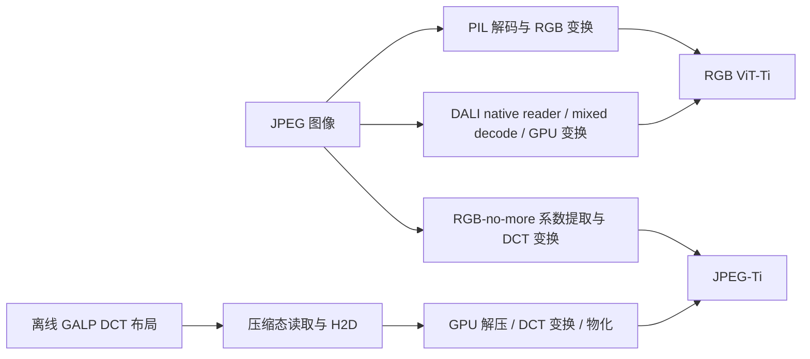

# GALP on ViT-Ti：端到端训练、推理与 I/O 性能报告

整理日期：2026-09-16。本文汇总 RGB-no-more ViT-Ti / JPEG-Ti 的既有实验，章节与
[CNN 报告](CNN_SYSTEM_PERFORMANCE_REPORT_2026-09-15.md)、
[SwinV2-T 报告](SWINV2_SYSTEM_PERFORMANCE_REPORT_2026-09-13.md)对应。
训练主结果来自 2026-09-01 的性能研究，分类推理来自 2026-08-05，旧布局的特征提取来自
2026-08-04。三批运行分别保留配置与口径，不视为同一软件版本上的统一实验。

## 摘要

ViT-Ti 的训练结果说明，输入供应足够快以后，完整系统仍可能受到主机提交、依赖和同卡资源交互影响。
RTX 4090 上，GALP B6 的 warm Epoch 2 为 **2246.38 images/s**，DALI D2/D3 分别为
**1607.11 / 1836.17 images/s**。相对各自输入域的 model-only 校准，达到约 88.9%、62.9%、71.8%。
三条路径的独立 data-only 吞吐均高于模型消费速率，不能把差距简单归因于 decoder 供数不足。
GALP 使用 DCT 增强与封闭池顺序，DALI 使用 RGB 输入，排序只能解释完整系统配置。

在另一批 50K 分类推理中，GALP planless、RGB-no-more、DALI、PyTorch 的 hot 中位吞吐为
**4766.23、1788.58、4711.70、1549.46 images/s**。GALP 与相同 DCT checkpoint 的
RGB-no-more 全量预测一致，在线吞吐约为其 **2.66×**。GALP/DALI 仅为 **1.012×**，未达到
当时预设的 1.10× 性能目标，不能报告为显著领先 DALI。

训练中 GALP 的压缩态 H2D 显著小于稠密 RGB，但每轮逻辑读取 57.865 GB，仍大于 JPEG 的
50.601 GB。因此已有收益来自表示、物化和调度的共同作用，不等价于磁盘读量或模型计算已减少。

## 1. 实验问题与证据结构

本文区分完整运行性能、独立服务速率和执行归因。首先比较相同样本数下的训练与推理，随后用
model-only、data-only、I/O 和 Nsight 解释差距。服务速率给出特定配置下的参照，不是通用硬件上限。

| 实验批次 | 范围 | 解释边界 |
| --- | --- | --- |
| 2026-09-01 训练性能研究 | 完整 warm E2；model-only、data-only、matched Nsight、cache 配对短测 | 同 epoch 规模的系统比较；不是 RGB/DCT 收敛等价试验 |
| 2026-08-05 分类推理 | 4 路，每路 50K×5 repeats；聚合 repeat 1–4 | 指定 checkpoint 下的分类吞吐和精度 |
| 2026-08-04 特征提取 | 6 路，每路 50K×5 repeats，另有布局诊断 | 输出 penultimate 192维特征，软件/执行路径不同；不能混入分类主表 |

训练性能研究以 production commit `31c9fd0a12971bab219e90d3fa8e12ba17004f68` 为运行依据，
benchmark study commit 为 `b479bb00439b3ce733813e8bd7aeb05a6aabfdb1`。
推理运行另有自己的源码记录，不能用当前工作区构造出的模型或默认值覆盖历史结果。

## 2. ViT-Ti 模型与数据路径

### 2.1 模型配置与来源

模型来自 Park 和 Johnson 的 CVPR 2023 论文
[RGB No More: Minimally-Decoded JPEG Vision Transformers](https://openaccess.thecvf.com/content/CVPR2023/html/Park_RGB_No_More_Minimally-Decoded_JPEG_Vision_Transformers_CVPR_2023_paper.html)
及[官方 RGB-no-more 实现](https://github.com/JeongsooP/RGB-no-more)。DCT 模型也称 JPEG-Ti。

| 属性 | JPEG-Ti / ViT-Ti DCT | ViT-Ti RGB |
| --- | --- | --- |
| 参数量 | 5,642,728 | 5,716,456 |
| 输入，不含 batch | Y：1×28×28×8×8；CbCr：2×14×14×8×8 | 3×224×224 |
| Patch embedding | grouped/sub-block DCT，ver=1，use_subblock=True | 16×16 RGB patch |
| Transformer | 12 blocks；维度192；3 heads；head dim64；MLP ratio4 | 同左 |
| Tokens / 类别 | 196 / 1000 | 196 / 1000 |
| 分类头 | LayerNorm→token均值→Linear(192,192)→Tanh→Linear(192,1000) | 同左 |
| 推理 checkpoint | `imgnetDCTViTTi_ep300_75.1.pth` | `imgnetRGBViTTi_ep300_74.1.pth` |
| 推理变换 | `ResizedCenterCrop_DCT(32,28)`；范围[-1,1] | 短边256→中心裁剪224；mean/std=.5 |

RGB/DCT 主干尺度相同，但输入层和权重不同。两个输入域之间的性能比较是系统参照，
不能假定输出逐元素等价。

### 2.2 训练与推理路径

训练 B6 按封闭池准备输入，以 lookahead 把下一池的 plan/materialize 放进上一池训练窗口。
DALI D2 使用 native JPEG reader、ROI decode 和预先规划的 crop/flip；D3 使用原生随机裁剪与
shuffle。PyTorch 由 DataLoader worker 解码并构造稠密 RGB，再传到 GPU。

推理只使用确定性验证变换。2026-08-05 的 `galp_planless` 是该次运行记录的执行路径，
不能直接等同于 2026-09-01 的 B6 训练调度或 2026-08-04 的旧 block-major 特征提取路径。

## 3. 实验设置与公平性

### 3.1 训练设置

| 属性 | 2026-09-01 训练研究 |
| --- | --- |
| GPU | RTX 4090；UUID `40c637bd-acf5-ea1a-0df8-617138228467` |
| 软件 | Torch 2.11.0+cu128；DALI 2.2.0；driver 590.48.01；Nsight 2025.5.2 |
| 工作量 | 1,281,167 图/epoch；20,019 microbatches；1252次更新；尾批保留 |
| 测量边界 | 从 E1 / global update1252 恢复，测量 E2 至 update2504 |
| Batch / precision | microbatch64×累积16＝有效batch1024；FP32 |
| 模型编译 | 编译已在 measured E2 timer 外完成 |
| 优化器 | AdamW；LR0.003；betas=(0.9,0.999)；epsilon=1e−8；内置decay=0 |
| 独立衰减 / clipping | weight decay 1e−4；gradient norm1 |
| 调度 | 10,000-update warmup；300-epoch cosine horizon；不是300轮已完成结果 |
| 数值检查 | 前100次 global updates严格；本次E2仍保留每次更新前的gradient finite检查 |
| 计时排除 | checkpoint、logging、validation 不计入 measured training epoch |

DCT 使用随机裁剪、水平翻转、RandAugment N=2/M=3 和 Mixup α=.2；RGB D2/PyTorch
使用计划的逐样本 crop/flip，不启用 RandAugment/Mixup。D3 的顺序和增强由 DALI 自行生成。
即使优化器与 batch 一样，三者也不是仅更换 loader 的同语义实验。

本批 DALI 使用16个 operator threads、prefetch depth2、async/pipelined/dynamic executor
和 DLPack；它不是旧的 Python 逐图读取 JPEG bytes 的 external-source adapter。
PyTorch 完整测量了4与48 workers；48是 data-only sweep 中的候选，不是已证明的全局最优配置。

### 3.2 推理设置

| 属性 | 2026-08-05 分类推理 |
| --- | --- |
| 硬件 / 数据 | RTX 4090；50,000张 ImageNet-512 验证图，固定顺序与标签 |
| Batch / workers / precision | 50 / 8 / FP32；seed11997733 |
| Repeats | 5；repeat0保留但不入hot聚合；repeat1–4取中位数 |
| 每repeat | 1000个测量batch；额外warmup batch=0；50K恰好整除，无样本尾部 |
| 资源计数 | 主进程RSS；Torch allocator显存；不含所有worker/native分配 |

训练主比较的双方数据已进入 page cache；推理也未提供受控冷缓存对照。结果适用于所述缓存状态下的
输入变换、传输与执行比较，不是冷 NVMe 排名。各执行器的 workers 参数具有不同含义。

## 4. 训练端到端性能

### 4.1 Warm Epoch 2

| 路径 | E2 秒 | images/s | 串行准备秒 | 暴露输入等待秒 | Torch peak allocated，GiB |
| --- | ---: | ---: | ---: | ---: | ---: |
| GALP B6，DCT | 570.325 | 2246.38 | 0.000 | 2.644 | 2.198 |
| DALI D2，RGB | 797.185 | 1607.11 | 43.015 | 12.058 | 2.299 |
| DALI D3，RGB | 697.740 | 1836.17 | 10.015 | 5.201 | 2.299 |
| PyTorch，4 workers，RGB | 1363.368 | 939.71 | 33.985 | 209.918 | 2.335 |
| PyTorch，48 workers，RGB | 1168.602 | 1096.32 | 40.449 | 7.125 | 2.335 |

GALP/D2 与 GALP/D3 的吞吐比为1.398×、1.223×，但包含输入域和增强策略差异。
PyTorch由4增至48 workers后，显式等待从209.918秒降至7.125秒，吞吐只从939.71升至1096.32，
表明消除 batch-ready 等待不足以消除完整训练的其他开销。

GALP 的串行整epoch准备为0，不代表没有准备工作。313个池累计异步 plan/materialize/I/O work
约315.188秒，其中 plan97.698秒、materialize217.489秒；312/313池在激活前已准备好。
异步work不能与570.325秒相加。池准备p50约1.01秒，而上一池训练窗口p50约1.82秒，
解释了暴露等待只有epoch时间的0.46%。

### 4.2 Model-only 与 data-only

| 路径 | 本域训练model-only images/s | data-only images/s | E2 / model-only |
| --- | ---: | ---: | ---: |
| GALP，DCT | 2526.88 | 5698.78 | 88.9% |
| DALI D2，RGB | 2556.93 | 15665.56 | 62.9% |
| DALI D3，RGB | 2556.93 | 17682.21 | 71.8% |
| PyTorch 4，RGB | 2556.93 | 981.31 | 36.8% |
| PyTorch 48，RGB | 2556.93 | 2721.31 | 42.9% |

Model-only 使用32个已物化真实GPU microbatches，先完成2个warmup窗口，再测量3个
256-microbatch窗口，保留优化器及数值检查，不运行reader/augmentation/H2D。
RGB-no-more另有4-worker训练data-only短测4.87 images/s，主要耗于逐图DCT裁剪/缩放；
它不是本轮完成的全epoch训练参赛项，不将该短测外推为完整训练加速比。

D2/D3 独立供数均超过模型消费速率六倍。因此E2与model-only之间的差距不能称为纯decoder吞吐不足。
`min(model-only,data-only)`只是理想服务速率参照，实际同卡运行还存在主机提交、依赖与资源竞争。

### 4.3 训练 Nsight 与关键路径

每条matched窗口覆盖16,384图。下表报告实际区间统计，而不是把短窗口线性放大为实测epoch分解。

| 路径 | GPU空闲占比 | 最大内部空隙ms | 输入kernel秒 | 输入与模型重叠秒 | H2D与模型重叠秒 |
| --- | ---: | ---: | ---: | ---: | ---: |
| GALP | 19.97% | 6.137 | 0.818 | 0.557 | 0.031 |
| DALI D2 | 38.54% | 5.700 | 0.282 | 0.083 | 0.146 |
| DALI D3 | 36.80% | 4.691 | 0.306 | 0.108 | 0.263 |
| PyTorch 4 | 66.12% | 23.273 | 0 | 0 | 0 |
| PyTorch 48 | 59.98% | 28.149 | 0 | 0 | 0 |

图1：各路径的代表性optimizer窗口，来自原始Nsight区间；图内窗口不替代全16,384图统计。
PyTorch worker位于子进程，父进程图中backend lane为空不表示没有CPU工作。

D2/D3的model-kernel区间并集与RGB model-only接近，forward/backward/optimizer主机scope却
分别膨胀约34.4%/42.7%。PyTorch48仍有约60% GPU空闲。这些现象支持主机提交和依赖空隙的解释，
不支持把全部损失计入磁盘等待或GPU算术变慢。没有CPU affinity配对试验，不能量化其中多少由CPU线程竞争造成。

GALP曾记录的65.009ms最大空隙包含capture结束尾部；稳态内部最大值为6.137ms。
输入工作没有与模型重叠的部分也不自动等于关键路径损失：预取可能仍在消费者需要前完成。

## 5. 存储、I/O下推与数据移动

### 5.1 训练逻辑读量与存储

| 项目 | 数值与口径 |
| --- | --- |
| GALP训练布局footprint | 98.905 GiB，1252个文件 |
| 原始JPEG训练数据 | 50.601 GB |
| GALP实际逻辑读/epoch | 57.865 GB，2,839,332 requests |
| DALI D2/D3逻辑读/epoch | 各约50.602 GB；包含49个尾批补齐的额外读取 |
| PyTorch逻辑读/epoch | 50.601 GB，1,281,167个唯一JPEG |
| GALP该计数器的full compressed payload | 74.568 GB |

GB为十进制，GiB为二进制。GALP crop pushdown跳过约46.8%的DCT blocks，但压缩字节不与block数
等比例变化；其实际逻辑读量仍比unique JPEG多约14.36%。另一来源的104.196GB no-crop量使用
不同统计范围，不与74.568GB分母混算。这里不能声称GALP逻辑字节已小于JPEG。

### 5.2 H2D与稠密输入

| 路径 | 16,384图H2D GB | MB/image | 拷贝次数 |
| --- | ---: | ---: | ---: |
| GALP | 1.030 | 0.06287 | 257 |
| DALI D2 | 6.484 | 0.39577 | 18,176 |
| DALI D3 | 6.531 | 0.39860 | 18,176 |
| PyTorch 4/48 | 9.865 | 0.60212 | 512 |

RGB FP32输入为602,112 bytes/image；最终DCT FP32输入为301,056 bytes/image。
GALP实测约62,872 bytes/image跨PCIe，其余在GPU解压、变换和物化。
因此低H2D既有表示差异，也有压缩态传输的贡献，并非最终DCT tensor只有0.063MB。
这些是trace传输量，不是源文件读量。

### 5.3 Cold/rewarm配对短测

| GALP同一4池、16,384图 | Cold | Immediate rewarm |
| --- | ---: | ---: |
| Data-only秒 | 5.778 | 3.088 |
| images/s | 2835.58 | 5305.54 |
| Native逻辑压缩量GB | 0.693 | 0.693 |
| 进程physical read_bytes GB | 0.965 | 0 |
| 系统NVMe读增量GB | 0.965 | 0 |

冷态data-only吞吐下降46.6%，但不能把该降幅直接应用到完整训练：data-only没有前一池约1.82秒
模型执行窗口来隐藏准备工作。该实验只对GALP做定向文件cache处理，没有匹配的DALI/PyTorch
冷epoch，因此不形成跨系统冷盘排名。训练主表仍是warm-cache比较。

## 6. 训练收敛与准确率边界

本报告采用的9月训练主材料是性能研究，提供完整样本覆盖、有限梯度和更新边界，未提供
GALP、RGB-no-more及RGB基线在同配方下的长期配对准确率曲线。不能用E2最终loss或吞吐排序
代替收敛比较，尤其DCT使用Mixup软标签，RGB使用hard labels。

已有其他ViT训练前缀及token/频率实验，但其配置与本轮性能研究不同，未合并为同一收敛曲线。
同样，推理使用外部300-epoch checkpoint，其75.14% DCT Top-1不能当作本地B6训练达到的最终精度。
与Swin报告的配对E15、CNN/eFUN的两轮验证相比，这是本报告的明确证据缺口。

## 7. 推理端到端性能

### 7.1 2026-08-05完整50K分类

各项取repeat1–4的中位数；p95列是各repeat内batch时延p95的中位数，不是重复运行间的p95。

| 路径 | images/s | 平均ms/batch | p95 ms/batch | Top-1 | Top-5 |
| --- | ---: | ---: | ---: | ---: | ---: |
| GALP planless，DCT | 4766.23 | 10.490 | 11.005 | 75.140% | 92.446% |
| RGB-no-more，DCT | 1788.58 | 27.955 | 92.782 | 75.140% | 92.446% |
| DALI，RGB | 4711.70 | 10.612 | 10.947 | 74.076% | 92.104% |
| PyTorch，RGB | 1549.46 | 32.273 | 122.498 | 74.100% | 92.088% |

GALP/RGB-no-more为2.665×，DALI/PyTorch为3.041×。GALP/DALI为1.0116×，
两个输入域的checkpoint不同，且仅约1.2%的吞吐差不能表述为显著系统优势。
原运行总状态为失败，具体原因是未达到GALP/DALI≥1.10的预设性能目标；这不是DCT预测等价失败。

### 7.2 全量与抽样正确性

GALP与RGB-no-more的50K预测一致率为100%，Top-1正确数均为37,570；抽样8图的输入最大绝对误差
约1.19e−7，logits最大绝对误差约5.53e−5，满足当次比较容差。

DALI/PyTorch在抽样8图的top-1一致，但50K全量一致率是 **98.944%**，正确数分别为37,038和37,050。
原自动报告中的“agreement 1.0000”对应抽样，不能扩展为全量预测一致。
这组RGB比较保留为系统参照，并记录PIL/nvJPEG与缩放实现差异。

### 7.3 内存

| 路径 | 主进程峰值RSS，MiB | Torch peak allocated中位数，MiB |
| --- | ---: | ---: |
| GALP planless | 1979.30 | 148.52 |
| RGB-no-more | 1763.45 | 163.74 |
| DALI | 1965.38 | 140.68 |
| PyTorch | 1957.95 | 169.39 |

RSS取hot repeats峰值的最大值，不含DataLoader子进程。显存只覆盖Torch allocator，
不含GALP/DALI native分配。它们不能替代CNN报告中的全进程NVML和进程树RSS口径，
也不能据此排列总GPU内存消耗。

### 7.4 2026-08-04历史布局与特征提取

旧六路工作负载输出`classhead.ch_tanh`后的192维特征，并计入feature statistics，不落盘特征。
以下hot值只用于保留布局历史，不与7.1的分类数值拼接计算加速比。

| 旧路径 | Hot p50 images/s |
| --- | ---: |
| image-major v2 | 4331.5 |
| DALI | 3561.0 |
| DCT block-major | 1432.7 |
| image-major v3 | 1402.0 |
| RGB-no-more | 1281.1 |
| PyTorch | 1250.5 |

该次block-major与v3仅相差约2.2%，repeat区间重叠。原报告还包含TTFT、存储和segment-size诊断，
保留在[历史汇总](EXPERIMENT_REPORT_2026-08-04.md)。不同日期、输出任务和运行时变化
使这些数字不能证明“布局单项优化导致从1432.7提升至4766.23”。

## 8. 与SwinV2-T、CNN和eFUN的关系

ViT-Ti FP32训练在输入准备大多隐藏后，仍有模型/主机关键路径空间；它为较大模型的SwinV2及
不同算术强度CNN提供了参照。eFUN的全频率实验进一步区分布局物化收益与频率裁剪收益。
各模型的输入、精度、软件版本和worker配置不同，本报告不从跨报告吞吐比推导模型规模的因果影响。

三类系统结论应一致解释：DALI可以有效重叠输入工作，但异步不意味着工作没有资源成本；
GALP的低H2D来自离线表示和GPU物化，代价包括额外存储、离线构建及较专门的输入算子。
本轮未缩减ViT tokens或模型主干，不能把H2D下降解释为Transformer算术量下降。

## 9. 结论适用范围

证据支持指定配置下的warm E2系统排序、DCT同checkpoint推理等价、较低H2D及池准备的高度重叠。
证据不支持RGB/DCT训练语义等价、300轮最终精度、多GPU扩展、跨系统冷盘排名或DALI配置已达全局最优。

DALI D2的43.015秒准备包括本runner的全epoch顺序/增强计划和pipeline建立，不能称为decoder固有成本。
即使解析删除D2/D3的显式等待与串行准备，乐观吞吐也仅约1726.38/1877.10 images/s，
仍低于RGB model-only的2556.93；这说明其他主机/依赖开销不能由loader wait单项解释。
这些是基于计数的外推，不是实测优化结果。

## 10. 原始证据与可复现性

| 内容 | 原始资料 |
| --- | --- |
| 训练完整分析 | [2026-09-01 REPORT_ZH](../../../../benchmark_results/galp_dali_ceiling_4090_20260901_160642/REPORT_ZH.md) |
| E2全部路径 | [warm_epoch_extended.csv](../../../../benchmark_results/galp_dali_ceiling_4090_20260901_160642/warm_epoch_extended.csv) |
| 独立校准 | [model_ceiling.csv](../../../../benchmark_results/galp_dali_ceiling_4090_20260901_160642/model_ceiling.csv)、[data_ceiling.csv](../../../../benchmark_results/galp_dali_ceiling_4090_20260901_160642/data_ceiling.csv) |
| 训练I/O与cache | [storage_io.csv](../../../../benchmark_results/galp_dali_ceiling_4090_20260901_160642/storage_io.csv)、[cache_io.csv](../../../../benchmark_results/galp_dali_ceiling_4090_20260901_160642/cache_io.csv) |
| 传输与Nsight | [transfer.csv](../../../../benchmark_results/galp_dali_ceiling_4090_20260901_160642/transfer.csv)、[nsys目录](../../../../benchmark_results/galp_dali_ceiling_4090_20260901_160642/nsys/) |
| 代表性optimizer窗口 | [actual_overlap_optimizer_window.csv](../../../../benchmark_results/galp_dali_ceiling_4090_20260901_160642/actual_overlap_optimizer_window.csv) |
| 50K分类推理数值与全量正确性 | [2026-08-05 results.json](../../../../benchmark_results/system_rgbnomore/e2e_v3_full50k_20260805_115900/results.json)、[原自动报告](../../../../benchmark_results/system_rgbnomore/e2e_v3_full50k_20260805_115900/report.md) |
| 旧布局与特征提取 | [2026-08-04汇总](EXPERIMENT_REPORT_2026-08-04.md) |
| 历史训练对照 | [2026-08-28 baseline报告](../../../../benchmark_results/dali_fair_4090_20260828/COMPLETE_BASELINE_REPORT_ZH.md)、[2026-08-29 Nsight报告](../../../../benchmark_results/training_nsys_fine_4090_20260829/REPORT_ZH.md) |

原始CSV/JSON保留更多精度；本文在显示时取舍小数。历史训练报告的adapter和检查策略不同，
仅作来源索引，不混入9月主表。所有图复用已有分析产物，未新增GPU测量。

## 11. 结论

ViT-Ti的既有证据支持两点：训练中，GALP能以较低H2D和高度重叠的池准备接近本域model-only参照；
推理中，GALP保持DCT checkpoint预测并明显快于RGB-no-more在线参考。
与此同时，分类推理与DALI的差距很小，训练跨域配方不等价，逻辑读量也并未低于JPEG。
这些边界决定了结果应表述为指定模型和配置下的系统收益，而非所有输入路径上的普遍优势。
