# GALP Direct-DCT 当前最佳里程碑报告

日期：2026-07-18

状态：当前最佳里程碑候选（milestone candidate），不是稳定版本

基线提交：`500793e66627a9155ed1646d53135be62e851565`

工作区 tracked diff SHA-256：`a71d683efeb79174ac2ad1e226e74192f9914b281bc55816faf4cf572f26f2a1`

最新结果目录：`/tmp/galp-stage1-stable-50k-20260717-234423`

> 结果目录名称中的 `stable` 是历史 benchmark ID，不代表本报告将当前代码认定为稳定发布版。

## 1. 里程碑结论

本阶段已经完成一条可严格验证的 JPEG DCT 域推理链路：ImageNet JPEG 被组织为 image-major v2 分片，每张图像对应一个可独立寻址的 FLS rowgroup；GALP 在 GPU 上直接解压 FastLanes 表达式，在 DCT 域完成 RGB-no-more 的 resize/center-crop/dequantize 变换，并把结果直接交给 ViT-Ti DCT 模型。

当前版本适合作为“当前最佳实现”推送到独立 milestone 分支或 tag，主要依据是：

- 完整处理 50,000 张 ImageNet validation 图像，5 次重复结果全部保持相同 Top-1/Top-5。
- GALP 与 RGB-no-more 的输入张量和 logits 通过严格语义验证，Top-1 预测一致率为 100%。
- 每个逻辑 batch 严格保持一个 workset、一次 decode kernel launch 和一次 internal sync。
- 已修复可变图像尺寸、跨 shard、缓存容量收缩、image-major estimator、数据集替换原子性和 selected dataset 残留文件等 review 问题。
- GALP GPU 解码新增 FastLanes `DELTA` I8/I16 表达式，并补齐外部字典、混合表达式和大 partial rowgroup 支持。

它仍不是稳定版本，原因包括：benchmark 运行时工作区为 dirty、当前 full-50K 运行使用 `smoke` preset 且没有吞吐硬门槛、完整 CTest 尚未全部执行，而且规划阶段仍然是端到端主要瓶颈。

## 2. 最新 50K 结果

### 2.1 汇总指标

| Pipeline | Domain | Throughput median (img/s) | Mean latency median (ms/batch) | Top-1 median | Top-5 median |
| --- | --- | ---: | ---: | ---: | ---: |
| galp | dct | 731.799 | 68.325 | 0.7514 | 0.9245 |
| rgbnomore | dct | 1844.278 | 27.111 | 0.7514 | 0.9245 |

本次 GALP 吞吐比此前关闭计划缓存时的 `672.758 img/s` 提高约 8.8%。两次结果的主要配置差异是 `plan_cache_capacity` 从 0 调整为 128，因此该变化支持“此前下降主要来自 benchmark 配置，而不是 correctness 修复导致 GPU kernel 退化”的判断。

GALP 当前达到 RGB-no-more 参考实现吞吐的约 39.7%，平均 batch 延迟约为参考实现的 2.52 倍。当前结果是这一实现路径的最佳完整 50K 结果，但尚不等价于性能目标已经完成。

### 2.2 运行合同

| 项目 | 值 |
| --- | --- |
| 数据集 | ImageNet-1K validation，50,000 张 |
| GPU | NVIDIA GeForce RTX 4090，compute capability 8.9 |
| Python / Torch | Python 3.11.15，Torch 2.11.0+cu128 |
| batch size | 50 |
| measurement batches | 1000 |
| repeats | 5 |
| warmup batches | 0 |
| precision | FP32 |
| GALP decoded cache | 0 MiB |
| GALP plan cache | 128 个 batch plans |
| decode batch rowgroups | 64 |
| batch prefetch depth | 2 |
| rowgroup prefetch | depth 64，workers 16，minimum decode batches 1 |
| DCT 输出 | Y `[N,1,28,28,8,8]`，CbCr `[N,2,14,14,8,8]` |

虽然命令使用 `--preset smoke`，实际参数覆盖为完整 50K 测量。`smoke` preset 不启用吞吐门槛，因此这里的 PASS 代表语义和结构合同通过，不代表 `3000 img/s` 性能门槛通过。

### 2.3 语义验证

GALP 与 RGB-no-more 在相同的 canonical sample ordinal、sample ID、label、DCT checkpoint 和 FP32 模型下比较 640 个语义样本：

| 检查 | 结果 |
| --- | ---: |
| sample ordinal 一致 | 是 |
| label 一致 | 是 |
| Y 输入 max absolute error | `1.1920929e-7` |
| CbCr 输入 max absolute error | `1.1920929e-7` |
| logits max absolute error | `7.276535e-4` |
| logits cosine mean | `0.99999999995` |
| logits Top-1 agreement | `1.0` |
| validation failures | 0 |

严格比较只在同一 DCT 输入域内进行。DCT 模型与 RGB 模型使用不同的 domain-specific checkpoint，不能对二者做逐元素张量或权重等价声明。

### 2.4 结构合同与运行计数

每轮处理 1000 个逻辑 batch 和 50,000 个 image-major rowgroup，GALP 每轮均记录：

- `worksets = 1000`
- `decode_kernels = 1000`
- `internal_syncs = 1000`
- `rowgroups = 50000`
- `fixed_transform_components = 150000`
- `fixed_transform_items = 235200000`
- `fixed_transform_output_blocks = 58800000`
- `projection_items = 0`
- `decoded_projection_items = 0`

这说明 RGB-no-more 固定网格路径没有退回通用逐 coefficient projection，也没有因为跨 shard、尺寸变化或 rowgroup 解包宽度变化拆成多个 GPU workset。

### 2.5 重复间行为和剩余瓶颈

| Repeat | Throughput (img/s) | Mean latency (ms/batch) | Plan hits | Plan misses | Planning total (s) |
| ---: | ---: | ---: | ---: | ---: | ---: |
| 0 | 629.914 | 79.376 | 0 | 1000 | 66.080 |
| 1 | 742.129 | 67.374 | 127 | 873 | 55.664 |
| 2 | 733.489 | 68.167 | 127 | 873 | 56.191 |
| 3 | 730.183 | 68.476 | 127 | 873 | 56.471 |
| 4 | 731.799 | 68.325 | 127 | 873 | 56.649 |

计划缓存容量为 128，而一轮包含 1000 个不同 batch key，因此它不是全命中 workload；跨轮只能复用有限的尾部计划。首轮还包含冷文件页、变换矩阵和计划缓存状态，明显慢于后四轮。

稳定轮中，规划约为 `56 ms/batch`，fixed-transform GPU kernel 约为 `5.5–5.8 ms/batch`，模型 forward 约为 `18.5–18.9 ms/batch`。当前最值得继续优化的是 host-side plan construction，而不是 DELTA 解码或固定变换 kernel 本身。

## 3. 当前系统总体流程

### 3.1 数据生成和发布流程

```mermaid
flowchart LR
    A[ImageNet JPEG] --> B[libjpeg 读取量化 DCT 和 JPEG metadata]
    B --> C[按全局 semantic component slot 规范化]
    C --> D[image-major: 每张图像一个 FLS rowgroup]
    D --> E[空间顺序: raster / tiled-raster-32 / z-order / tiled-z-32]
    E --> F[FastLanes Wizard 压缩 64 个 coefficient columns]
    F --> G[统一 capability table 校验实际 root operator]
    G --> H[generation_*.tmp 中写入 shard 和 metadata]
    H --> I[重命名为不可变 generation 目录]
    I --> J[最后原子替换 manifest.bin]
```



关键性质：

1. image-major v2 的存储/解码原子是单张图像，一个图像不跨 FLS rowgroup。
2. manifest 引用 generation-specific shard 路径，不再覆盖旧 manifest 正在引用的稳定文件名。
3. 所有 shard 写完并通过实际 token 扫描和 GPU capability validation 后才发布 generation。
4. `manifest.bin` 是唯一可见提交点。提交前读者继续看到旧 manifest 和旧 generation；提交后新读者完整看到新 generation。
5. 新 generation 发布后若 manifest replacement 失败，会清理未被引用的新 generation；已经提交的旧 generation 不受影响。

当前实现不会自动回收更早、已经不再被 manifest 引用的历史 generation，长期重复替换数据集时需要后续增加显式、安全的 generation GC 工具。

### 3.2 在线读取和推理流程

```mermaid
flowchart LR
    A[canonical batch image IDs] --> B[manifest shard lookup]
    B --> C[image_group_index / LocateRow]
    C --> D[crop + transformed-grid batch planning]
    D --> E{plan cache hit?}
    E -->|hit| F[共享 immutable shard/transform graph]
    E -->|miss| G[构建 rowgroup plans 和 deterministic permutation]
    F --> H[有界、有序 batch prefetch]
    G --> H
    H --> I[rowgroup parallel read + zero-copy materialization]
    I --> J[解析 DELTA/FFOR/DICT/RLE/FREQUENCY 等表达式]
    J --> K[整个逻辑 batch 选择兼容 unpack width]
    K --> L[单一 GPU workset 解压]
    L --> M[deterministic grouped DCT transform + dequantize]
    M --> N[round 到 int16 Y/CbCr tensors]
    N --> O[Torch CUDA tensors]
    O --> P[RGB-no-more ViT-Ti forward]
```



读取路径同时保留 legacy spatial-major layout。manifest v1 和旧 v2 metadata 仍按历史 raster invariant 解码；新 image-major v2 metadata 显式记录 spatial order。

## 4. FastLanes/GALP 基础能力改动

### 4.1 大型 inline footer 和大 rowgroup 安全性

- FlatBuffers `TableDescriptor` verifier 的 table 数量上限改为随输入字节数增长，避免大型 JPEG-DCT shard 因超过默认一百万个小 table 而被误判为非法。
- “缺失 null map 表示全有效”不再依赖固定 65,536 字节静态数组。`TypedColumnView` 和 `NullMapView` 对每个向量返回固定全零向量，避免超过历史 64-vector 边界后越界读取。
- Wizard 的一对一 column mapping 能同时处理显式 null map 和 MemoryTable 省略 null map 的形式，只拒绝长度不完整的 malformed map。
- 新测试覆盖 65 个以上向量、partial tail、写入 FLS 后重新读取和原值一致。

### 4.2 统一 operator capability registry

新增 `operator_capabilities.hpp`，作为 writer audit、zero-copy materializer 和 GPU dispatch 共用的单一事实来源。它统一描述：

- FastLanes `OperatorToken`
- 是否支持 GPU 执行
- 是否可能由 Wizard 产生
- 静态 value type（I8/I16）
- 静态 `PlanKind`

当前表覆盖 29 个 I8/I16 相关 token，包括 uncompressed、constant、FFOR、SLPATCH、DELTA、FREQUENCY、CROSS_RLE、RLE、EQUAL、内联字典和外部字典引用。`EXP_NULL_I16` 被明确记录为 Wizard candidate，但标记为 GPU 不支持，避免“未列出”和“明确不支持”混为一谈。

JPEG-DCT staged shard validation 直接读取 inline footer 中每个 rowgroup 的 64 个实际 root operator，并使用同一 capability table 判断是否允许提交。错误信息包含 shard、rowgroup、coefficient column 和 token。

## 5. 新增 DELTA GPU 解码

### 5.1 存储模型

新增 host/device `DELTAColumn<T>`：

- delta payload 使用相同位宽的无符号类型 `UINT_T`。
- delta payload 本身以 `FFORColumn<UINT_T>` 保存。
- 每个 vector/lane 保存一个 `rsum_base`，用于恢复该 lane 的 prefix sum。
- host column 支持普通 device allocation 和 `DeviceArena` 批量上传，也支持 clone/free 生命周期管理。

使用无符号同位宽累加可以自然保留二进制补码的模回绕语义，最终再转换回 I8/I16。

### 5.2 I8 解码

FastLanes I8 DELTA code 与输出 prefix 顺序一致。每个并行 unpack vector 维护一个 running prefix：读取 delta、执行无符号加法、立即输出对应 I8 值。无需缓存完整 lane。

### 5.3 I16 解码和重排

FastLanes I16 在 lane 内使用 `0,2,...,14,1,3,...,15` 的 prefix 编码顺序，而 unpacker 产生物理位置 `0..15`。因此 I16 `DeltaUnsumer`：

1. 先缓存完整的 16 个 lane delta。
2. 按 FastLanes 逻辑 prefix 顺序累加。
3. 把恢复值写回对应物理位置。
4. 通过 `FastLanes1024InputUntransposer` 恢复最终行顺序。

这一实现显式覆盖 signed wraparound，不依赖未定义的有符号溢出行为。

### 5.4 Runtime 集成

DELTA 已接入：

- generated kernel bindings；
- `DeviceExpression` union 和 `PlanKind::DELTA`；
- zero-copy segment parser；
- host/device column traits；
- workset dispatch；
- selected-vector 解码；
- multi-vector unpack width 1/2/4；
- non-divisible tail fallback；
- I8/I16 混合表达式 workset。

代码生成器会为 I8/I16 分别生成 DELTA direct-decompression binding，并为 unpack width 1、2、4 生成 StatefulBranchless 变体。

### 5.5 DELTA microbenchmark

新增独立 runner，覆盖 DELTA 与 FFOR 对照矩阵：

- 数据类型：I8、I16；
- 模式：full、selected、tail；
- unpack width：1、2、4；
- 多种 bit width；
- 多样本 median/min/max 和 ns/value；
- 可与历史 summary JSON 比较并施加最大退化百分比；
- 解析 PTXAS register、stack、spill 信息并估算 occupancy；
- 记录 GPU、driver、commit 和工作区状态。

## 6. 外部字典和混合表达式支持

外部 `DICTREF` resolver 从仅支持 I8/U8 的特例扩展为类型化依赖解析：

- value 类型支持 I8、I16；
- index 类型支持 U8、U16；
- index source 支持 BP、FFOR、SLPATCH，以及已解析的本地 DICT_FFOR/DICT_SLPATCH；
- 支持 alias chain 和 dictionary dependency chain；
- 使用 DFS visit state 检测依赖环并报告具体 cycle；
- 验证 source index 范围、key count、key segment、value count 和 index width；
- 在构建 GPU workset 前保证不存在 unresolved DICTREF。

解析后，外部字典被转换为 GALP 已支持的本地 `DICTFFORColumn` 或 `DICTSLPATCHColumn`。转换得到的 index buffer 归新 payload 所有，dictionary key 继续由 rowgroup backing storage 保持存活，避免 double-free 或悬空指针。

同时补齐了 I16 constant/uncompressed、CROSS_RLE I16、partial rowgroup 和 mixed I8/I16 expression 的执行覆盖。

## 7. JPEG-DCT image-major v2 存储

### 7.1 物理布局

新增两种明确的物理布局：

- `kSpatialMajorImageMinor`：历史布局，同一空间 block 跨图像相邻。
- `kImageMajor`：随机 batch 布局，每张图像一个独立 FLS rowgroup。

`kRandomAccess` shard preset 默认选择 image-major。writer 会根据整个数据集解码到的最大图像自动扩大 `rowgroup_vectors`，确保异常大图像仍不会跨 rowgroup。

### 7.2 image index 和随机访问

image-major metadata 新增 `JpegDctImageGroupIndex`，记录：

- local image index；
- global row start / row count；
- FLS rowgroup index；
- rowgroup 内起始位置。

`LocateRow`、`MaterializeImageDct`、device batch planner 和 `EstimateDeviceDctBatch` 都能从 `image_group_index` 推导行位置，不再依赖 image-major layout 中故意为空的 legacy `block_group_index`。

### 7.3 空间顺序

image-major 支持：

- raster；
- 32×32-block tiled raster；
- 全局 Z-order；
- 32×32-block tiled Z-order。

`block_order_rank()` 对 raster 为 O(1)，对 Z-order 为 O(log(max(width,height)))，能够处理非方形图像和 ragged edge tile，不需要在 hot planner 中为每张图像构造完整 rank table。

空间顺序只改变图像 rowgroup 内 block 的物理顺序，不改变“一图一 rowgroup”的随机访问原子。

### 7.4 Wizard 和实际 token 扫描

JPEG-DCT writer 不暴露表达式策略或 force-schema 产品 API；包括 image-major 在内的生产写入始终运行默认 FastLanes Wizard。需要强制 root token 的底层测试直接使用 `MemoryTableOptions::force_schema`。

writer 在提交前扫描每个 coefficient 的实际 root token，并以统一 capability table 验证；存在任何 GPU 不支持的表达式时，整个 staged generation 都不会提交。`jpeg_dct_policy_bench` 保留单数据集的实际 token、compressed bytes、GPU support、按 coefficient 分布和不同 image-major spatial order 报告，不再生成 fixed-FFOR/Wizard 双数据集对照。

`jpeg_dct_tool` 新增 random-access preset、physical layout 和 spatial order CLI。

## 8. 确定性 transformed-DCT GPU 路径

### 8.1 单逻辑 batch 合并

image-major transformed batch 可跨多个 shard 收集 rowgroup miss，再统一构建一个逻辑 GPU workset。`decode_batch_rowgroups` 仍是通用保护上限，但正常 batch 不再因为 shard 边界被强制拆分。

### 8.2 每次 flush 的局部 permutation

plan 中的固定变换排列描述整个 batch。若 pending rowgroup 因容量或其他边界提前 flush，执行层现在按：

- 当前 workset 的 source item offset；
- 当前 workset item count；
- 全局 item permutation；
- 全局 group offsets；

切出并重新基址化局部 permutation/group offsets。这样 `project_transformed_dct_grid_batch` 接收到的 item 数与当前工作集严格一致，不会再对合法可变尺寸 batch 抛出 “fixed-transform plan does not match decoded items”。

### 8.3 workset 统一 unpack width

一个 GPU workset 只能使用一种 FLS unpack width。执行前会扫描所有 cache miss rowgroup：如果任意 full-rowgroup vector count 不能整除 preferred width，整个 workset 统一回退到 universally compatible scalar width；不会在宽度转换点拆成多个 workset。

这保证 correctness 和 single-workset contract。代价只出现在确实混入不兼容 full rowgroup 的 batch；兼容 batch 保留 preferred width。

### 8.4 deterministic grouped transform

固定网格 planner 为所有 source transform item 构造稳定排序，按 output tensor 和 output block 分组。GPU grouped kernel 对每个输出 block 执行确定顺序的 source reduction，随后独立 round kernel 写出 int16 Y/CbCr。

RGB-no-more profile 当前固定：

- Y 输出 28×28 blocks；
- CbCr 输出 14×14 blocks；
- crop reference 32×32 blocks；
- crop origin 2-block alignment；
- chroma crop scale 2×2；
- dequantize 开启；
- require all 64 coefficients；
- 输出 clamp `[-1024, 1016]`；
- 支持 grayscale 和 4:4:4 / 4:2:0 sampling ratio。

## 9. Prepared plan 和 plan cache

transformed batch plan 中最大的对象是 shard/rowgroup/transform graph。缓存命中时现在通过 `shared_ptr` 共享 immutable graph、item permutation 和 group offsets，避免每次从 cache 复制数十万条 transform item。

缓存行为：

- capacity 0：清空已有计划并禁用缓存；
- miss：构建计划，在插入前按当前 capacity 驱逐；
- hit：即使 key 相同且 capacity 不属于 key，也先按本次调用的 capacity 收缩缓存；
- 大 graph 的析构移出 cache mutex 临界区，降低其他 reader 被 deallocation 阻塞的时间；
- 导出 hit、miss、eviction counters。

prepared plan 带 reader owner token，禁止把一个 reader 生成的计划交给另一个 reader 执行；执行前也会校验 coefficient selection 没有在 prepare 后被修改。

## 10. Torch 和异步批处理接口

Torch binding 新增或完善：

- `plan_cache_capacity` 参数及默认值 128；
- plan cache hit/miss/eviction statistics；
- `plan_batch`、`read_batch`、`prefetch_batch`、`read_batch_async` 一致的 option surface；
- reader 内有序 prefetch chain；
- 每个异步任务设置正确的 CUDA device guard；
- 异常路径仍完成 successor signal，避免后续 prefetch 永久等待。

system benchmark 使用 bounded batch lookahead depth 2。native read/decode 可以与当前模型 forward 重叠，但同一个 Direct-DCT runtime 的 reader 操作仍按提交顺序串行，确保 cache 和 scratch 生命周期确定。

RGB-no-more 专用 transformed-grid 参数移动到 `galp/torch/rgbnomore_dct_profile.py`，核心 JPEG-DCT API 保持通用 transform spec，不把一个模型的参数硬编码进底层 reader。

## 11. Canonical system benchmark 改动

### 11.1 精确数据集视图

当只选择原始数据集的一部分时，prepare 工具现在：

- 写出与 storage order 完全一致的 selected index CSV；
- 创建无复制 hard-link/symlink ImageFolder view；
- 删除上次运行残留、但本次不再选择的文件；
- 如果源 inode 变化，刷新对应 link；
- 清理空目录；
- 校验目标路径不能逃逸 output root。

这保证 ImageFolder 实际发现的样本集合与报告中的 selected count 完全一致。

### 11.2 可复现性合同

benchmark contract 和结果记录：

- canonical sample manifest、ordinal、sample ID 和 label；
- 每个源 JPEG 的 size、file identity 和 SHA-256；
- GALP manifest 及其所有 FLS/metadata payload fingerprint；
- checkpoint path、size 和 SHA-256；
- contract SHA-256；
- native binding SHA-256；
- FastLanes/RGB-no-more commit、dirty 状态和 runtime file hashes；
- GPU、Torch、CUDA、Python 版本。

大 shard fingerprint 可以缓存，正式刷新发生在计时区间之外；日常重复运行只有在显式要求 refresh 时重新哈希。

### 11.3 计时、结构和语义 gate

benchmark 分离并记录：

- loader/preprocess submit；
- host-to-device GPU；
- model forward GPU；
- GALP planning、rowgroup read、workset build/upload、decode、fixed transform、round 等 native totals；
- workset/decode/sync/plan-cache 等 native counters。

结构 gate 要求 image-major manifest v2、一图一 rowgroup、每 batch 一个 workset/一次 sync/一次 decode kernel。语义 gate 要求 sample identity 一致、张量误差达标、logit cosine 达标且 Top-1 agreement 精确为 1.0。

## 12. 测试覆盖

当前已执行结果：

- `git diff --check`：通过。
- `galp_tests` build：通过。
- GALP C++ tests：111 个中 109 passed、2 skipped、0 failed。
- `galp/tests/test_system_benchmark.py`：11/11 passed。
- FastLanes MemoryTable/TableDescriptor 相关断言：8 个全部通过；工具环境中的 LeakSanitizer 因 ptrace 限制在进程退出阶段报错，需要在普通本地 shell 再确认一次 exit code 0。

新增或扩展的关键测试包括：

- DELTA I8/I16 prefix、reorder、wraparound、selected vectors 和 vector tail；
- mixed DELTA I8/I16 单 workset；
- 外部字典 I16/U8/U16、alias chain、dependency error、cycle 和 key ownership；
- large partial rowgroup 的 constant/uncompressed/DELTA；
- capability table 唯一性和 token 覆盖；
- image-major estimator、LocateRow、单图单 rowgroup 和最大图像自动适配；
- 四种 spatial order 在 ragged tile 上的 rank/roundtrip；
- generation-atomic replacement；
- staged unsupported expression error location；
- cross-shard mixed-expression transformed workset；
- local transform permutation、统一 unpack width、selected-vector 和 decoded-cache reuse；
- plan cache capacity 从大值缩小、capacity 0 和统计；
- selected dataset stale-file cleanup；
- payload fingerprint cache；
- exact Top-1 semantic gate；
- ordered two-batch prefetch。

两个 skipped GALP 测试分别因为缺少外部 GALP CSV dataset fixture，以及当前 fixture 未包含 unsupported token。后者应在稳定发布前改为自包含 fixture。

## 13. 全部改动文件清单

### 13.1 FastLanes 基础

- `src/footer/table_descriptor.cpp`
- `src/table/rowgroup.cpp`
- `src/wizard/wizard.cpp`
- `test/src/unit_tests/memory_table_test.cpp`

### 13.2 GALP codec、表达式和 runtime

- `galp/src/codecs/encodings/delta.cuh`（新增）
- `galp/src/codecs/encodings/all.cuh`
- `galp/src/codecs/encodings/dict_ffor.cuh`
- `galp/src/codecs/encodings/dict_slpatch.cuh`
- `galp/src/codecs/device_ops/decompressors.cuh`
- `galp/src/codecs/device_ops/unsumer.cuh`
- `galp/src/core/operator_capabilities.hpp`（新增）
- `galp/src/core/data/model.cuh`
- `galp/src/core/enums.cu`
- `galp/src/core/enums.cuh`
- `galp/src/core/expression.cuh`
- `galp/src/cuda/device_kernels.cuh`
- `galp/src/cuda/launch/dispatch.cuh`
- `galp/src/cuda/launch/rebind.cuh`
- `galp/src/engine/dispatch.cuh`
- `galp/src/engine/materialization/zero_copy_materializer.cu`
- `galp/src/engine/operators/column.cu`
- `galp/src/engine/operators/column_traits.cuh`
- `galp/src/engine/operators/dict_ref_resolver.cuh`
- `galp/src/engine/unpack_dispatch.cuh`
- `galp/src/engine/workset/append.cuh`
- `galp/src/format/compression_column_builder.cuh`
- `galp/scripts/codegen/generate_kernel_bindings.py`

### 13.3 DELTA benchmark 和 GALP tests

- `galp/benchmarks/CMakeLists.txt`
- `galp/benchmarks/include/galp_bench/data.cuh`
- `galp/benchmarks/micro_bench.cu`
- `galp/benchmarks/run_delta_microbenchmark.py`（新增）
- `galp/tests/CMakeLists.txt`
- `galp/tests/delta_test.cu`（新增）
- `galp/tests/reader_test.cu`

### 13.4 JPEG-DCT storage/device/tools/tests

- `galp/include/galp/jpeg_dct.hpp`
- `galp/src/jpeg/jpeg_dct.cpp`
- `galp/src/jpeg/jpeg_dct_device.cu`
- `galp/src/jpeg/jpeg_dct_device.cuh`
- `galp/src/jpeg/jpeg_dct_order.cpp`
- `galp/src/jpeg/jpeg_dct_order.hpp`
- `galp/src/jpeg/jpeg_dct_expression_validation.hpp`（新增）
- `galp/tools/jpeg_dct/jpeg_dct_tool.cpp`
- `galp/tools/jpeg_dct/jpeg_dct_policy_bench.cpp`
- `galp/tests/jpeg_dct_test.cpp`

### 13.5 Torch 和 system benchmark

- `galp/torch/direct_dct_torch.cpp`
- `galp/torch/rgbnomore_dct_profile.py`（新增）
- `galp/benchmarks/system_rgbnomore/README.md`
- `galp/benchmarks/system_rgbnomore/shared/common.py`
- `galp/benchmarks/system_rgbnomore/diagnostics/direct_dct.py`
- `galp/benchmarks/system_rgbnomore/inference/pipeline.py`
- `galp/benchmarks/system_rgbnomore/dataset/prepare_dataset.py`
- `galp/benchmarks/system_rgbnomore/inference/run.py`
- `galp/benchmarks/system_rgbnomore/inference/validate.py`
- `galp/benchmarks/system_rgbnomore/docs/E2E_COMPARISON_RUN_GUIDE.md`（新增）
- `galp/tests/test_system_benchmark.py`（新增）

不得纳入 milestone commit：

- `.cache/`：clangd 等本地生成缓存。
- `galp/examples/image_order_benchmark/res`：本地运行/对话记录，不是源码资产。

## 14. 建议的 milestone commit 序列

不建议把 5,600 多行改动压成一个 commit。推荐按以下依赖顺序提交，并对 `jpeg_dct.cpp`、`jpeg_dct_device.cu`、`jpeg_dct_test.cpp` 使用 hunk staging：

1. `fix(fastlanes): harden large descriptors and all-valid null maps`
2. `feat(galp): complete integer expression and external dictionary materialization`
3. `feat(galp): add DELTA I8/I16 GPU decoding`
4. `bench(galp): add reproducible DELTA microbenchmark`
5. `feat(jpeg-dct): add image-major v2 random-access storage`
6. `fix(jpeg-dct): publish replacement datasets generation-atomically`
7. `feat(jpeg-dct): execute transformed batches as one deterministic workset`
8. `perf(jpeg-dct): share prepared transform plans and bound the plan cache`
9. `feat(torch): expose ordered Direct-DCT prefetch and plan-cache controls`
10. `bench(rgbnomore): harden the canonical 50k system benchmark`
11. `docs(rgbnomore): record the current-best Direct-DCT milestone`

每个 commit 至少应保证对应目标能够构建；第 2/3 个 commit 需要按 hunk 暂存 capability table，不能让中间 commit 提前宣称 DELTA 已支持但 decoder 尚未落地。

建议推送到独立分支，例如：

```text
milestone/galp-direct-dct-image-major-v2-20260718
```

可选 annotated tag：

```text
galp-direct-dct-current-best-20260718
```

tag message 应明确写“current-best milestone, not stable”。当前 `gfastlanes` 分支已经比 `origin/gfastlanes` ahead 15；正式 push 前应确认这 15 个既有 commit 也属于本次准备发布的范围。

## 15. 已知限制和下一阶段方向

1. **规划仍是最大瓶颈。** 稳定轮约 `56 ms/batch`，远高于 fixed-transform kernel 时间。下一阶段应缓存或增量化 image/crop 到 transform item graph 的构建，而不是首先继续微调 decode kernel。
2. **计划缓存对随机 1000-batch trace 命中有限。** 容量 128 每轮只有约 127 个跨轮 hit；需要评估按图像/shape 子图缓存，而不只是完整 batch key 缓存。
3. **结果来自 dirty tree。** 虽然记录了 diff hash 和 runtime file hash，仍需要从 milestone commit clean checkout 重新构建、复跑并归档。
4. **当前没有性能硬 gate。** full-50K 命令覆盖了 smoke 参数，但 contract 中 minimum throughput 为 null。里程碑可以接受，稳定版必须单独定义现实、可重复的 performance gate。
5. **完整 CTest 未执行。** 当前已验证重点路径，但稳定版前应执行完整或经过审计的 release test matrix。
6. **Python benchmark tests 尚未注册 CI/CTest。** 需要把 `test_system_benchmark.py` 纳入自动化。
7. **内存统计不完整。** 报告中的 peak GPU memory 来自 Torch allocator，不包含 GALP native allocation。
8. **历史 generation 不自动 GC。** 原子替换保证安全，但长期维护需要显式清理不再被 manifest 引用的 generation。
9. **工作区生成物需要清理。** `.cache/` 和 `res` 必须排除，建议补充 ignore 规则。

## 16. 里程碑验收条件

本版本按“当前最佳里程碑”推送前，最低验收动作是：

1. 按上述序列形成可审阅 commits，工作区只保留明确需要的源码和报告。
2. 重新执行 `git diff --check`、GALP C++ tests 和 Python system benchmark tests。
3. 在普通本地 shell 复跑 MemoryTable/TableDescriptor tests，确认 LeakSanitizer 环境正常且进程 exit code 为 0。
4. 从最终 milestone commit 重新 build Torch binding。
5. 至少跑一次短 smoke，确认 commit 后 binary 与 API 没有漂移。
6. 将现有 50K 结果作为 dirty-diff 历史证据保留；有资源时再从 clean milestone commit 复跑完整 50K，生成最终归档结果。

完成这些动作后，可以把当前实现正式称为：

> GALP image-major v2 Direct-DCT current-best milestone，具备完整 50K 语义验证和确定性单 workset 结构合同；尚未承诺稳定 API 或最终性能目标。
